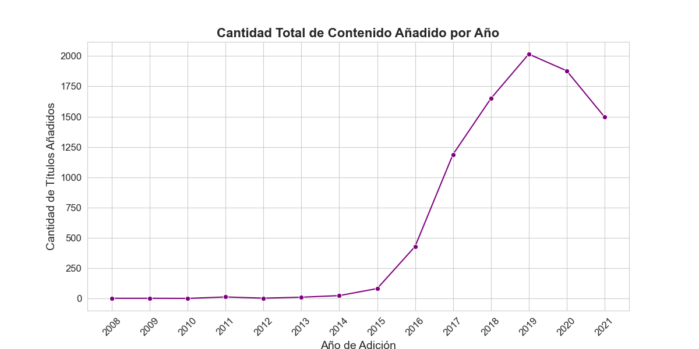
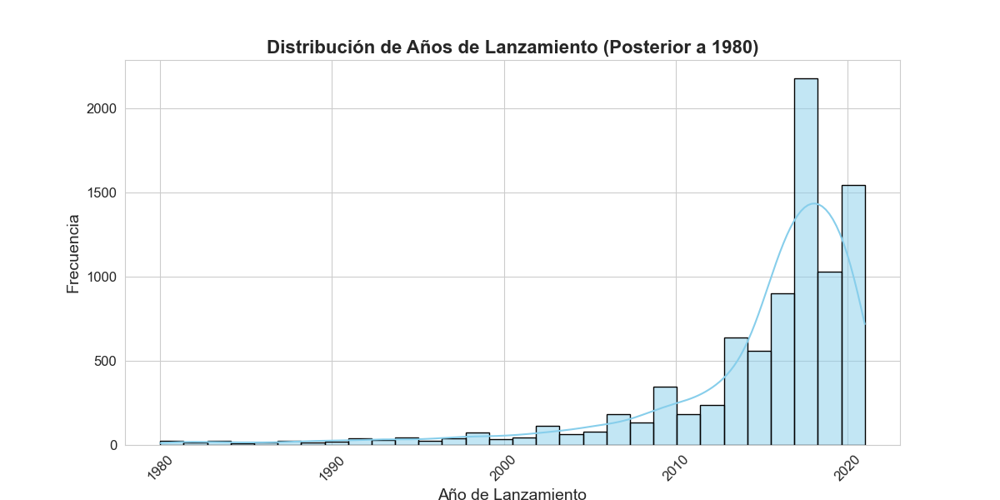
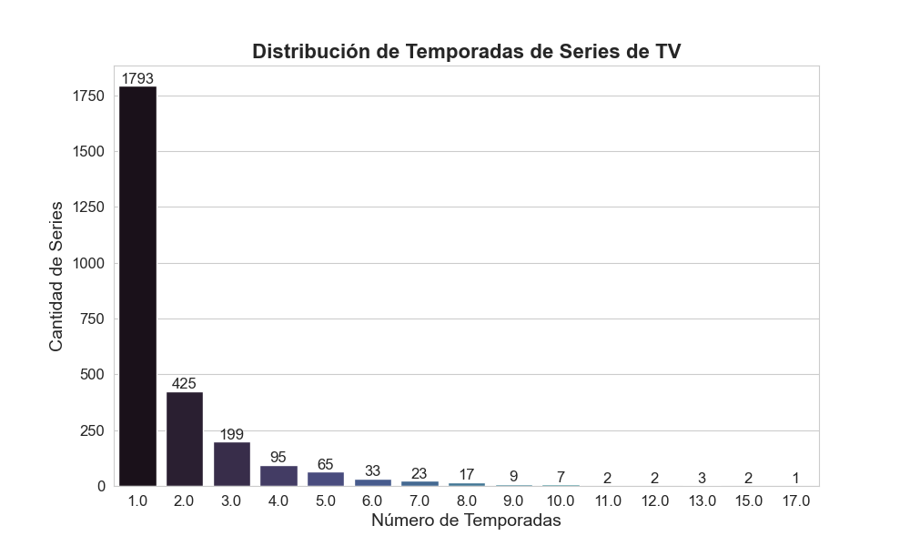
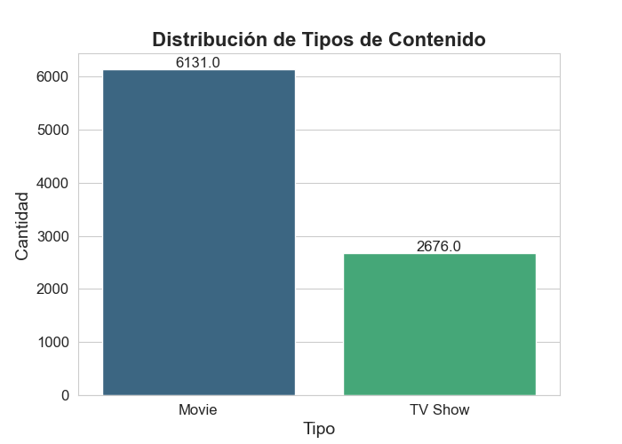
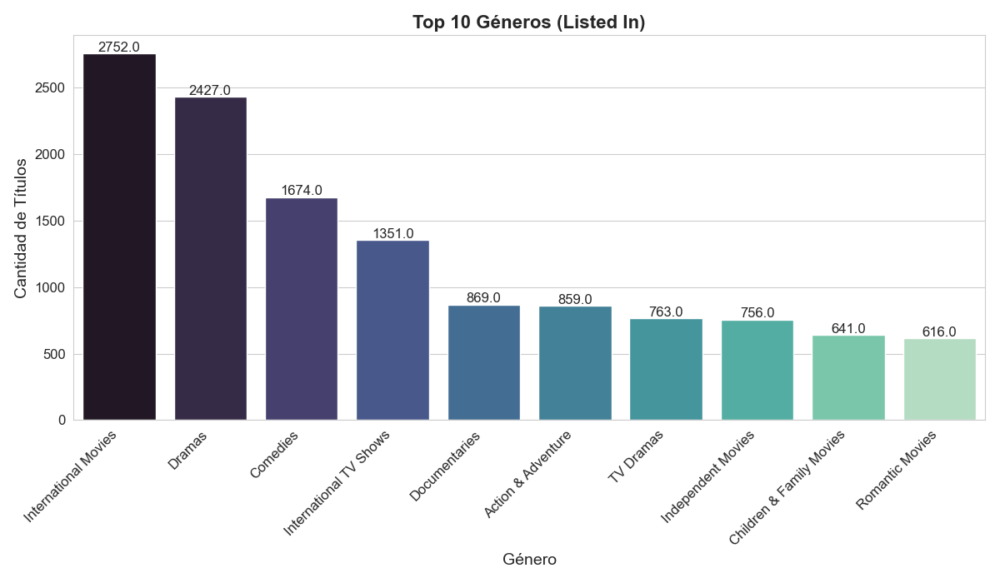
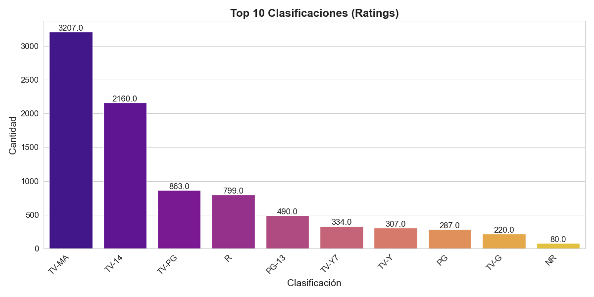

## 🧭 MiniProyecto — Netflix Titles

### 📘 Descripción General
Este miniproyecto pertenece al curso **Sistemas de Inteligencia de Negocio (SI807)**.  
Analiza el catálogo de **Netflix** para obtener *insights* descriptivos sobre tipos de contenido, géneros, clasificaciones y evolución temporal.

---

## 📦 Datos
- **Fuente cruda:** `Data/raw/netflix_titles.csv`
- **Datos procesados:** `Data/Processed/datos_limpios.csv`

**Columnas clave (diccionario breve)**
- `type` (Movie / TV Show), `title`, `country`, `date_added`, `release_year`, `rating`,  
  `duration` (minutos o seasons), `listed_in` (géneros).

---

## 🧹 Limpieza
- Conversión de `date_added` a fecha y extracción de año de alta.
- Normalización de `duration` a minutos (películas) y temporadas (series).
- Split de `listed_in` para agregaciones por género.
- Manejo básico de nulos con valores por defecto o imputaciones sencillas.

> Notebooks:  
> - `notebooks/Notebook limpieza.ipynb`  
> - `notebooks/Notebook_Graficas.ipynb`

---

## 🔎 Exploración y Visualizaciones

### 1) Cantidad total de contenido añadido por año


### 2) Distribución de años de lanzamiento (posterior a 1980)


### 3) Distribución de temporadas de series de TV


### 4) Distribución de tipos de contenido


### 5) Top 10 géneros (Listed In)


### 6) Top 10 clasificaciones (Ratings)


---

## 📚 Estructura del MiniProyecto
```
MiniProyecto/
├─ Data/
│  ├─ raw/
│  │  └─ netflix_titles.csv
│  └─ Processed/
│     └─ datos_limpios.csv
├─ notebooks/
│  ├─ Notebook limpieza.ipynb
│  └─ Notebook_Graficas.ipynb
├─ results/
│  ├─ Cantidad_total_Contenido.png
│  ├─ Distribucion_Tipo_contenido.png
│  ├─ Distribucion_anios_lanzamiento.png
│  ├─ Distribucion_temporadas_series.png
│  ├─ Top10_generos.png
│  └─ Top10_rating.png
└─ README.md
```

---

## 📌 Conclusiones
- La oferta alcanza su máximo en 2019 y luego muestra una desaceleración en los años siguientes. Esto sugiere que el crecimiento dejó de ser por volumen y pasó a ser más selectivo
- El catálogo está dominado por Movies frente a TV Shows. Dentro de las series, prevalecen las de una sola temporada, lo que indica foco en miniseries/antologías y reduce el compromiso de producción a largo plazo.
- Los géneros International Movies, Dramas y Comedies concentran la mayor parte del catálogo, con una larga cola de géneros minoritarios. Esto sugiere que las decisiones de incorporación priorizan títulos con tracción global y alta capacidad de localización.
- Predomina la clasificación TV-MA, evidenciando una estrategia de contenidos maduros. Existe una oportunidad de crecimiento en franjas familiares/PG-13 si se buscara ampliar alcance demográfico.

---

## 👥 Autores
> 
| Rol            | Integrante                                            |
| -------------- | ----------------------------------------------------- |
| Líder de grupo | Jordan Laureano                                       |
| Miembros       | Joel Gamboa, Luis Aymachoque                          |
| Curso          | Sistemas de Inteligencia de Negocio                   |
| Universidad    | UNI - Facultad de Ingeniería Industrial y de Sistemas |

