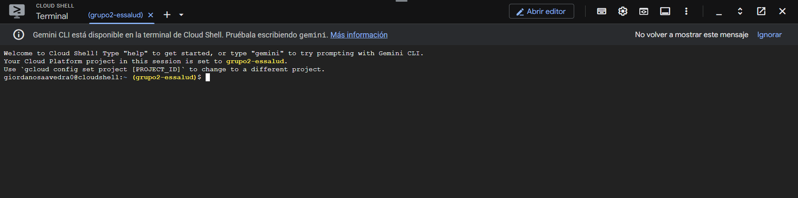
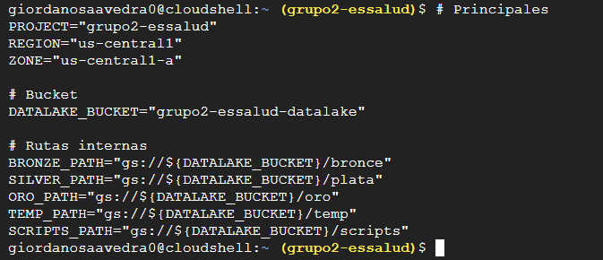
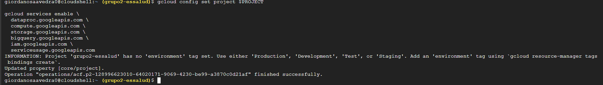
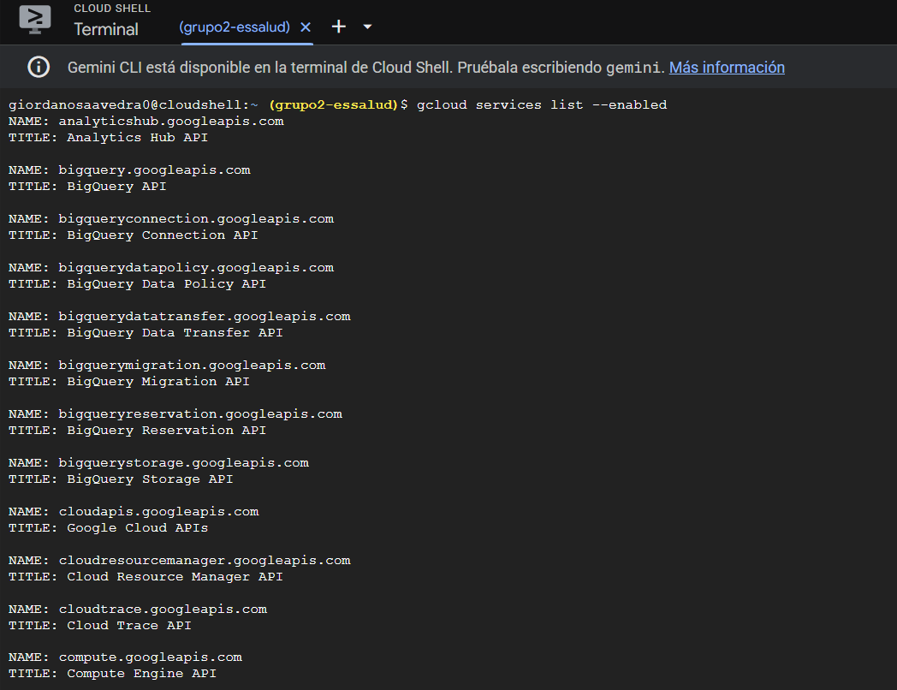
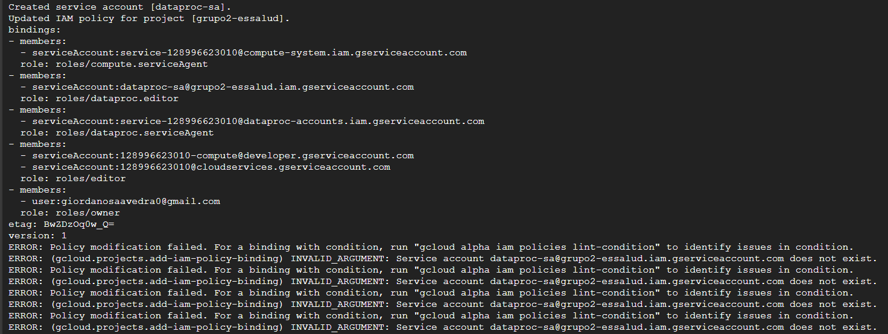
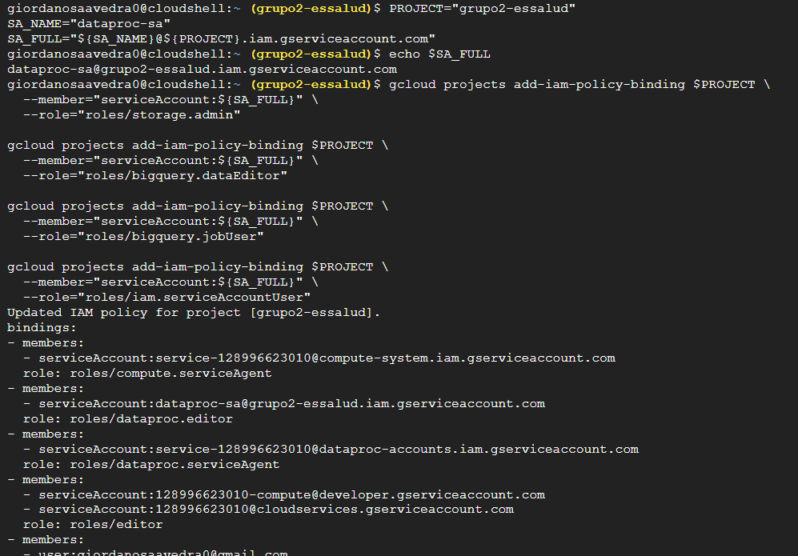
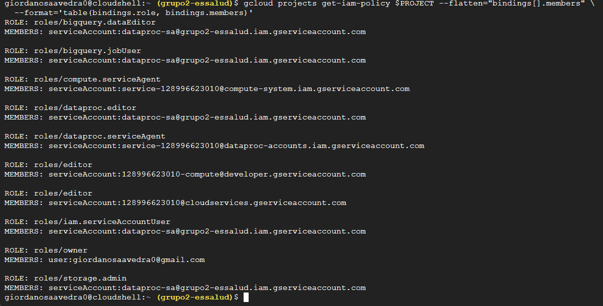

# 🚀 Habilitación Inicial

## 1️. Entramos al bash de GCP  


---

## 2️. Una vez abierto el bash veremos las líneas donde ingresaremos los comandos  


---

## 3️. Definimos los valores generales  }

```bash
# Principales
PROJECT="grupo2-essalud"
REGION="us-central1"
ZONE="us-central1-a"

# Bucket
DATALAKE_BUCKET="grupo2-essalud-datalake"

# Rutas internas
BRONZE_PATH="gs://${DATALAKE_BUCKET}/bronce"
SILVER_PATH="gs://${DATALAKE_BUCKET}/plata"
ORO_PATH="gs://${DATALAKE_BUCKET}/oro"
TEMP_PATH="gs://${DATALAKE_BUCKET}/temp"
SCRIPTS_PATH="gs://${DATALAKE_BUCKET}/scripts"
``` 



---

## 4. Habilitamos las APIs necesarias  
```bash
gcloud config set project $PROJECT

gcloud services enable \
  dataproc.googleapis.com \
  compute.googleapis.com \
  storage.googleapis.com \
  bigquery.googleapis.com \
  iam.googleapis.com \
  serviceusage.googleapis.com
``` 


---

### 4.1 Verificamos las APIs activadas  
Ejecutamos: **gcloud services list --enabled**  


---

## Creamos las carpetas *temp* y *scripts* en el bucket  
```bash
gsutil ls gs://${DATALAKE_BUCKET} || echo "Bucket no existe"
gsutil cp -Z /dev/null "${TEMP_PATH}/placeholder.txt"
gsutil cp -Z /dev/null "${SCRIPTS_PATH}/placeholder.txt"
``` 


---

## 5. Creamos un Service Account para manejar permisos  
```bash
PROJECT="grupo2-essalud"
SA_NAME="dataproc-sa"
SA_FULL="${SA_NAME}@${PROJECT}.iam.gserviceaccount.com"


# Crear el service account
gcloud iam service-accounts create $SA_NAME \
  --project=$PROJECT \
  --description="Service account para jobs Dataproc" \
  --display-name="dataproc-sa"

# Conceder roles mínimos recomendados
gcloud projects add-iam-policy-binding $PROJECT \
  --member="serviceAccount:${SA_FULL}" \
  --role="roles/dataproc.editor"

gcloud projects add-iam-policy-binding $PROJECT \
  --member="serviceAccount:${SA_FULL}" \
  --role="roles/storage.admin"

gcloud projects add-iam-policy-binding $PROJECT \
  --member="serviceAccount:${SA_FULL}" \
  --role="roles/bigquery.dataEditor"

gcloud projects add-iam-policy-binding $PROJECT \
  --member="serviceAccount:${SA_FULL}" \
  --role="roles/bigquery.jobUser"

# Para que Composer ejecute cosas con ese SA
gcloud projects add-iam-policy-binding $PROJECT \
  --member="serviceAccount:${SA_FULL}" \
  --role="roles/iam.serviceAccountUser"
``` 


### ✔️ Posible error y solución  


---

### 6.Comprobamos los roles asignados  
```bash
gcloud projects get-iam-policy $PROJECT --flatten="bindings[].members" \
  --format='table(bindings.role, bindings.members)'
``` 



