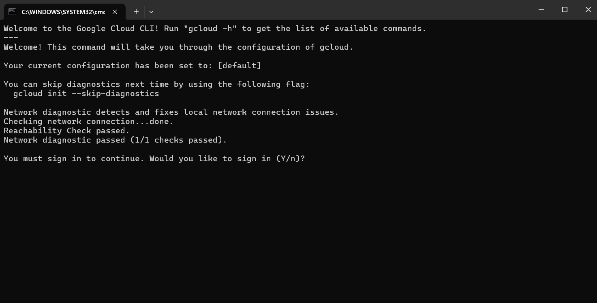
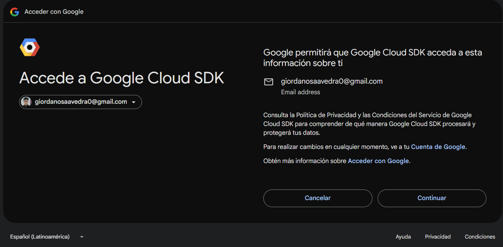
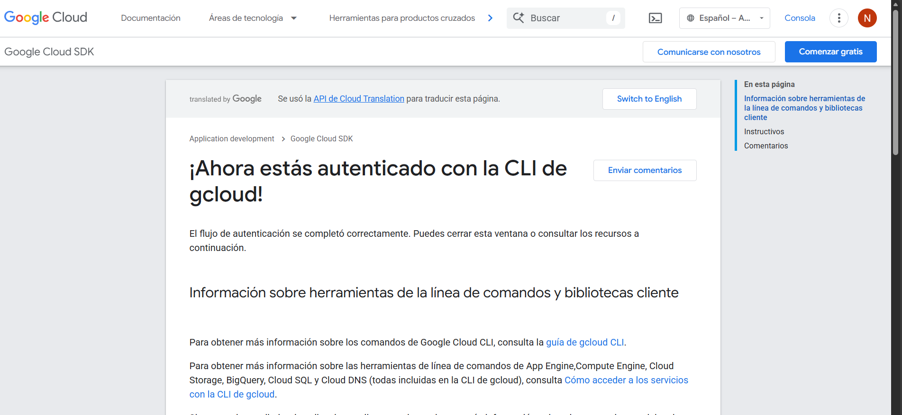
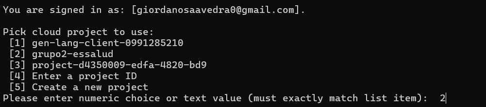
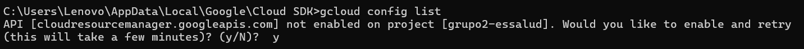
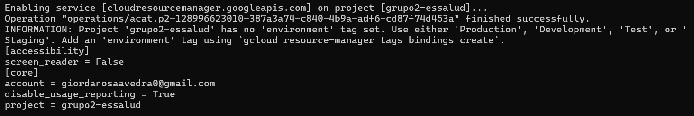

# ☁️ Instalación de GCloud

1. Descargamos el instalador de Google Cloud desde la página oficial:  
   [https://cloud.google.com/sdk/docs/install?hl=es-419](https://cloud.google.com/sdk/docs/install?hl=es-419)

2. Aceptamos todo lo que muestra el instalador Wizard. Al finalizar, se abrirá el CMD de esta forma:  
   

3. Escribimos **y** y damos Enter. Esto nos redirigirá a la página de Google para iniciar sesión con nuestra cuenta:  
   

4. Aceptamos todos los permisos. Una vez hecho, estaremos autenticados:  
   

5. Seleccionamos el proyecto que vamos a usar. En este caso: **grupo2-EsSalud**  
   

6. ¡Listo! Ya estamos dentro del proyecto deseado:  
   

7. Podemos verificar si la conexión fue exitosa ejecutando:  
   **gcloud config list**  
   Si nos pide activar el API *cloudresourcemanager.googleapis.com*, escribimos **y**.  
   

8. Finalmente, podemos confirmar que el proyecto está seleccionado con la cuenta correcta:  
   
