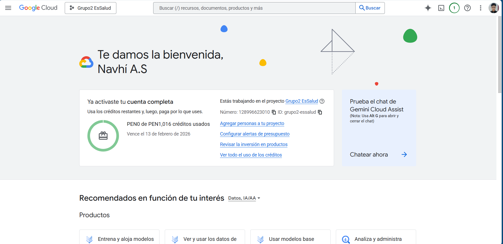
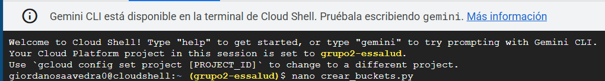
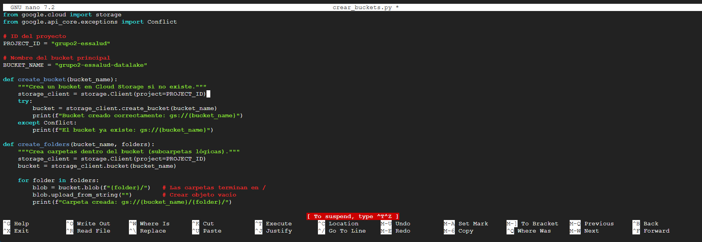
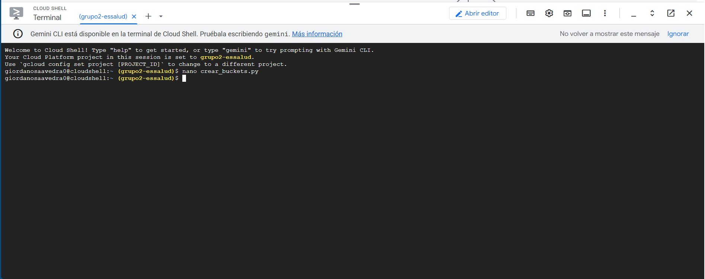
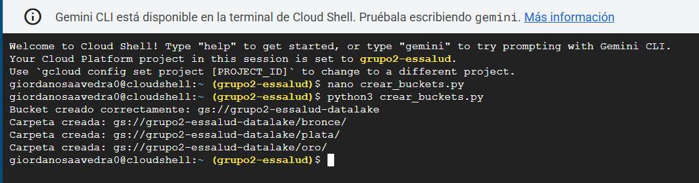
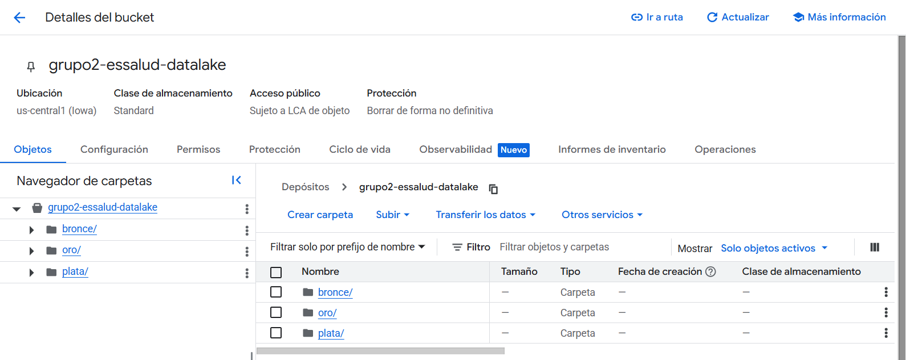
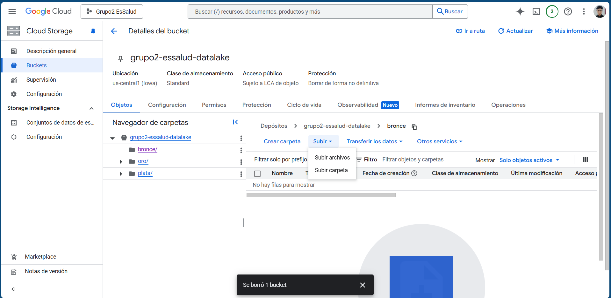
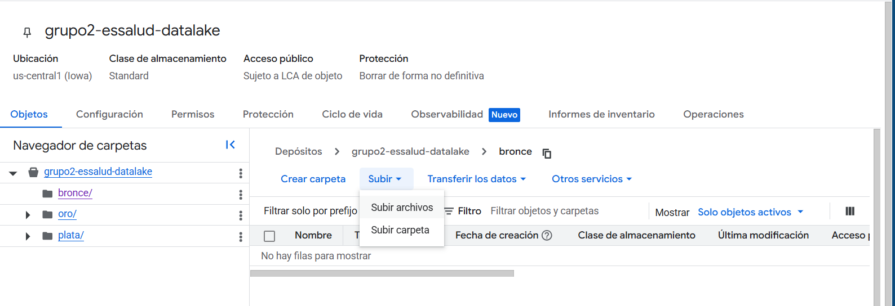
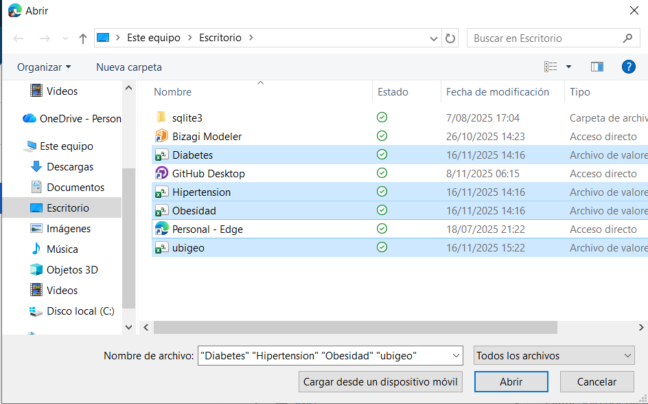
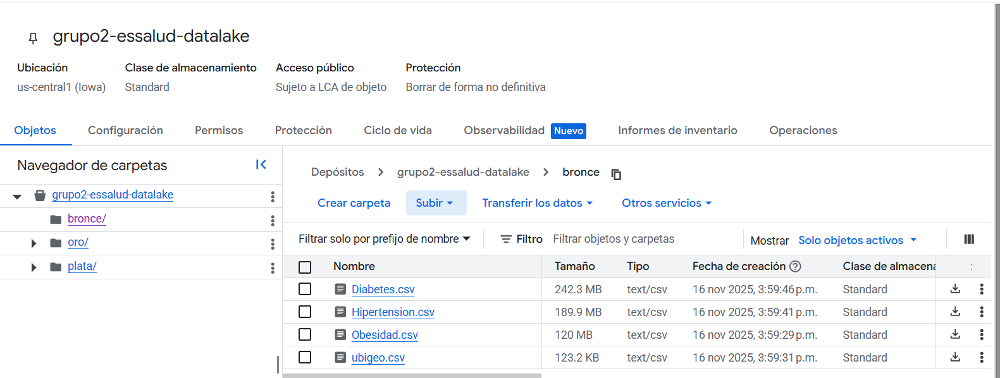

# Subida de Datos

## Creación del Bucket

1. Entramos a la consola de Google Cloud  
   

2. Entramos a la terminal  
   

3. Creamos un archivo Python para ejecutar el código de creación de buckets  
   ```
   nano crear_buckets.py
   ```  
   

4. Luego vemos esta pantalla:  
   

5. Pegamos el código correspondiente en el archivo 

    ```python
    from google.cloud import storage
    from google.api_core.exceptions import Conflict

    # ID del proyecto
    PROJECT_ID = "grupo2-essalud"

    # Nombre del bucket principal
    BUCKET_NAME = "grupo2-essalud-datalake"

    # Región deseada
    LOCATION = "us-central1"   # <--- REGIONAL, no multirregional

    def create_bucket(bucket_name):
        """Crea un bucket regional en Cloud Storage si no existe."""
        storage_client = storage.Client(project=PROJECT_ID)

        bucket = storage.Bucket(storage_client, name=bucket_name)
        bucket.location = LOCATION

        try:
            bucket = storage_client.create_bucket(bucket)
            print(f"Bucket creado correctamente: gs://{bucket_name} en {LOCATION}")
        except Conflict:
            print(f"El bucket ya existe: gs://{bucket_name}")

    def create_folders(bucket_name, folders):
        """Crea carpetas dentro del bucket."""
        storage_client = storage.Client(project=PROJECT_ID)
        bucket = storage_client.bucket(bucket_name)

        for folder in folders:
            blob = bucket.blob(f"{folder}/")
            blob.upload_from_string("")  # Crea carpeta lógica
            print(f"Carpeta creada: gs://{bucket_name}/{folder}/")

    if __name__ == "__main__":
        # 1. Crear bucket principal regional
        create_bucket(BUCKET_NAME)

        # 2. Crear carpetas bronce, plata y oro
        folders = ["bronce", "plata", "oro"]
        create_folders(BUCKET_NAME, folders)

    ```

   

6. Guardamos con **CTRL + O**, luego **ENTER** y salimos con **CTRL + X**  
   

7. Ejecutamos el script con:  
   ```
    python3 crear_buckets.py
    ``` 
   

8. ¡Listo! Bucket creado con sus carpetas correspondientes  
   

---

## Subida de Archivos a la Carpeta **bronce**

1. Entramos a la carpeta **bronce** en Cloud Storage  
   

2. Seleccionamos **Subir** → **Subir Archivos**  
   

3. Elegimos los archivos a subir y hacemos clic en **Abrir**  
   

4. ¡Y listo!  
   

