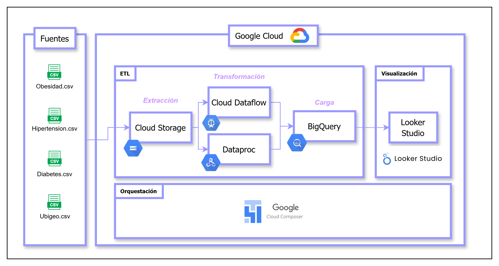
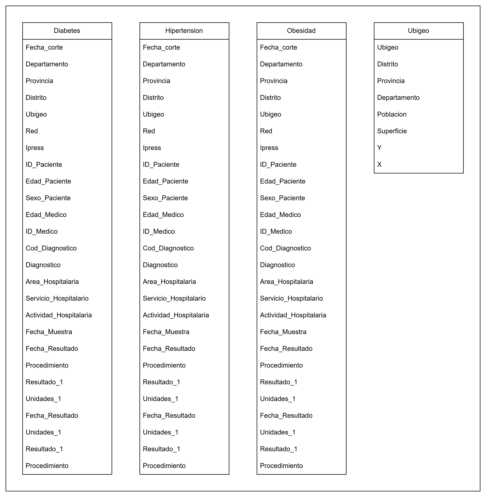
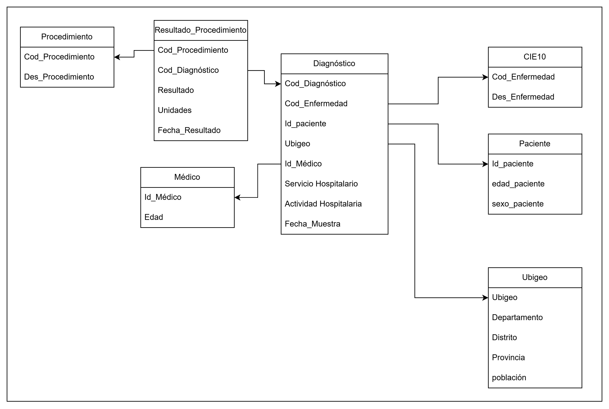
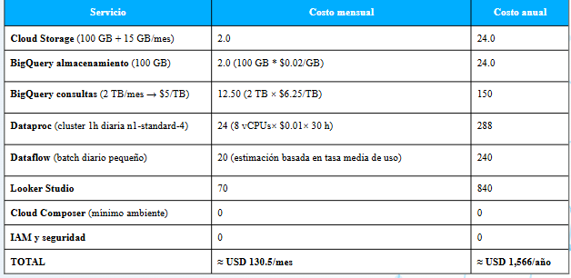

# Práctica Calificada 3

Se realizó la activación del entorno de GCP.  
La documentación detallada de cada parte se encuentra en los siguientes enlaces:

- 📌 [Instalación de GCloud](../3PC/Partes/Instalacion_GCloud.md)
- ⚙️ [Habilitación Inicial](../3PC/Partes/Habilitacion_Inicial.md)
- 📤 [Subida de los datos](../3PC/Partes/Subida_datos.md)
- 🔧 [Creación de Cluster para Dataproc](../3PC/Partes/Creacion_Cluster_Dataproc.md)

---

## 🏗️ Arquitectura

La arquitectura en GCP se representa de la siguiente manera:

---

## 🗄️ Diseño de Datos

### 🥉 Capa Bronce  

### 🥈 Capa Plata  

### 🥇 Capa Oro  

## 💰 Costos del proyecto

Los costos estimados mensualmente y proyectados anualmente se muestran en la matriz de costos:

Estos costos se calcularon utilizando la Google Cloud Pricing Calculator, la herramienta oficial de Google para estimar precios de servicios en la nube.
