# Visualización y Análisis en Power BI

Este apartado describe el **proceso de conexión, modelado visual y diseño del dashboard** en Power BI, utilizando como fuente de datos la tabla final de KPIs almacenada en **BigQuery**. El objetivo es transformar los datos procesados en información clara y accionable para la toma de decisiones en salud.

---
Datos de conexión (pasos más adelante)

* Account: **service-account@grupo2-essalud.iam.gserviceaccount.com**

* Clave: Se envió al privado

**OJO**: La clave de conexión será cambiada el **21/12/2025**

---

---

## 1. Objetivo de la Visualización

* Conectar Power BI con BigQuery de forma segura.
* Consumir la tabla `oro.kpi_reporte_powerbi` generada por el ETL.
* Diseñar un **Healthcare Dashboard** con enfoque ejecutivo, geográfico y epidemiológico.
* Facilitar el análisis temporal, demográfico y clínico.

---

## 2. Conexión de Power BI con BigQuery

### 2.1 Creación de un Reporte Nuevo

Se inicia Power BI Desktop y se crea un reporte en blanco.

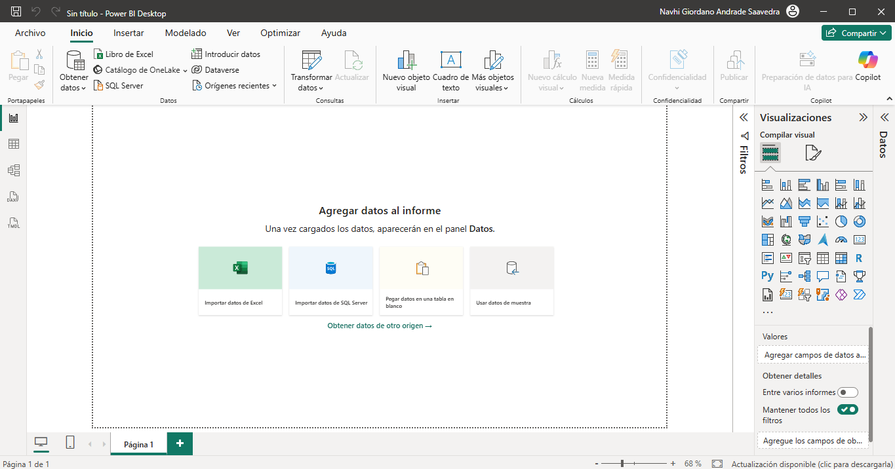

---

### 2.2 Selección de Fuente de Datos

1. Seleccionar **Obtener datos** → **Más**.
2. Buscar y seleccionar **Google BigQuery**.

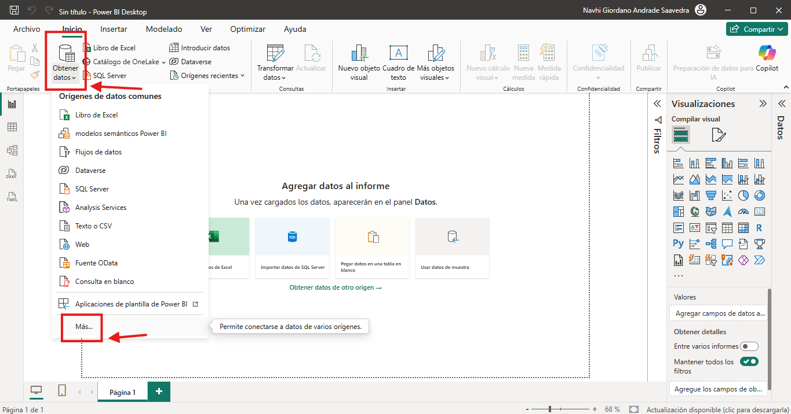

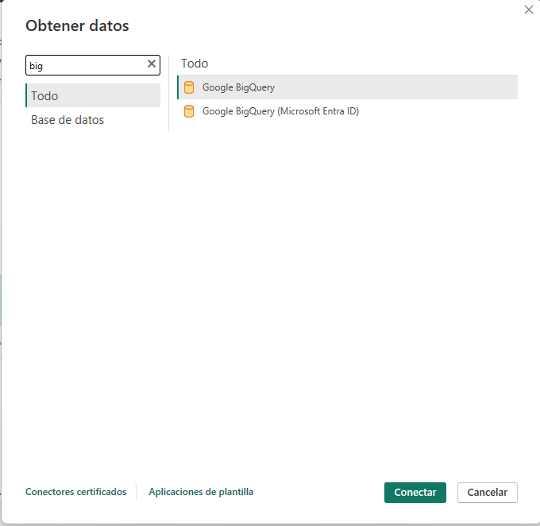

---

### 2.3 Autenticación mediante Service Account

Para garantizar una conexión segura, se utiliza una **Service Account** de Google Cloud.

1. Ingresar los datos de la cuenta de servicio.

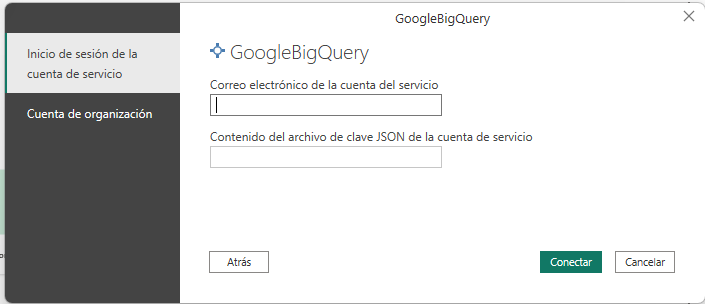

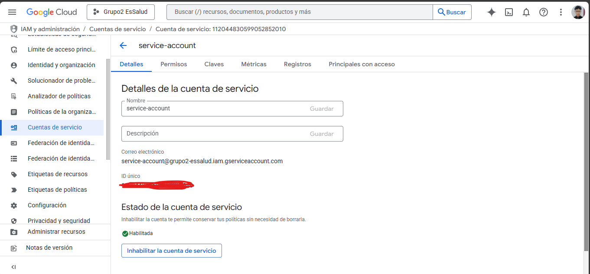

2. En Google Cloud Console, acceder a la cuenta de servicio y administrar sus claves.

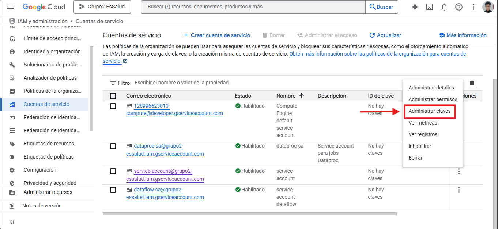

3. Crear una nueva clave:

   * Tipo: **JSON**

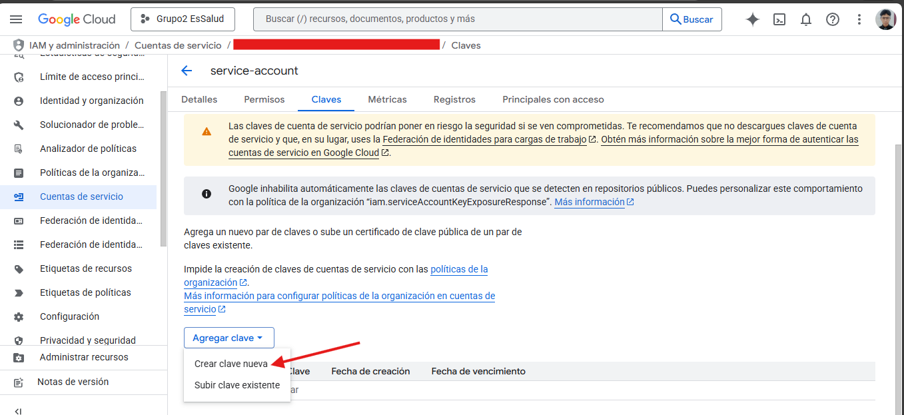

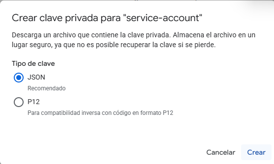

4. Copiar el contenido del archivo JSON y pegarlo en Power BI para completar la conexión.

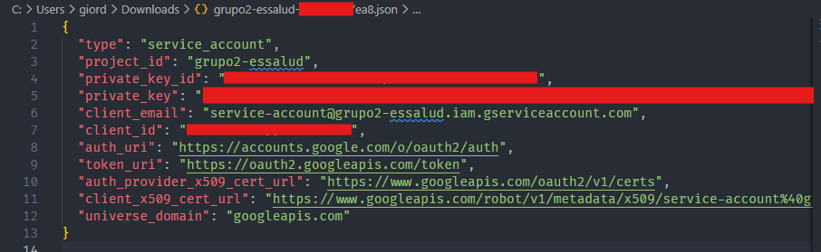


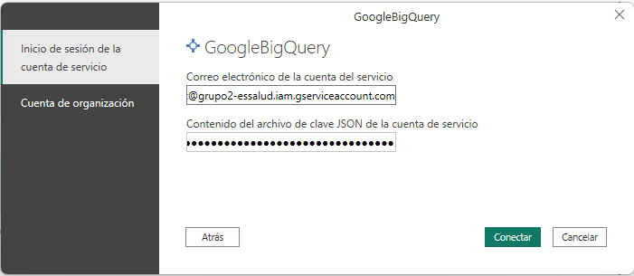


### 2.4 Selección de la Tabla de KPIs

Una vez establecida la conexión:

1. Seleccionar la tabla **kpi_reporte_powerbi**.
2. Hacer clic en **Cargar**.
3. Elegir el modo **Importar** para un mejor rendimiento del dashboard.

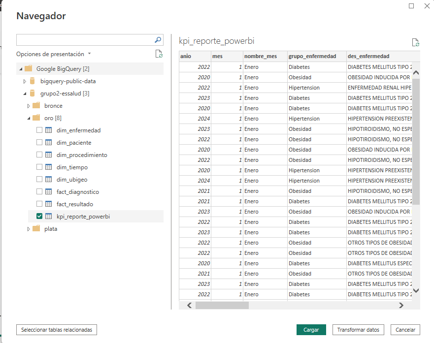


---

## 3. Modelo de Datos para el Dashboard

La tabla de KPIs contiene una estructura óptima para un **dashboard de salud**, integrando:

* **Tiempo:** Año, mes
* **Geografía:** Departamento, provincia, distrito, macro región
* **Demografía:** Sexo, grupo etario
* **Clínica:** Grupo y detalle de enfermedad

Esta estructura permite análisis multidimensionales sin necesidad de transformaciones adicionales.

---

## 4. Medidas DAX Básicas Recomendadas

Antes de construir los gráficos, se crean las siguientes medidas para estandarizar los indicadores:

```DAX
Atenciones = SUM(Tabla[total_atenciones])

Pacientes = SUM(Tabla[pacientes_unicos])
```

Estas medidas aseguran consistencia y nombres profesionales en todo el dashboard.

---

## 5. Diseño del Dashboard en Power BI

El dashboard se organiza en **cinco páginas**, cada una con un objetivo analítico claro.

---

## 6. Página 1 – Panorama General (Executive Summary)

**Objetivo:** Mostrar el estado general de la población y comparar las principales patologías.

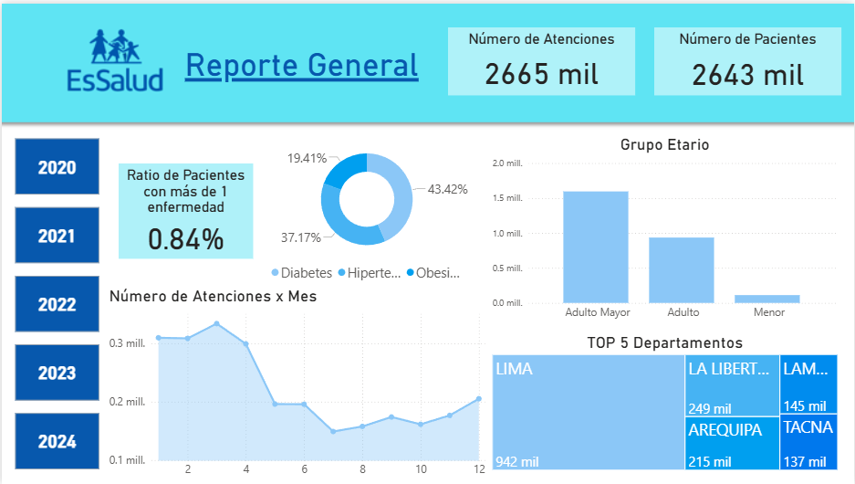

---

## 7. Página 2 – Foco Lima (Análisis Regional)

**Objetivo:** Profundizar el análisis en la capital a nivel distrital.

**Filtro de página:** Departamento = **LIMA**

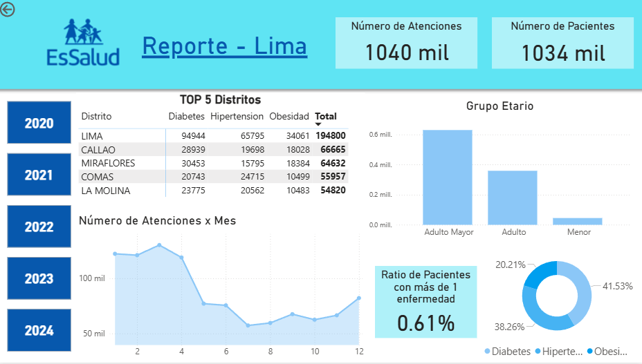

---

## 8. Páginas 3, 4 y 5 – Análisis por Patología

Estas páginas comparten la misma estructura y se diferencian únicamente por el filtro aplicado:

* Página 3: **Diabetes**
* Página 4: **Hipertensión**
* Página 5: **Obesidad**

**Filtro de página:** `grupo_enfermedad = [Patología]`

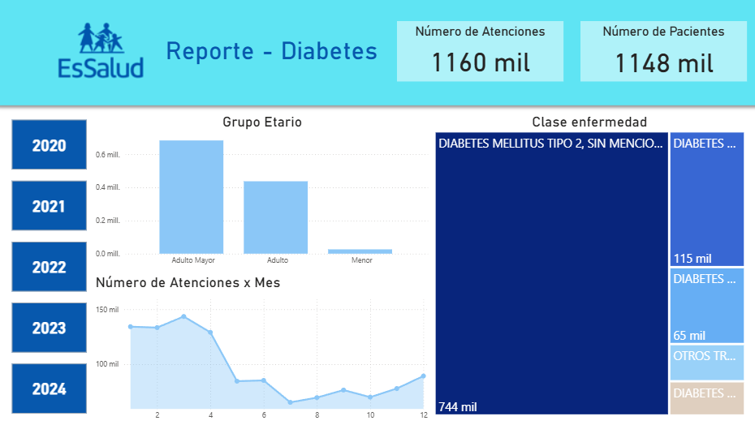

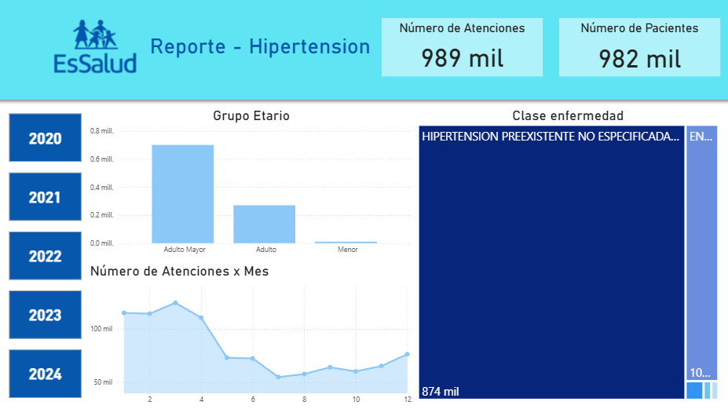

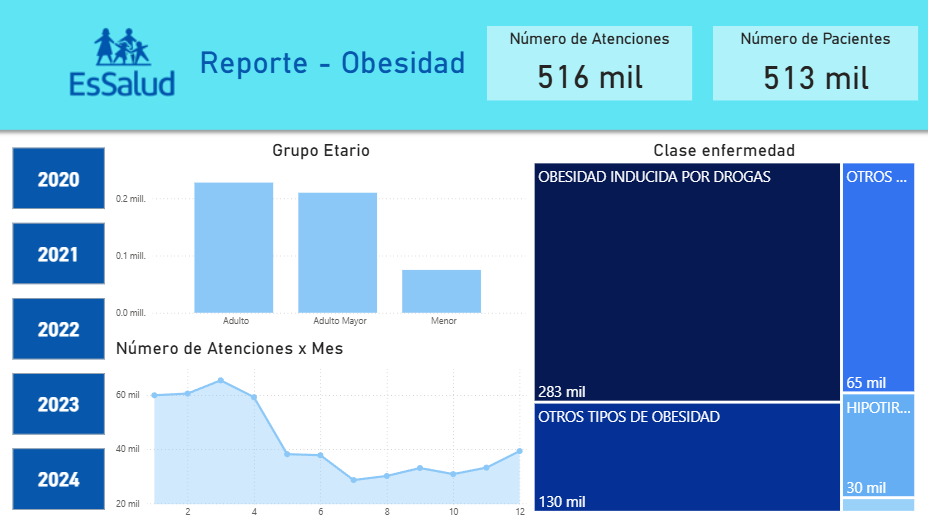

---

## 9. Resultado Final

El dashboard final permite:

* Visualizar indicadores clave de salud de forma intuitiva.
* Analizar tendencias temporales y patrones geográficos.
* Identificar grupos poblacionales de riesgo.
* Apoyar la toma de decisiones estratégicas en control epidemiológico.

Esta capa de visualización completa el flujo **End-to-End**, desde la ingestión de datos hasta el análisis ejecutivo en Power BI.
