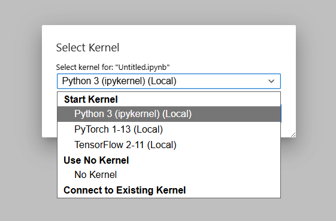
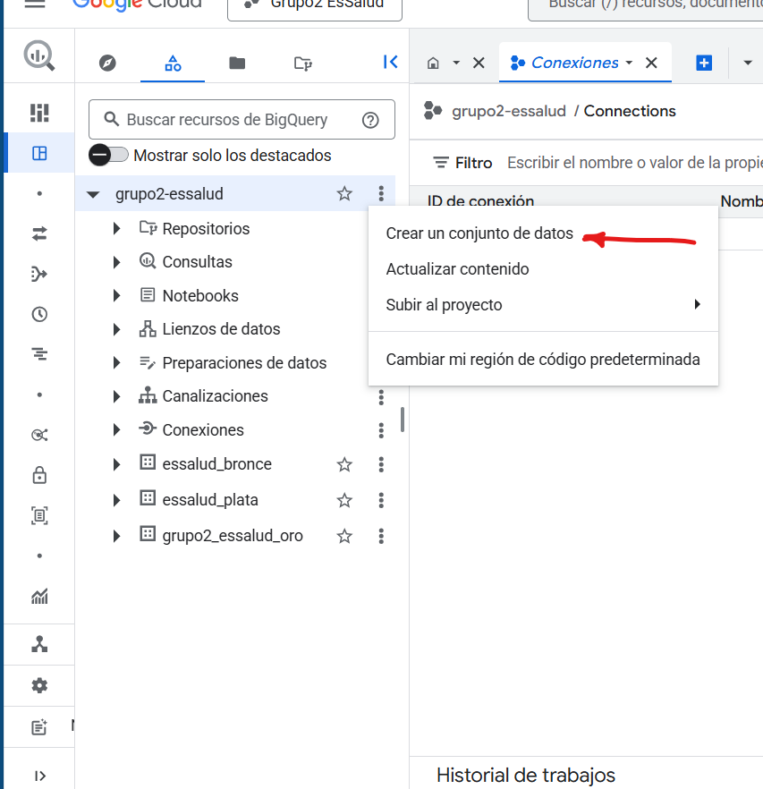
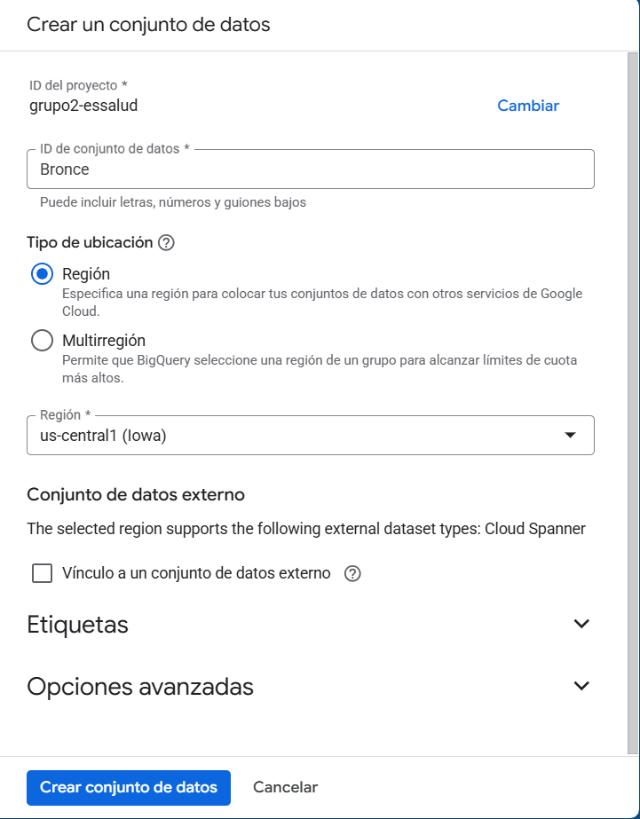
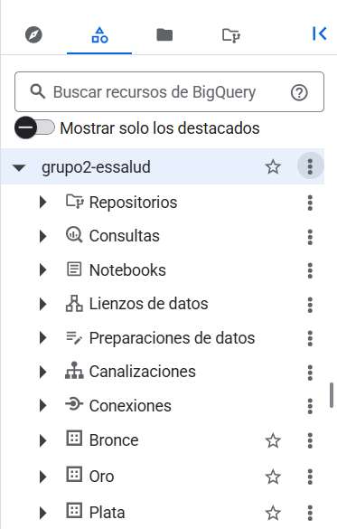

# **Proceso de Transformación de Datos**

A continuación, se describe el flujo utilizado para desarrollar, probar y desplegar la transformación de datos mediante JupyterLab y Google BigQuery, siguiendo la arquitectura *etl_script* (Bronce → Plata → Oro).

---

## **1. Creación del Entorno de Trabajo**

Primero, se crea una instancia denominada **“transformacion”**, la cual se utilizará para ejecutar JupyterLab y realizar las pruebas de transformación de datos antes de generar el script final en Python.

Una vez creada la instancia, seleccionamos **“Abrir JupyterLab”**.

---

## **2. Configuración Inicial en JupyterLab**

Dentro de JupyterLab, procedemos a crear un nuevo cuaderno:

1. Seleccionamos **File → New → Notebook**.
2. Elegimos el kernel por defecto (**ipykernel**) y presionamos **Select**.

Posteriormente, asignamos un nombre al cuaderno haciendo clic derecho sobre él y seleccionando la opción para renombrarlo.

---

## **3. Creación de las Bases de Datos en BigQuery (Bronce, Plata y Oro)**

Antes de iniciar la transformación, es necesario crear tres *datasets* en BigQuery, correspondientes a las capas de la arquitectura *etl_script*. Esto permitirá cargar automáticamente los datos procesados a cada capa.

1. Ingresamos a BigQuery y seleccionamos **“Crear Conjunto de Datos”**.

   

2. Completamos la información solicitada para las capas Bronce, Plata y Oro.

   

3. Finalmente, los tres datasets deben visualizarse de la siguiente manera:

   

---

## **4. Desarrollo de la Transformación**

El procesamiento completo —desde la capa Bronce hasta la capa Oro— se implementó en un único notebook:

* **Notebook de Transformación Bronce → Plata → Oro**
  [etl_script.ipynb](etl_script.ipynb)

Una vez finalizada la transformación y verificados los resultados, el notebook se exportó como script en Python, para ser utilizado posteriormente dentro del orquestador.

* **Script en Python de la Transformación Bronce → Plata → Oro**
  [etl_script.py](Script/etl_script.py)

