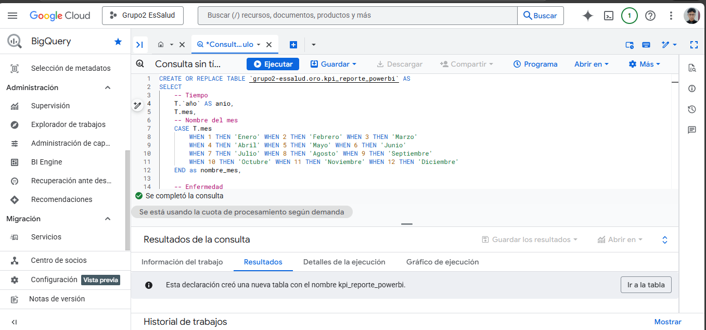
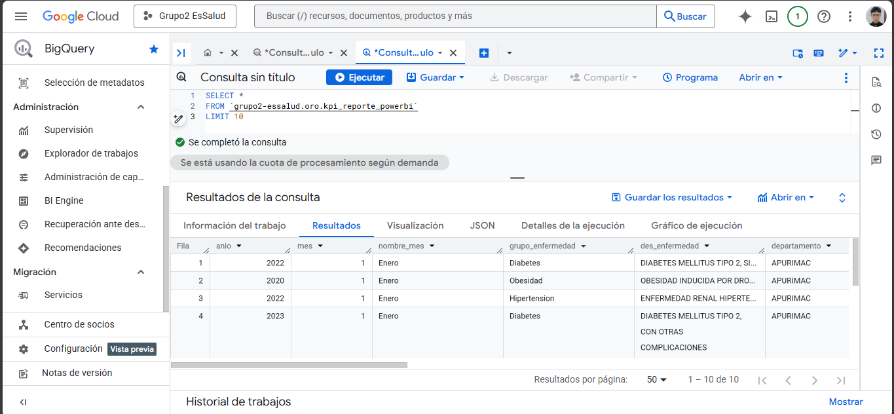

# Carga y Generación de KPIs para Power BI

Este documento describe de forma ordenada y paso a paso la definición de KPIs, la creación de la tabla final en BigQuery y su integración dentro del proceso ETL para consumo en Power BI.

---

## 1. Contexto y Alcance
a
Debido a que el dataset no contiene **resultados numéricos de laboratorio** (glucosa, presión arterial, etc.), los indicadores definidos se enfocan en:

* Volumen de atenciones
* Prevalencia de pacientes
* Perfil demográfico y geográfico

Estos KPIs permiten analizar la carga operativa y el comportamiento epidemiológico sin requerir valores clínicos cuantitativos.

---

## 2. Definición de KPIs

| Nº | Nombre del KPI | Definición | Fórmula Sugerida (Lógica DAX / SQL) | Unidad |
|----|----------------|-----------|------------------------------------|--------|
| 1 | Total de Atenciones | Cantidad total de diagnósticos o consultas registradas en el periodo seleccionado. Mide la carga operativa. | `COUNT(SK_Diagnostico)` | Atenciones |
| 2 | Pacientes Únicos Atendidos | Número de personas distintas que recibieron atención, sin importar cuántas veces fueron al hospital. | `DISTINCTCOUNT(SK_Paciente)` | Pacientes |
| 3 | Población con Diabetes | Cantidad de pacientes únicos que han sido diagnosticados con alguna variante del grupo **Diabetes**. | `CALCULATE(DISTINCTCOUNT(SK_Paciente), Dim_Enfermedad[Grupo] = "Diabetes")` | Pacientes |
| 4 | Población con Hipertensión | Cantidad de pacientes únicos diagnosticados con el grupo **Hipertensión**. | `CALCULATE(DISTINCTCOUNT(SK_Paciente), Dim_Enfermedad[Grupo] = "Hipertension")` | Pacientes |
| 5 | Población con Obesidad | Cantidad de pacientes únicos diagnosticados con el grupo **Obesidad**. | `CALCULATE(DISTINCTCOUNT(SK_Paciente), Dim_Enfermedad[Grupo] = "Obesidad")` | Pacientes |
| 6 | Frecuencia de Visita por Paciente | Promedio de cuántas veces acude una persona al médico. Indica si son pacientes crónicos recurrentes. | `Total de Atenciones / Pacientes Únicos Atendidos` | Visitas / Paciente |
| 7 | Tasa de Prevalencia de Diabetes | Porcentaje que representan los casos de diabetes respecto al total de atenciones generales. | `(Atenciones por Diabetes / Total de Atenciones) * 100` | Porcentaje (%) |
| 8 | Atenciones en Adultos Mayores | Volumen de atenciones brindadas específicamente al grupo etario de riesgo (+60 años). | `CALCULATE(COUNT(SK_Diagnostico), Dim_Paciente[Grupo_Etario] = "Adulto Mayor")` | Atenciones |
| 9 | Intensidad de Casos en Lima | Porcentaje de las atenciones que se concentran solo en el departamento de Lima respecto al país. | `(Atenciones en Lima / Total de Atenciones Nacional) * 100` | Porcentaje (%) |
|10 | Ratio de Atención Femenina | Proporción de atenciones brindadas a mujeres. Útil para análisis por sexo. | `(Atenciones Sexo Femenino / Total de Atenciones) * 100` | Porcentaje (%) |


---

## 3. Modelo de Datos Utilizado

La tabla final consolida información proveniente de:

* **Tabla de hechos:** `oro.fact_diagnostico`
* **Dimensiones:**

  * Tiempo (`oro.dim_tiempo`)
  * Enfermedad (`oro.dim_enfermedad`)
  * Ubigeo (`oro.dim_ubigeo`)
  * Paciente (`oro.dim_paciente`)

Este modelo sigue un **esquema estrella**, optimizado para análisis en herramientas BI.

---

## 4. Query de Generación de KPIs en BigQuery

La siguiente consulta crea la tabla final que será consumida directamente por Power BI:

```sql
CREATE OR REPLACE TABLE `grupo2-essalud.oro.kpi_reporte_powerbi` AS
SELECT
    -- Tiempo
    T.año,
    T.mes,
    CASE T.mes
        WHEN 1 THEN 'Enero' WHEN 2 THEN 'Febrero' WHEN 3 THEN 'Marzo'
        WHEN 4 THEN 'Abril' WHEN 5 THEN 'Mayo' WHEN 6 THEN 'Junio'
        WHEN 7 THEN 'Julio' WHEN 8 THEN 'Agosto' WHEN 9 THEN 'Septiembre'
        WHEN 10 THEN 'Octubre' WHEN 11 THEN 'Noviembre' WHEN 12 THEN 'Diciembre'
    END AS nombre_mes,

    -- Enfermedad
    E.grupo_enfermedad,
    E.des_enfermedad,

    -- Ubicación
    U.departamento,
    U.provincia,
    U.distrito,
    U.macroRegion,

    -- Paciente
    P.sexo_paciente,
    P.grupo_etario,

    -- Servicio
    F.servicio_hospitalario,

    -- KPIs
    COUNT(F.SK_Diagnostico) AS total_atenciones,
    COUNT(DISTINCT F.SK_Paciente) AS pacientes_unicos

FROM `grupo2-essalud.oro.fact_diagnostico` F
LEFT JOIN `grupo2-essalud.oro.dim_tiempo` T ON F.SK_Tiempo = T.SK_Tiempo
LEFT JOIN `grupo2-essalud.oro.dim_enfermedad` E ON F.SK_Enfermedad = E.SK_Enfermedad
LEFT JOIN `grupo2-essalud.oro.dim_ubigeo` U ON F.SK_Ubigeo = U.SK_Ubigeo
LEFT JOIN `grupo2-essalud.oro.dim_paciente` P ON F.SK_Paciente = P.SK_Paciente
GROUP BY
    1, 2, 3, 4, 5, 6, 7, 8, 9, 10, 11, 12;
```

---

## 5. Integración en el Proceso ETL (PySpark)

Este query se integra como el **paso final** del proceso ETL, luego de haber cargado las capas Bronce, Plata y Oro.

### 5.1 Bloque a Agregar en `etl_script.py`

```python
# ==========================================
# 4. GENERACIÓN DE TABLA FINAL PARA POWER BI
# ==========================================
logger.info("Generando tabla consolidada para Power BI en BigQuery...")

from google.cloud import bigquery

# Cliente de BigQuery
bq_client = bigquery.Client()

query_pbi = """
CREATE OR REPLACE TABLE `grupo2-essalud.oro.kpi_reporte_powerbi` AS
SELECT
    T.año,
    T.mes,
    CASE T.mes
        WHEN 1 THEN 'Enero' WHEN 2 THEN 'Febrero' WHEN 3 THEN 'Marzo'
        WHEN 4 THEN 'Abril' WHEN 5 THEN 'Mayo' WHEN 6 THEN 'Junio'
        WHEN 7 THEN 'Julio' WHEN 8 THEN 'Agosto' WHEN 9 THEN 'Septiembre'
        WHEN 10 THEN 'Octubre' WHEN 11 THEN 'Noviembre' WHEN 12 THEN 'Diciembre'
    END AS nombre_mes,
    E.grupo_enfermedad,
    E.des_enfermedad,
    U.departamento,
    U.provincia,
    U.distrito,
    U.macroRegion,
    P.sexo_paciente,
    P.grupo_etario,
    F.servicio_hospitalario,
    COUNT(F.SK_Diagnostico) AS total_atenciones,
    COUNT(DISTINCT F.SK_Paciente) AS pacientes_unicos
FROM `grupo2-essalud.oro.fact_diagnostico` F
LEFT JOIN `grupo2-essalud.oro.dim_tiempo` T ON F.SK_Tiempo = T.SK_Tiempo
LEFT JOIN `grupo2-essalud.oro.dim_enfermedad` E ON F.SK_Enfermedad = E.SK_Enfermedad
LEFT JOIN `grupo2-essalud.oro.dim_ubigeo` U ON F.SK_Ubigeo = U.SK_Ubigeo
LEFT JOIN `grupo2-essalud.oro.dim_paciente` P ON F.SK_Paciente = P.SK_Paciente
GROUP BY 1,2,3,4,5,6,7,8,9,10,11,12
"""

query_job = bq_client.query(query_pbi)
query_job.result()

logger.info("Tabla `oro.kpi_reporte_powerbi` actualizada exitosamente.")
```

---

## 6. Evidencia de Ejecución

* Script ETL actualizado: [`etl_script.py`](Scripts/etl_script.py)
* Ejecución correcta del query en BigQuery:



* Creación exitosa de la tabla final:



---

## 7. Resultado Final

La tabla `oro.kpi_reporte_powerbi` queda lista para ser conectada directamente a **Power BI**, permitiendo:

* Dashboards dinámicos
* Análisis temporal, demográfico y geográfico
* Soporte a la toma de decisiones en control epidemiológico
