# Orquestación del Proceso ETL con Cloud Functions y Dataproc

Este apartado describe de forma ordenada y profesional la **orquestación del proceso ETL** mediante **Google Cloud Functions (2ª gen)** y **Dataproc Serverless**, permitiendo la ejecución automática del pipeline cuando se detecta la llegada de nuevos archivos en la capa Bronce del Data Lake.

---

## 1. Objetivo de la Orquestación

Automatizar la ejecución del proceso ETL de la siguiente manera:

1. Detectar la carga de nuevos archivos en la carpeta **bronce/** del bucket de Cloud Storage.
2. Validar que el archivo corresponde a la capa Bronce.
3. Ejecutar de forma automática el script `etl_script.py` usando **Dataproc Serverless (Spark)**.
4. Garantizar un flujo desacoplado, escalable y orientado a eventos.

---

## 2. Arquitectura de la Solución

La orquestación se basa en un enfoque **event-driven**:

* **Cloud Storage**: Almacena los archivos fuente (Bronce).
* **Cloud Functions (2ª gen)**: Escucha eventos de carga de archivos.
* **Dataproc Serverless**: Ejecuta el procesamiento Spark sin necesidad de clústeres persistentes.
* **BigQuery**: Almacena las capas Plata y Oro generadas por el ETL.

---

## 3. Preparación del Entorno

### 3.1 Carga del Script ETL al Bucket

El script principal de procesamiento (`etl_script.py`) se almacena en la carpeta **scripts/** del bucket, desde donde será invocado por Dataproc.

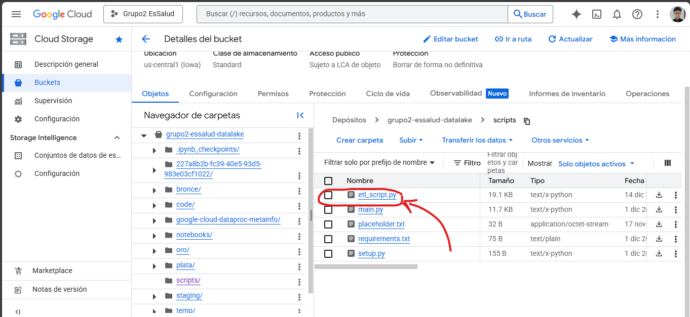

---

## 4. Creación de la Cloud Function

### 4.1 Acceso a Cloud Functions

Se ingresa a **Cloud Run Functions (Cloud Functions 2ª gen)** desde la consola de Google Cloud.

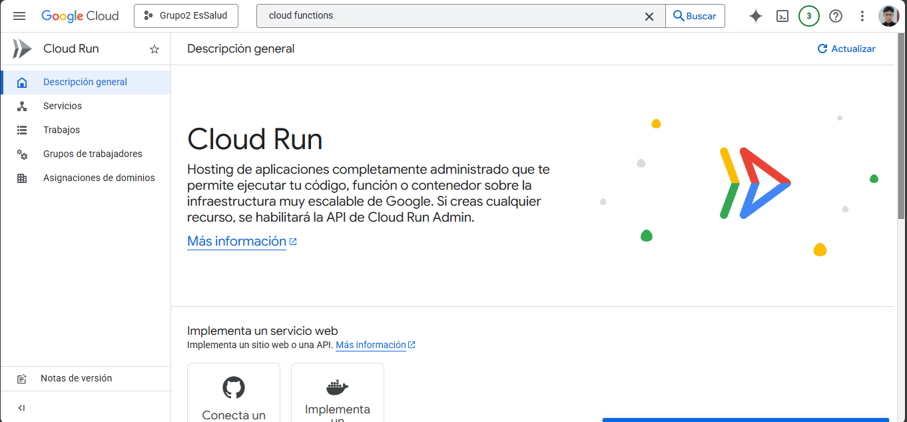

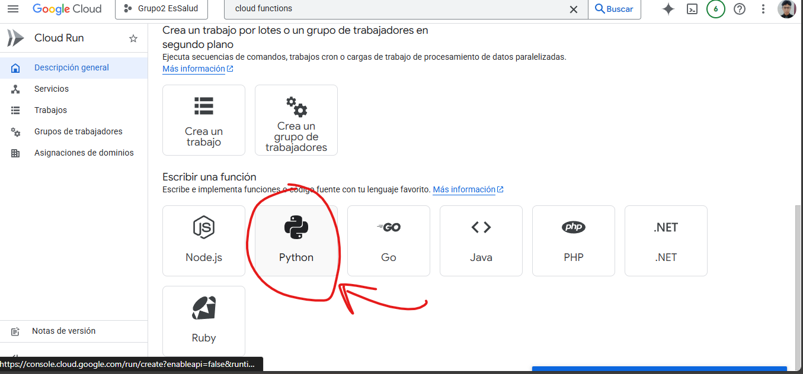

---

### 4.2 Configuración Inicial de la Función

En la pantalla de creación de la función se define:

* **Nombre de la función**
* **Región** (alineada con el bucket y Dataproc)

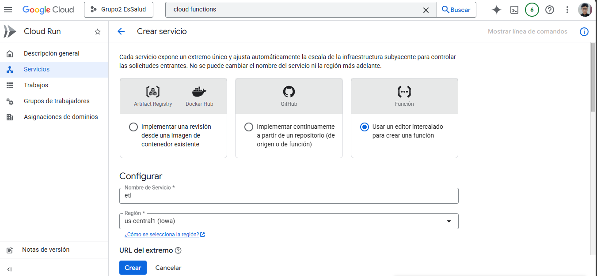

Posteriormente se configuran los parámetros de ejecución:

* **Runtime:** Python 3.10
* **Seguridad:** IAM
* **Activador:** Cloud Storage

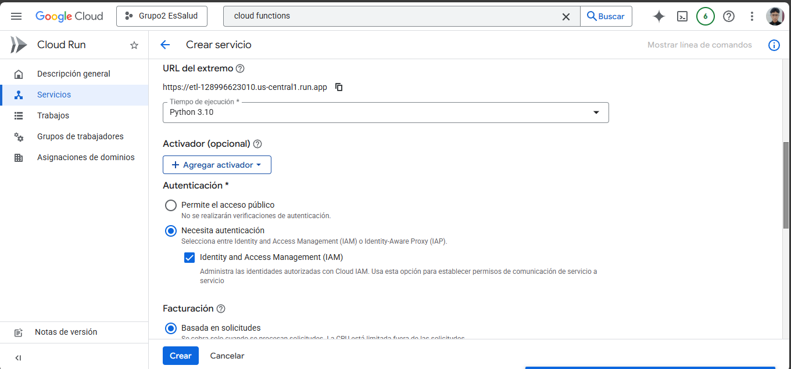

---

## 5. Configuración del Activador (Trigger)

La función se activa automáticamente al producirse eventos en Cloud Storage.

### 5.1 Tipo de Activador

* **Proveedor del evento:** Cloud Storage
* **Tipo de evento:** Finalización / creación de objeto
* **Filtro de ruta:** `bronce/*`

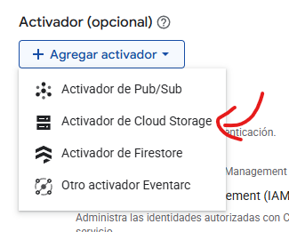

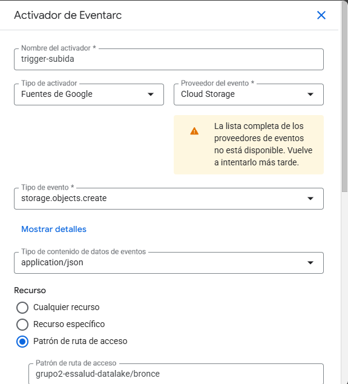

### 5.2 Ubicación y Cuenta de Servicio

Se define:

* **Ubicación del recurso**
* **Cuenta de servicio** con permisos para Dataproc y Cloud Storage

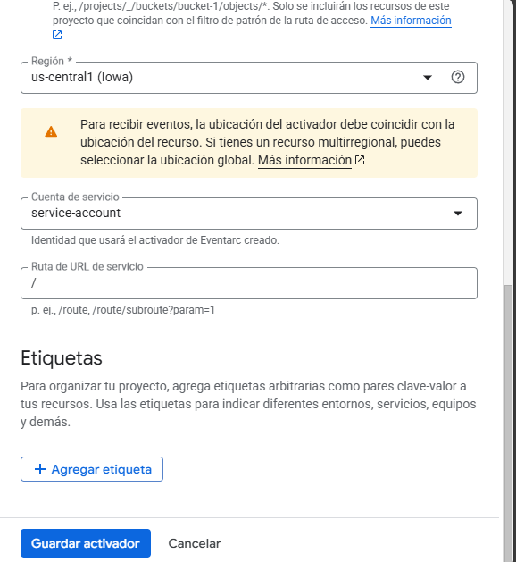

Una vez finalizado, se guarda el activador.

---

## 6. Código de la Cloud Function

Tras aceptar la configuración, se accede al editor de código de la función.

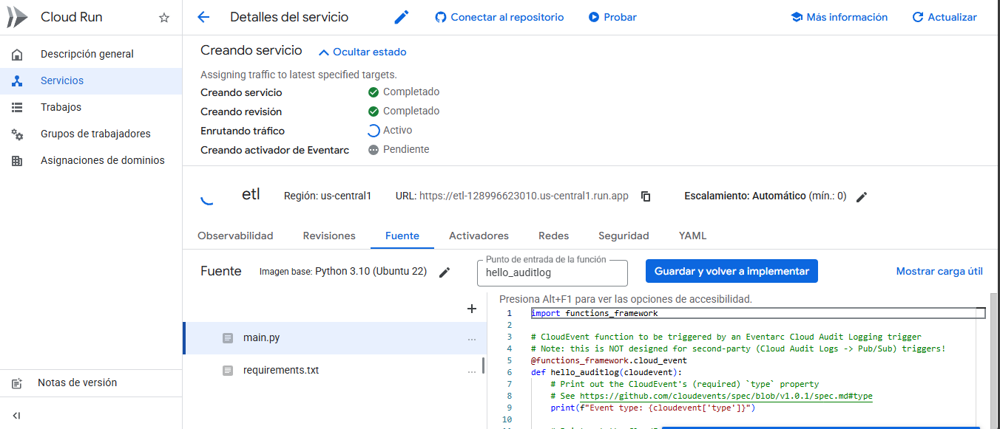

### 6.1 Archivo `main.py`

La función valida el archivo subido y lanza un **Job de Dataproc Serverless** para ejecutar el ETL.

```python
import functions_framework
from google.cloud import dataproc_v1 as dataproc

@functions_framework.cloud_event
def validar_archivo(cloud_event):

    # 1. Obtener datos del archivo subido
    data = cloud_event.data
    bucket_name = data["bucket"]
    file_name = data["name"]
    
    # Validar que el archivo pertenezca a la capa Bronce
    if not file_name.startswith("bronce/"):
        print(f"Ignorando archivo fuera de bronce: {file_name}")
        return "Ignorado"

    print(f"Archivo detectado: {file_name}. Iniciando Job de Dataproc...")

    # 2. Configuración del Job
    project_id = "grupo2-essalud"
    region = "us-central1"
    
    client = dataproc.BatchControllerClient(
        client_options={"api_endpoint": f"{region}-dataproc.googleapis.com:443"}
    )

    # 3. Definición del Batch (Spark Serverless)
    batch = dataproc.Batch()
    batch.pyspark_batch.main_python_file_uri = (
        f"gs://{bucket_name}/scripts/etl_script.py"
    )

    batch.pyspark_batch.jar_file_uris = [
        "gs://spark-lib/bigquery/spark-bigquery-with-dependencies_2.12-0.30.0.jar"
    ]
    
    batch.runtime_config.version = "2.0"

    # 4. Envío del Job
    parent = f"projects/{project_id}/locations/{region}"
    operation = client.create_batch(
        request={
            "parent": parent,
            "batch": batch,
            "batch_id": f"etl-{data['id']}"
        }
    )

    print(f"Job enviado a Dataproc: {operation.operation.name}")
    return "Job Enviado"
```

---

### 6.2 Archivo `requirements.txt`

Dependencias necesarias para la ejecución de la función:

```txt
functions-framework==3.*
google-cloud-dataproc
```

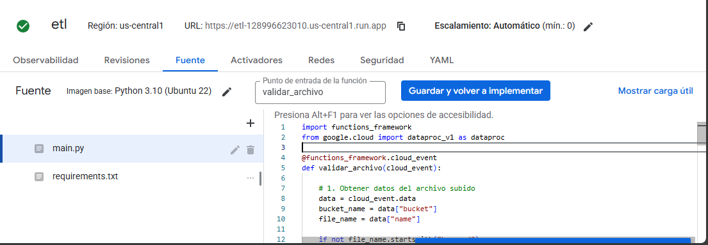

---

## 7. Despliegue de la Función

Una vez validado el código, se selecciona la opción **Guardar e Implementar**.

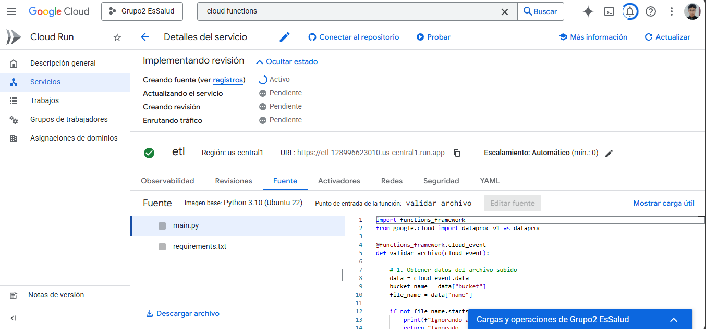

---

## 8. Prueba de Funcionamiento

### 8.1 Carga de Archivo de Prueba

Se vuelve a subir un archivo de prueba (`Diabetes.csv`) a la carpeta **bronce/** del bucket.


### 8.2 Validación de Logs

En los logs de la Cloud Function se verifica:

* Detección correcta del archivo
* Envío exitoso del Job a Dataproc

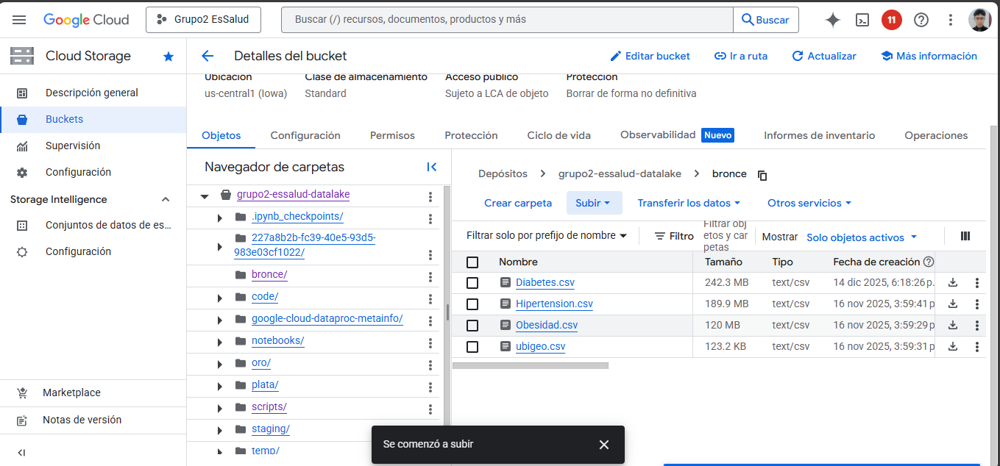

---

## 9. Resultado Final

Con esta configuración, el proceso ETL queda completamente **automatizado y orquestado**, logrando:

* Ejecución automática ante nuevos datos
* Uso eficiente de recursos con Dataproc Serverless
* Arquitectura escalable y desacoplada
* Base sólida para analítica avanzada y BI en tiempo casi real
