# Documentación Técnica y Evidencias de Ejecución

Este documento registra paso a paso la implementación de la solución, los scripts utilizados y las evidencias (logs) de la ejecución en vivo.

---

## Índice
1. [Ingestión y Estructuración (Bronce)](#1-ingestión-y-estructuración-bronce)
2. [Transformación y Modelo (Plata y Oro)](#2-transformación-y-modelo-plata-y-oro)
3. [Visualización (Power BI)](#3-visualización-power-bi)

---

## 1. Ingestión y Estructuración (Bronce)

### 1.1. Estructura y Carga vía CLI
A continuación, se detallan los comandos ejecutados para la creación del Data Lake.

**1. Autenticación y Configuración:**
```bash
gcloud auth login
gcloud config set project final-sin-andrade-saavedra

```

<div align="center">
  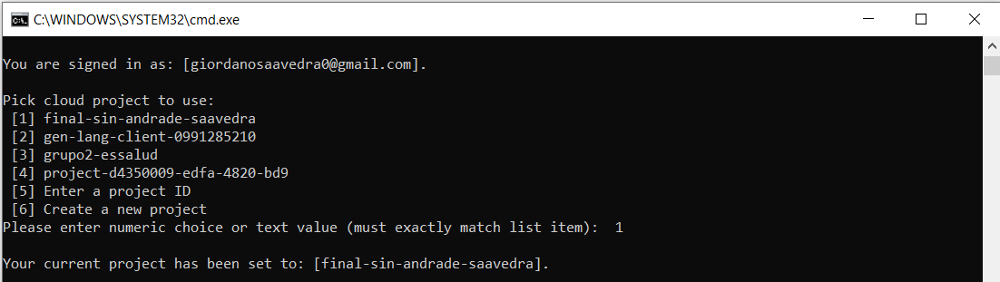
  <p><em>Figura 1: Evidencia de Autenticacion</em></p>
</div>

**2. Creación de Buckets y Carpetas:**

```bash
gsutil mb -l us-central1 gs://bucket-final-sin-andrade-saavedra/

type NUL > placeholder.txt
gsutil cp placeholder.txt gs://bucket-final-sin-andrade-saavedra/bronce/raw/
gsutil cp placeholder.txt gs://bucket-final-sin-andrade-saavedra/bronce/processed/
del placeholder.txt

```
<div align="center">
  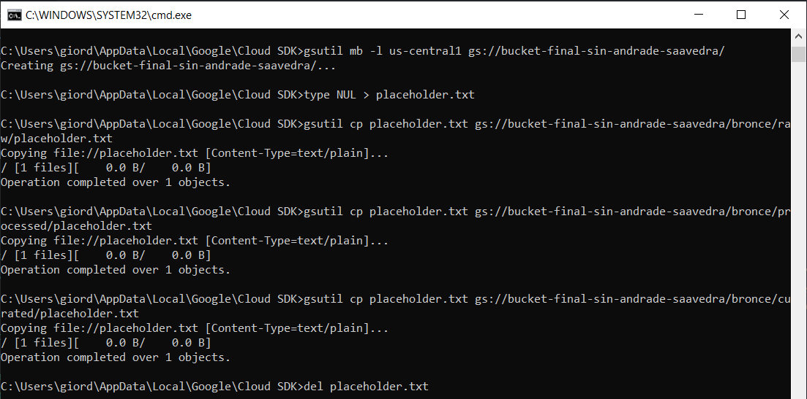
  <p><em>Figura 2: Evidencia de Creación Bucket</em></p>
</div>

**Estructura resultante en GCP:**
<div align="center">
  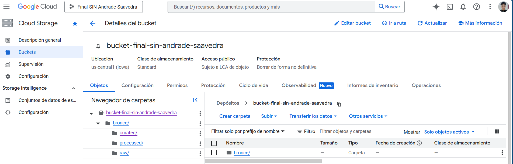
  <p><em>Figura 3: Evidencia de Storage Console</em></p>
</div>

**3. Subida de Datos:**

```bash
cd C:\Users\giord\OneDrive\Escritorio\Datos_Final

gsutil cp train.csv gs://bucket-final-sin-andrade-saavedra/bronce/raw/train.csv

```
<div align="center">
  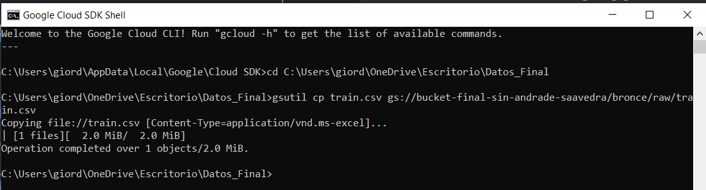
  <p><em>Figura 4: Evidencia de Subida de Datos</em></p>
</div>

<div align="center">
  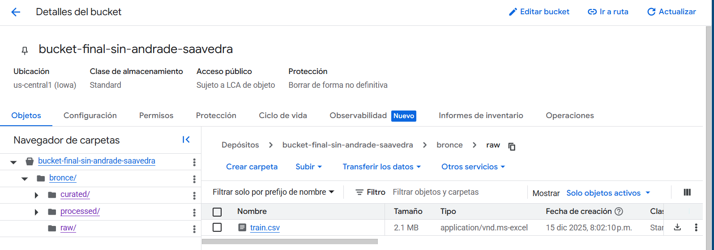
  <p><em>Figura 5: Evidencia de Subida en Storage Console</em></p>
</div>

### 1.2. Ejecución de EDA (Análisis Exploratorio)
Se ejecutó un script de Python preliminar para validar la calidad, dimensiones y consistencia de los datos antes de la ingesta.

* **Script utilizado:** [`eda.py`](../eda.py)
* **Evidencia Visual:**

<div align="center">
  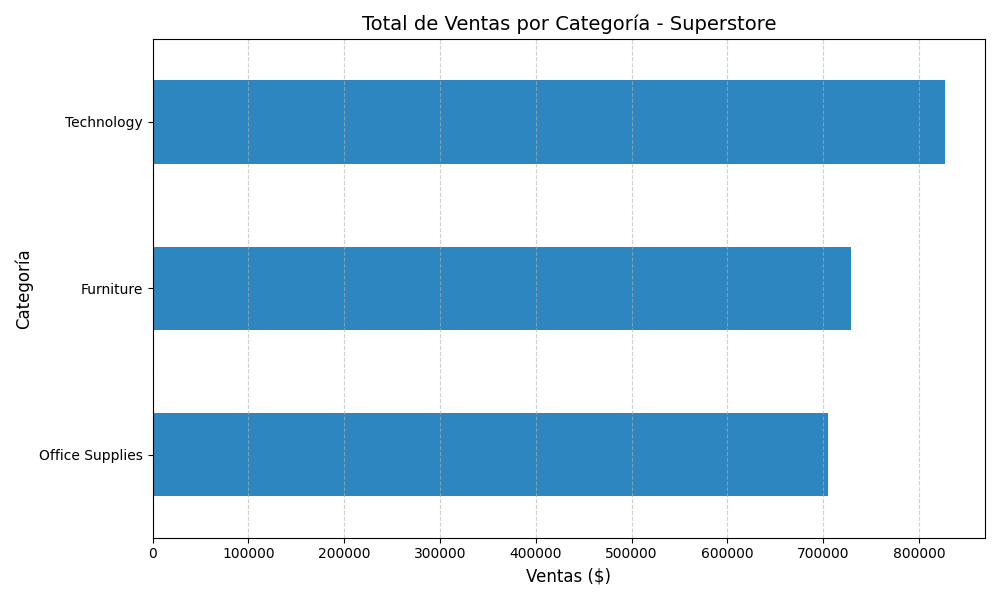
  <p><em>Figura 6: Gráfico de Ventas por Categoría</em></p>
</div>

**Hallazgos Principales:**

1. **Dimensiones:** El dataset consta de **9,800 registros** y **18 columnas**, representando un volumen transaccional adecuado para el análisis de series de tiempo.
2. **Calidad de Datos:** La integridad de los datos es alta. No se encontraron filas duplicadas. Respecto a valores faltantes, el impacto es insignificante:

| Columna | Nulos Detectados | Impacto | Acción Recomendada |
| --- | --- | --- | --- |
| **postal_code** | 11 | Bajo (<0.1%) | Dato geográfico secundario. Al ser mínima la pérdida, se puede imputar con la moda de la ciudad o filtrar si se requiere precisión a nivel de código postal. |

3. **Tipos de Datos y Transformación:**
* **Fechas:** Las columnas críticas `order_date` y `ship_date` se detectaron como tipo `object` (texto). Es **mandatorio** realizar un *casting* a `datetime` en la capa Plata para permitir la inteligencia de tiempo en Power BI.
* **Métricas:** La columna `sales` se encuentra correctamente tipada como `float64`, lista para agregaciones.

---

## 2. Transformación y Modelo (Plata y Oro)

### 2.1. Configuración de Entorno (APIs y Permisos)

Para asegurar el flujo automatizado y el acceso a los servicios, se habilitaron las APIs necesarias y se configuraron los permisos de Eventarc/Storage.

**1. Activación de APIs y Servicios:**

```bash
gcloud services enable \
  cloudfunctions.googleapis.com \
  run.googleapis.com \
  artifactregistry.googleapis.com \
  cloudbuild.googleapis.com \
  eventarc.googleapis.com \
  bigquery.googleapis.com \
  storage.googleapis.com

```

<div align="center">
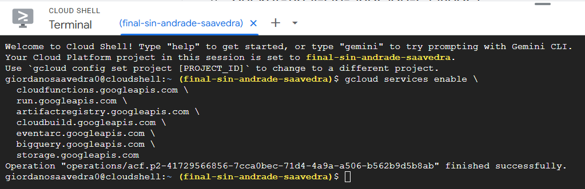
<p><em>Figura 7: Ejecución exitosa de la activación de APIs requeridas.</em></p>
</div>

**2. Asignación de Permisos (Eventarc/Storage):**

Se configuró el rol `pubsub.publisher` a la Cuenta de Servicio de Google Storage para permitir que Eventarc detecte los cambios en el bucket, resolviendo el error de validación inicial.

```bash
gcloud beta services identity create --service=storage.googleapis.com --project=final-sin-andrade-saavedra
gcloud projects add-iam-policy-binding final-sin-andrade-saavedra --member="serviceAccount:service-41729566856@gs-project-accounts.iam.gserviceaccount.com" --role="roles/pubsub.publisher"

```

### 2.2. Creación de Datasets Destino (BigQuery)
Se crearon los Datasets para recibir los datos procesados, siguiendo la arquitectura Medallion (Plata para limpieza, Oro para KPIs).

```bash
bq mk --location=us-central1 ds_silver
bq mk --location=us-central1 ds_gold

```

<div align="center">
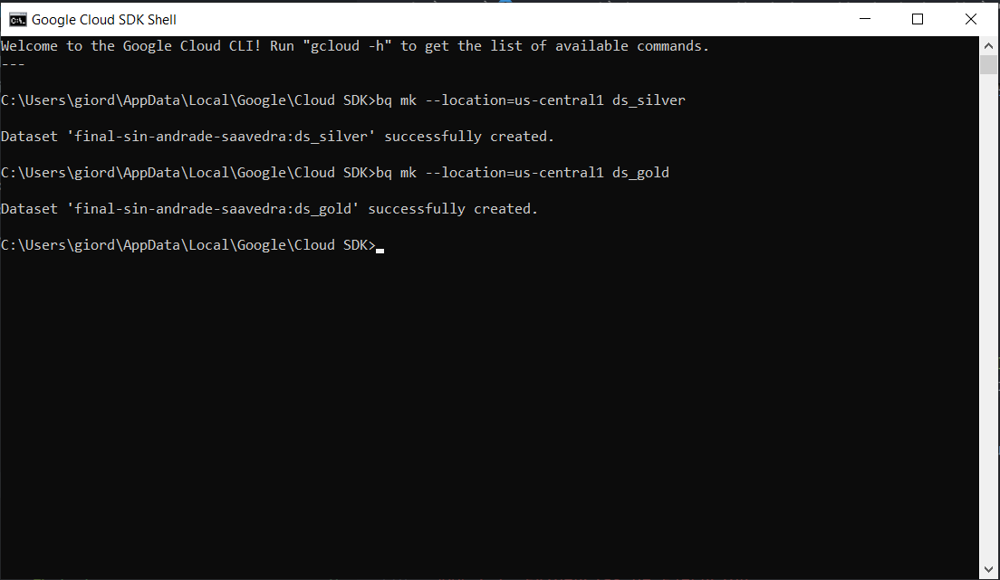
<p><em>Figura 8: Ejecución CLI para creación de datasets.</em></p>
</div>

<div align="center">
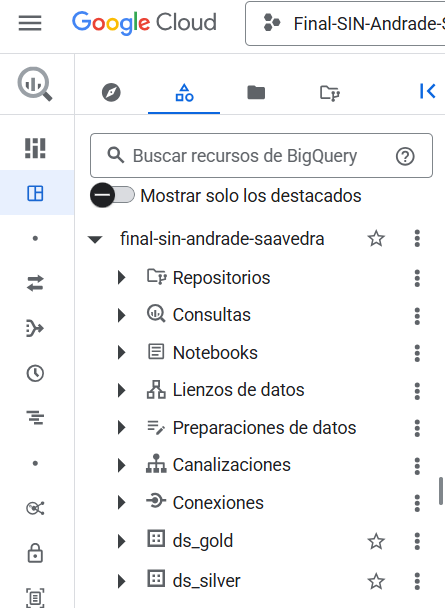
<p><em>Figura 9: Comprobación de creación en la consola de BigQuery.</em></p>
</div>

### 2.3. Despliegue de la Cloud Function (ETL Automático)
El procesamiento de datos se realiza mediante un script de Python dentro de una **Cloud Function (Gen 2)** que se dispara automáticamente al ingresar un archivo.

* **Trigger:** `google.storage.object.v1.finalized`
* **Runtime:** Python 3.10
* **Script Principal:** [`../Scripts/main.py`](../Scripts/main.py)

**Comando de Despliegue:**

```bash
cd C:\Github\SI807_Cloud_BI_2025\grupo02_essalud\ExFinal\Solucion_Individual\Andrade_Saavedra\Scripts

gcloud functions deploy funcion-final-etl --gen2 --runtime=python310 --region=us-central1 --source=. --entry-point=procesar_etl --trigger-event-filters="type=google.cloud.storage.object.v1.finalized" --trigger-event-filters="bucket=bucket-final-sin-andrade-saavedra"
```

### 2.4. Evidencias de Ejecución
El script procesa Bronce \to Plata \to Oro automáticamente.

**Captura de Logs en Vivo (Cloud Logging):**
<div align="center">
  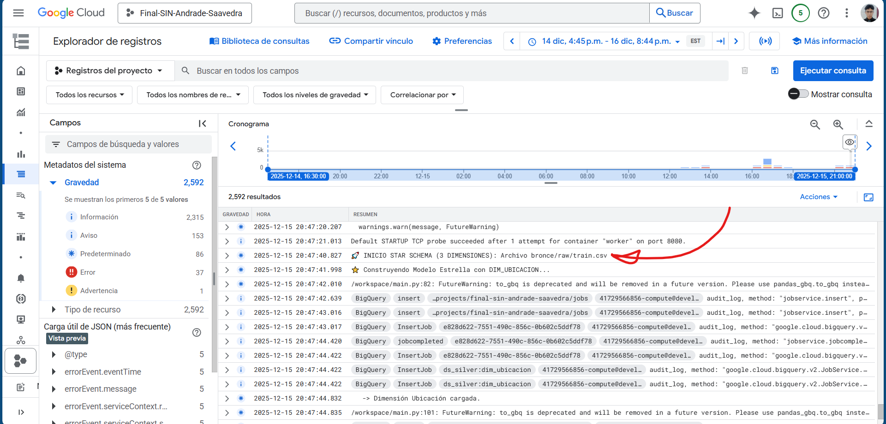
  <p><em>Figura 10: Logs Capturados parte inicial</em></p>
</div>
<div align="center">
  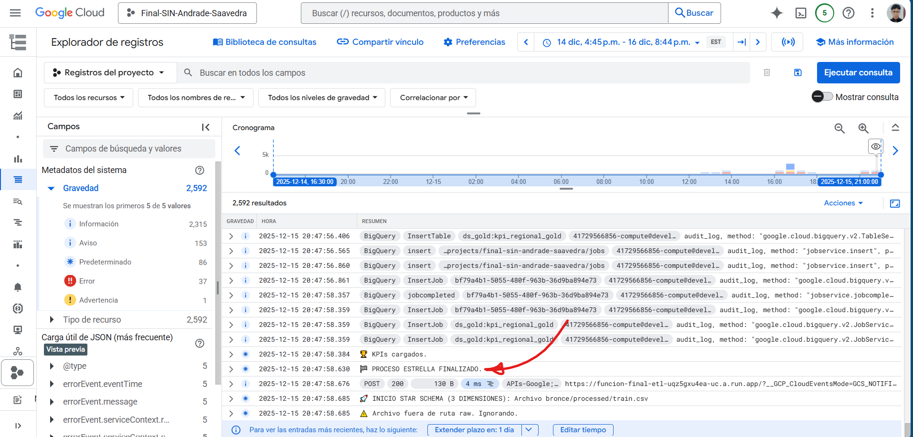
  <p><em>Figura 11: Logs Capturados parte final</em></p>
</div>
*Se observa la lectura del archivo, limpieza y carga exitosa.*

**Validación de Tablas en BigQuery:**
<div align="center">
  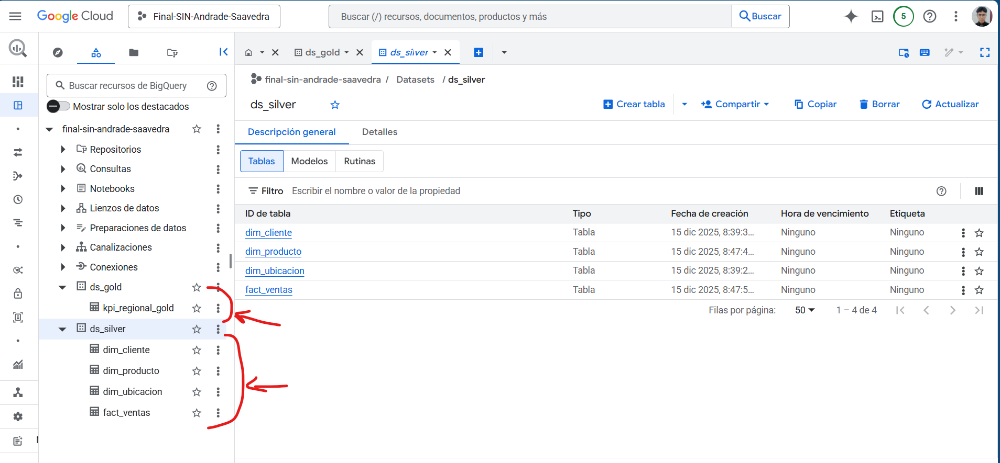
  <p><em>Figura 12: Tablas Creadas con el Cloud Functions</em></p>
</div>

### 2.3. Modelo Estrella Resultante
Esquema relacional implementado en la Capa Oro:

<div align="center">
    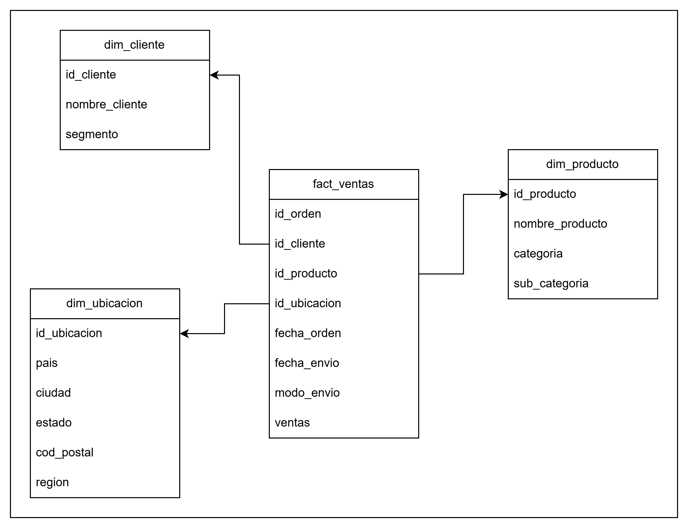
    <p><em>Figura 13: Modelo Estrella</em></p>
</div>

---

## 3. Visualización (Power BI)

### 3.1. ConexiónConexión directa mediante conector "Google BigQuery".

**DETALLE:** Otorgué permisos para clear una clave para la cuenta de servicios a la cuenta: `fgarcia@webconceptos.com`

<div align="center">
    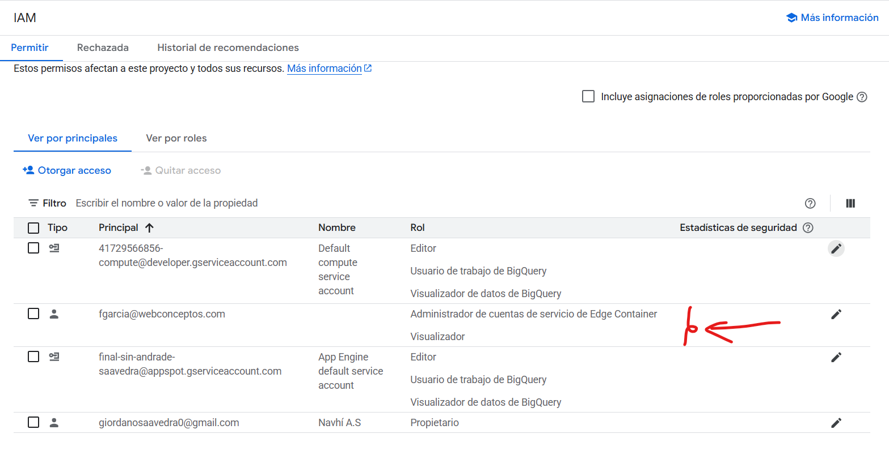
    <p><em>Figura 10: Permisos otorgados al correo del profesor</em></p>
</div>

<div align="center">
    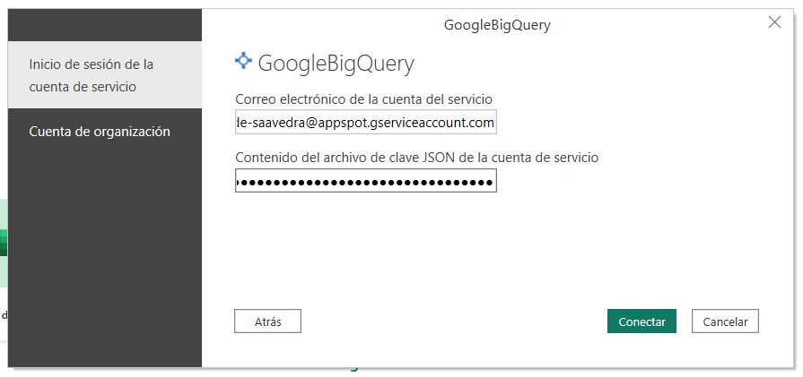
    <p><em>Figura 11: Conectando con Power BI</em></p>
</div>

<div align="center">
    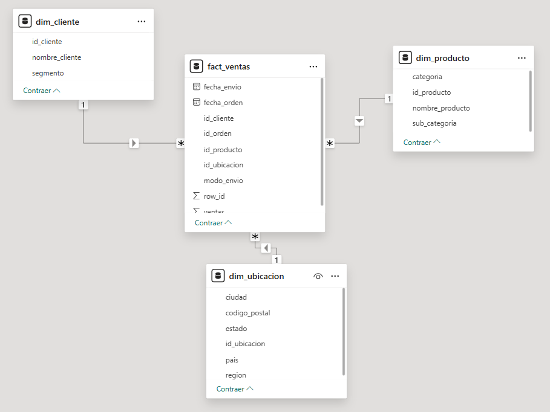
    <p><em>Figura 12: Esquema de datos en Power BI</em></p>
</div>


### 3.2. Dashboards Finales

**Tablero 1: Resumen Gerencial**
<div align="center">
    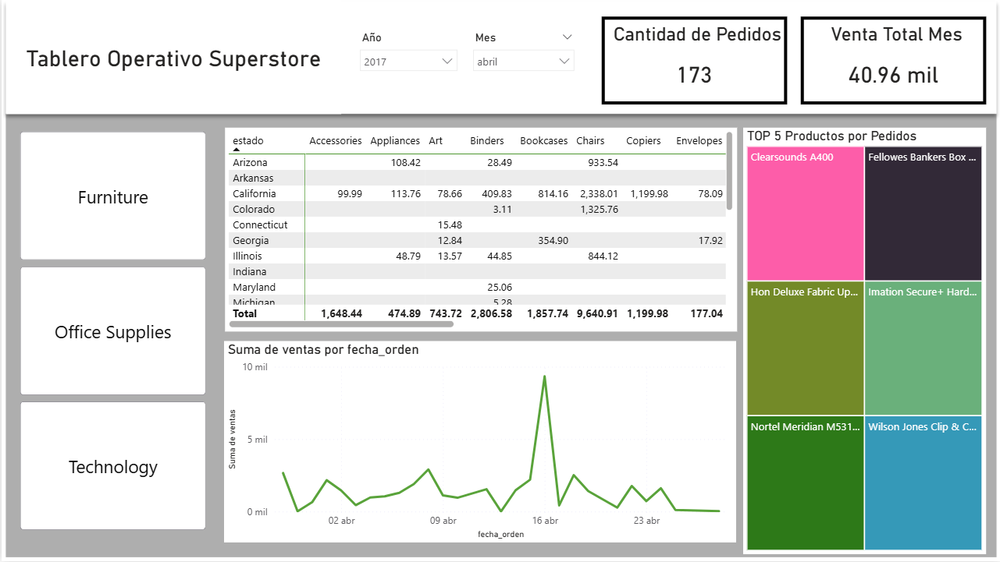
    <p><em>Figura 13: Dashboard 1</em></p>
</div>
*Muestra los KPIs principales definidos en la sección 3 del README principal.*

**Tablero 2: Detalle Operativo**
<div align="center">
    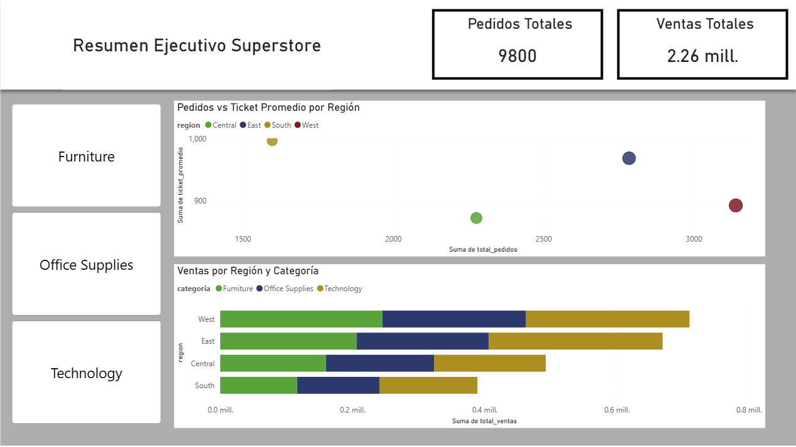
    <p><em>Figura 14: Dashboard 2</em></p>
</div>

