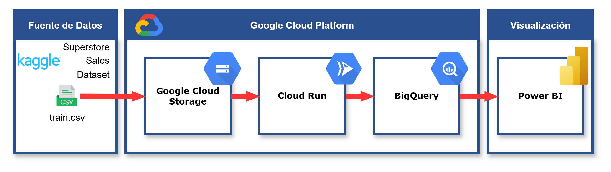

# Solución de Inteligencia de Negocios en la Nube (GCP)

* **Curso:** Sistema de Inteligencia de Negocios
* **Estudiante:** Andrade Saavedra, Navhi Giordano
* **Fecha:** 15/12/2025

---

## 1. Selección de la Nube y Justificación Técnica

Para la implementación de esta solución de Business Intelligence se ha seleccionado **Google Cloud Platform (GCP)**. La elección se fundamenta en los siguientes criterios técnicos:

### 1.1. Arquitectura "Event-Driven" (Automatización)
GCP permite una arquitectura basada en eventos mediante **Cloud Functions (2nd Gen)**. Esto cumple con el requisito crítico de ejecutar el ETL automáticamente al detectar un nuevo archivo CSV en el Data Lake (Storage), asegurando un procesamiento en tiempo real sin intervención manual.

### 1.2. BigQuery (Serverless Data Warehouse)
Al utilizar BigQuery, desacoplamos el almacenamiento del cómputo, permitiendo:
* **Velocidad:** Transformación de datos masiva mediante SQL y Python.
* **Integración:** Conexión nativa y optimizada con Power BI.

### 1.3. Stack Python Nativo
El uso de librerías como `functions-framework` y `pandas-gbq` asegura un código limpio, mantenible y escalable, alineado con los estándares de la industria.

---

## 2. Arquitectura de la Solución

El flujo de datos implementado sigue el patrón ELT/ETL automatizado:

1.  **Ingesta:** Carga del CSV en **Cloud Storage** (Capa Bronce).
2.  **Disparador:** Evento automático activa la **Cloud Function**.
3.  **Procesamiento:** Script Python limpia datos, calcula KPIs y carga a **BigQuery** (Capas Plata y Oro).
4.  **Visualización:** **Power BI** consume las vistas finales.

  
  
<em>Figura 1: Diagrama de Arquitectura de la Solución</em>

---

## 3. Justificación del Modelo y Visualización

### 3.1. Modelo Dimensional (Estrella)
Se ha diseñado un modelo estrella en la capa Oro para optimizar el rendimiento de las consultas en Power BI:
* **Tablas de Hechos:** Centraliza las métricas transaccionales.
* **Tablas de Dimensión:** Desnormalizadas para facilitar el filtrado por atributos.

    
    
<em>Figura 2: Modelo Estrella</em>

### 3.2. Definición de KPIs y Métricas
Se han seleccionado cuatro indicadores clave para el dashboard, diseñados para ofrecer una visión 360° del negocio (Temporal, Financiera, Producto y Geográfica):

* **KPI 1: Evolución de Ventas (Semanal/Mensual)**
    * **Definición:** Suma total de ventas (`sales`) agrupada por jerarquía de fechas.
    * **Objetivo:** Identificar tendencias, picos estacionales y caídas abruptas a lo largo del tiempo.
    * **Visualización:** Gráfico de Líneas o Áreas (para ver la continuidad).

* **KPI 2: Variación Porcentual de Ventas (Growth Rate)**
    * **Definición:** Comparación del periodo actual vs. el periodo anterior (Mes actual vs. Mes anterior).
        * *Fórmula:* $((Ventas Actuales - Ventas Anteriores) / Ventas Anteriores) * 100$
    * **Objetivo:** Medir la "velocidad" de crecimiento del negocio.
    * **Visualización:** Tarjeta (Card) con indicador de flecha y **formato condicional (semáforo)**.

* **KPI 3: Top 10 Productos Más Vendidos**
    * **Definición:** Ranking de productos ordenados descendentemente por volumen de ventas.
    * **Objetivo:** Aplicar la Ley de Pareto (80/20) para enfocar esfuerzos de inventario y marketing en los artículos "estrella".
    * **Visualización:** Gráfico de Barras Horizontales (facilita la lectura de nombres largos).

* **KPI 4: Rentabilidad y Ticket Promedio por Región**
    * **Definición:** Análisis del valor monetario generado dividido por zonas geográficas.
    * **Objetivo:** Detectar zonas de alto valor frente a zonas con bajo desempeño.
    * **Visualización:** Mapa de calor (Map Chart) o Matriz.

* **Sustento de Diseño:**
    Se prioriza la **"Glanceability"** (lectura rápida). Los KPIs de alto nivel (Ventas y Variación) se colocarán en la parte superior (encabezado), mientras que los desgloses detallados (Productos y Región) ocuparán el cuerpo del reporte para el análisis profundo (Drill-down).

---

* **Dashboard Final Funcional:** **[Dashboard Final](Docs/Informe_Final_Andrade_Saavedra.pbix)**

---

## 4. Reproducibilidad

Para reproducir esta solución paso a paso y ver las evidencias de ejecución, por favor consulte la documentación técnica detallada:

👉 **[Ver Documentación Técnica y Evidencias (Docs)](Docs/README.md)**