# Seguridad, IAM, Redes y Gobernanza

## 1) IAM *granular* por usuario y por servicio

**Resumen:** quita `roles/editor` a los correos y asigna roles más específicos por recurso/servicio.

```bash
PROJECT="grupo2-essalud"
# Usuarios
USER_OWNER="giordanosaavedra0@gmail.com"
USER_DAVID="david1237891712@gmail.com"
USER_JHON="jhon.carhuas.r@uni.pe"

# 1) REMOVER role/editor
gcloud projects remove-iam-policy-binding $PROJECT \
  --member="user:${USER_DAVID}" --role="roles/editor"
gcloud projects remove-iam-policy-binding $PROJECT \
  --member="user:${USER_JHON}" --role="roles/editor"

# 2) ASIGNAR roles más granulares
# David: necesita Cloud Storage (editar), Dataflow (editar) y BigQuery (editar)
gcloud projects add-iam-policy-binding $PROJECT \
  --member="user:${USER_DAVID}" --role="roles/storage.objectAdmin"
gcloud projects add-iam-policy-binding $PROJECT \
  --member="user:${USER_DAVID}" --role="roles/dataflow.developer"
gcloud projects add-iam-policy-binding $PROJECT \
  --member="user:${USER_DAVID}" --role="roles/bigquery.dataEditor"

# Jhon: Cloud Storage (editar), Dataproc (editar), BigQuery (usar)
gcloud projects add-iam-policy-binding $PROJECT \
  --member="user:${USER_JHON}" --role="roles/storage.objectAdmin"
gcloud projects add-iam-policy-binding $PROJECT \
  --member="user:${USER_JHON}" --role="roles/dataproc.editor"
gcloud projects add-iam-policy-binding $PROJECT \
  --member="user:${USER_JHON}" --role="roles/bigquery.jobUser"
```

### Pruebas

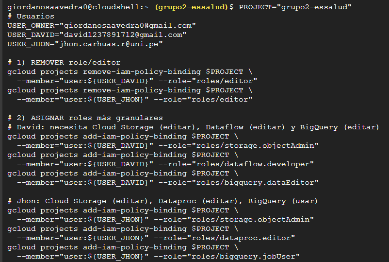

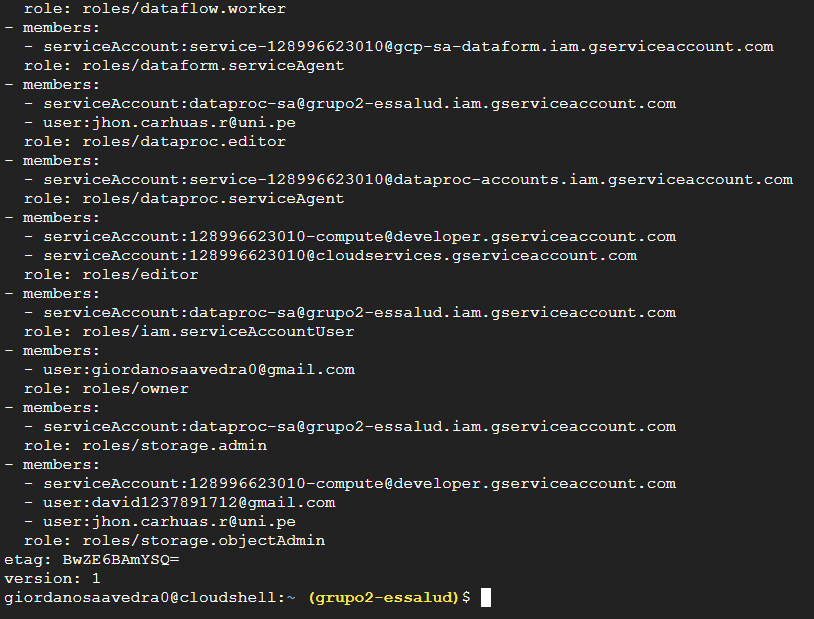


## 2) IAM por *servicio* y Service Accounts

**Objetivo:** no usar cuentas de usuario para trabajos automáticos: crear service accounts por servicio (Dataproc, Dataflow, Composer) y limitarles permisos.

```bash
PROJECT="grupo2-essalud"

## crear SA para dataflow
gcloud iam service-accounts create dataflow-sa \
  --project=$PROJECT --display-name="service-account-dataflow"

## dar roles mínimos
gcloud projects add-iam-policy-binding $PROJECT \
  --member="serviceAccount:dataflow-sa@${PROJECT}.iam.gserviceaccount.com" \
  --role="roles/dataflow.worker"

## Para composer (si usas Composer) y darle permiso para impersonate ejecutar jobs:
gcloud projects add-iam-policy-binding $PROJECT \
  --member="serviceAccount:dataflow-sa@${PROJECT}.iam.gserviceaccount.com" \
  --role="roles/iam.serviceAccountUser"
```

### Pruebas
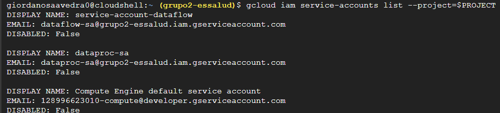

---

## 3) Políticas JSON / uso de CLI para evidencia

* Obtener la policy actual:

```bash
gcloud projects get-iam-policy $PROJECT --format=json > policy.json

nano policy.json
```

### Pruebas
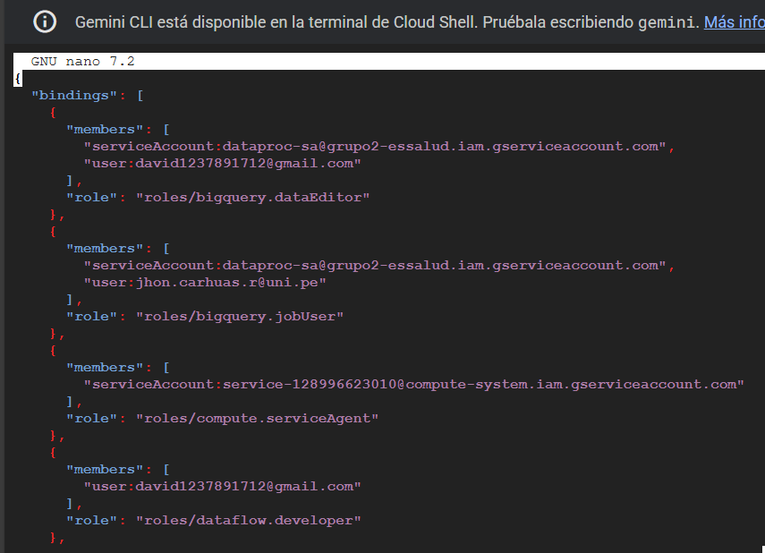
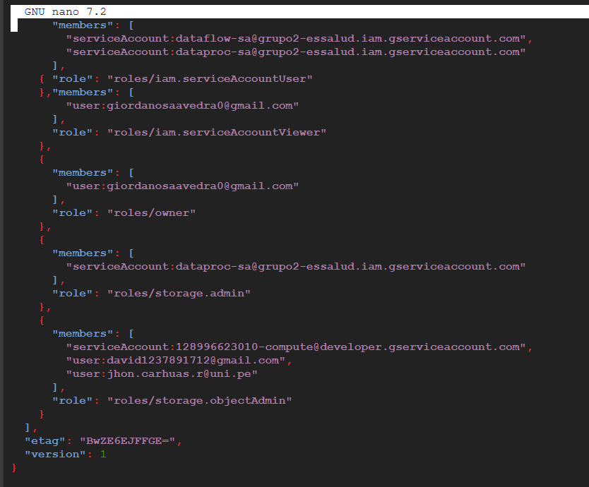

---

## 4) VPC/VNet personalizada: subredes públicas / privadas

**Objetivo:** una VPC con subred pública para ingreso controlado y privada para recursos.

```bash
VPC_NAME="vpc-essalud"
REGION="us-central1"

## Crear VPC modo custom
gcloud compute networks create $VPC_NAME --subnet-mode=custom

## Subnet pública
gcloud compute networks subnets create ${VPC_NAME}-public \
  --network=$VPC_NAME --region=$REGION --range=10.10.0.0/24 \
  --enable-flow-logs

## Subnet privada
gcloud compute networks subnets create ${VPC_NAME}-private \
  --network=$VPC_NAME --region=$REGION --range=10.10.1.0/24 \
  --enable-private-ip-google-access --enable-flow-logs
```

### Pruebas
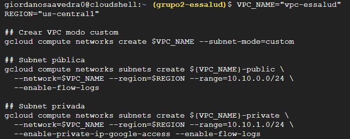
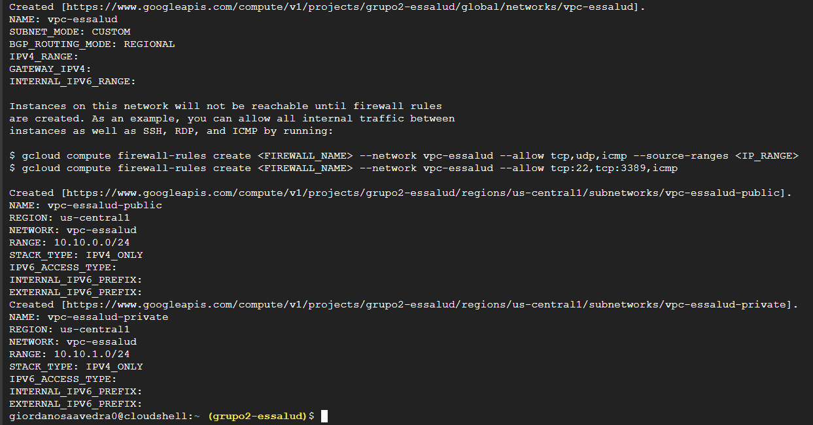

---

## 5) Firewalls / Security Groups configurados por puertos/servicios

**Reglas firewall:**

```bash
## 1) Denegar todo por defect
## Permitir SSH desde IP
gcloud compute firewall-rules create allow-ssh-from-home \
  --network=$VPC_NAME --direction=INGRESS --action=ALLOW \
  --rules=tcp:22 --source-ranges=1.2.3.4/32 \
  --description="SSH only from my IP"

## Permitir tráfico entre subnets
gcloud compute firewall-rules create allow-internal \
  --network=$VPC_NAME --direction=INGRESS --action=ALLOW \
  --rules=tcp:1-65535,udp:1-65535,icmp \
  --source-ranges=10.10.0.0/16

## Permitir los puertos necesarios para Dataproc Web UI
gcloud compute firewall-rules create allow-dataproc-ui \
  --network=$VPC_NAME --direction=INGRESS --action=ALLOW \
  --rules=tcp:8088,tcp:8080 \
  --source-ranges=0.0.0.0/0
```

### Pruebas
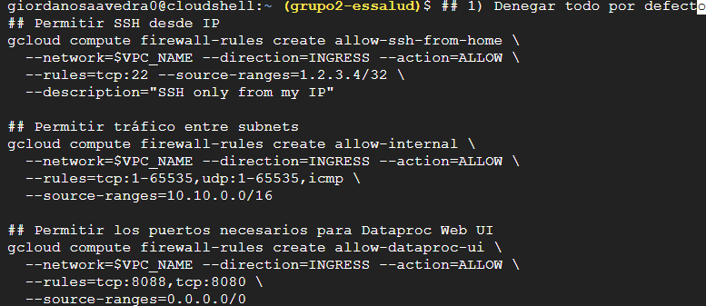
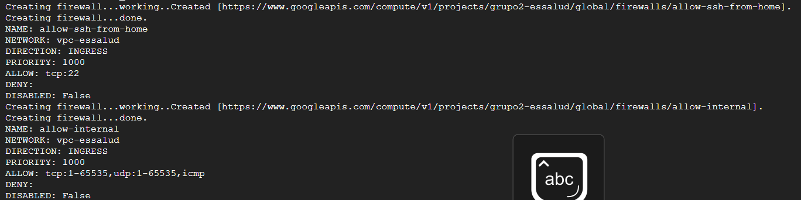
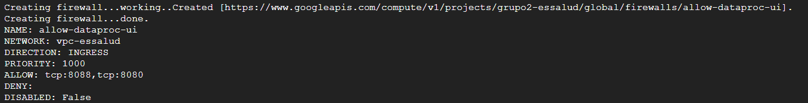

---

## 6) Cifrado en tránsito y en reposo con KMS / CMEK

**Cifrado en tránsito:** GCP cifra el tráfico entre servicios de Google automáticamente; para conexiones externas usa TLS. Para conexiones internas asegúrate que tus aplicaciones usen TLS.

**Cifrado en reposo (CMEK):** crear KeyRing y CryptoKey y asignarlos a recursos (Cloud Storage, BigQuery, Pub/Sub, etc).

Comandos:

```bash
LOCATION="us-central1"
KEYRING="kr-essalud"
CRYPTOKEY="ck-essalud"

## Crear KeyRing y Key
gcloud kms keyrings create $KEYRING --location=$LOCATION --project=$PROJECT
gcloud kms keys create $CRYPTOKEY --location=$LOCATION --keyring=$KEYRING \
  --purpose=encryption --project=$PROJECT

## Permitir uso de la clave al SA dataprocs
gcloud kms keys add-iam-policy-binding projects/$PROJECT/locations/$LOCATION/keyRings/$KEYRING/cryptoKeys/$CRYPTOKEY \
  --member="serviceAccount:dataproc-sa@${PROJECT}.iam.gserviceaccount.com" \
  --role="roles/cloudkms.cryptoKeyEncrypterDecrypter"

## Usar CMEK en un bucket
gsutil kms encryption -k projects/$PROJECT/locations/$LOCATION/keyRings/$KEYRING/cryptoKeys/$CRYPTOKEY \
  gs://grupo2-essalud-datalake
```

### Pruebas
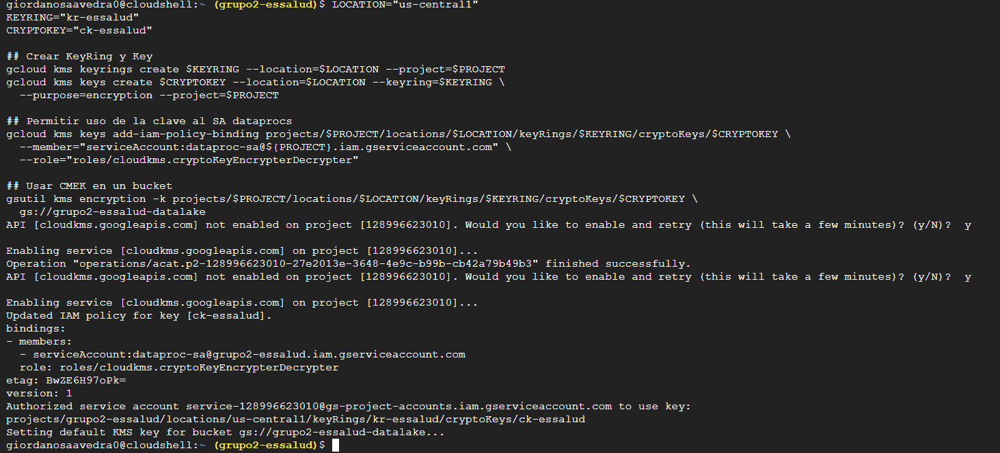
---

## 7) Auditoría activa

* **Admin Activity logs** se habilitan por defecto. Para **Data Access audit logs** normalmente están deshabilitados por defecto por coste y se activan a nivel de proyecto/organización.

Pasos rápidos:

1. Habilitar Data Access audit logs para servicios relevantes

### PASOS:
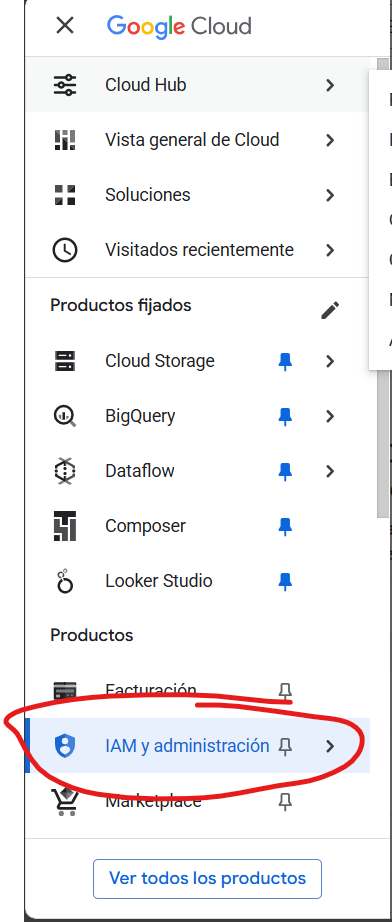

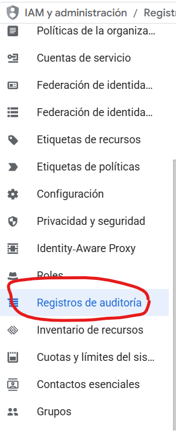

* Activando la escritura y visualización de las apps principales
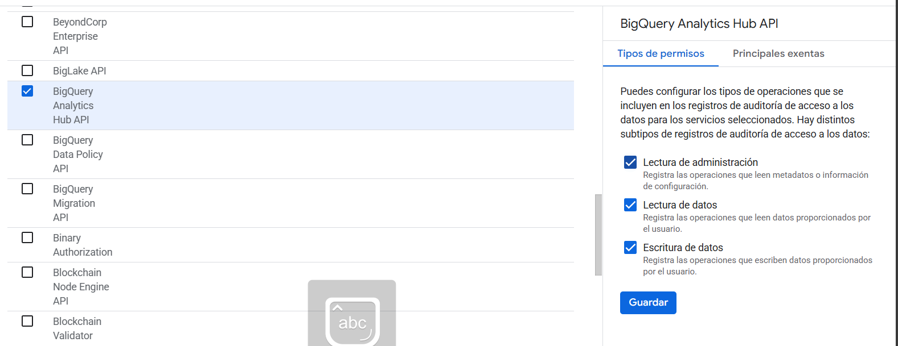
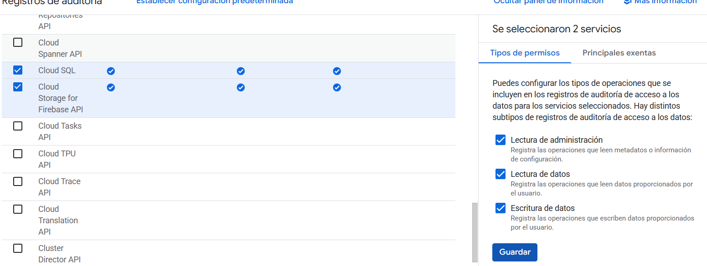
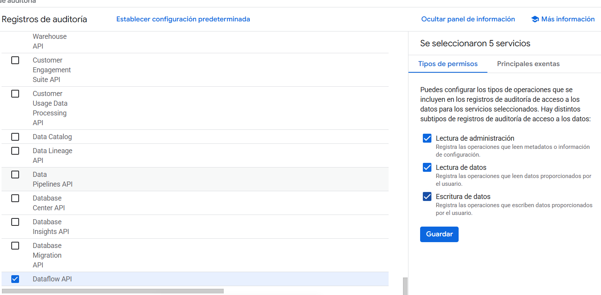

2. Crear sink para exportar logs:

```bash
## Crear bucket para logs o dataset BigQuery
gsutil mb -p $PROJECT gs://audit-logs-${PROJECT}

## Crear sink que exporte audit logs al bucket
gcloud logging sinks create sink-audit storage.googleapis.com/audit-logs-${PROJECT} \
  --log-filter='logName:"cloudaudit.googleapis.com"' \
  --project=$PROJECT

## Dar permiso al sink service account para escribir al bucket
SINK_SA=$(gcloud logging sinks describe sink-audit --project=$PROJECT --format='value(writerIdentity)')
gsutil iam ch ${SINK_SA}:objectCreator gs://audit-logs-${PROJECT}
```
### Pruebas
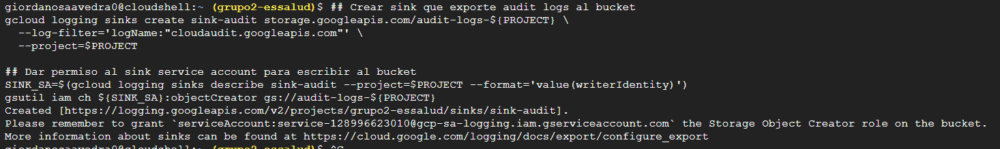

---

## 8) Conectividad segura entre servicios Private Service Connect

1. Haciendo la conexión
```bash
gcloud compute networks subnets update vpc-essalud-private \
  --region=us-central1 \
  --enable-private-ip-google-access
```

### Prueba
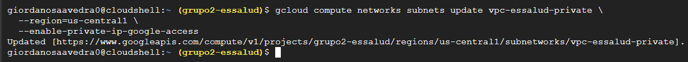


2. Comprobando la conexión

```bash
gcloud compute networks subnets describe vpc-essalud-private \
  --region=us-central1 \
  --format="table(name,region,enablePrivateIpGoogleAccess)"
```

### Prueba
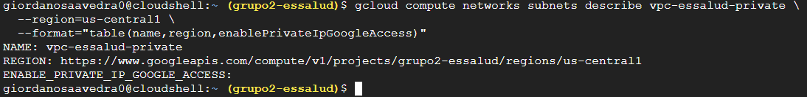

---

## 9) Evidencia

1. Consola IAM Final

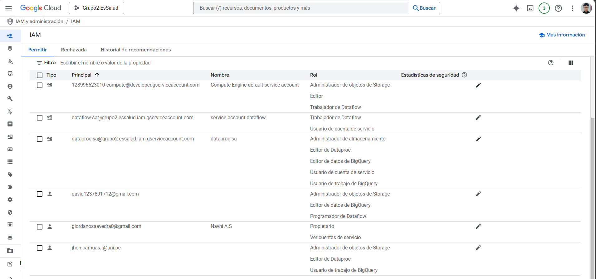


2. Comprobar funcionamiento en terminal

```bash
gcloud projects get-iam-policy $PROJECT
```

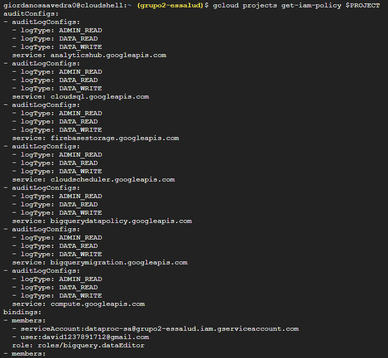
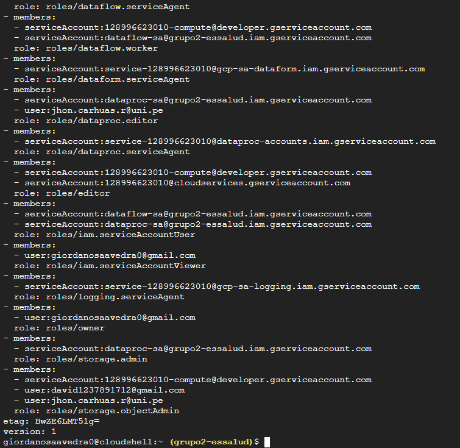

```bash
gcloud compute firewall-rules list
```

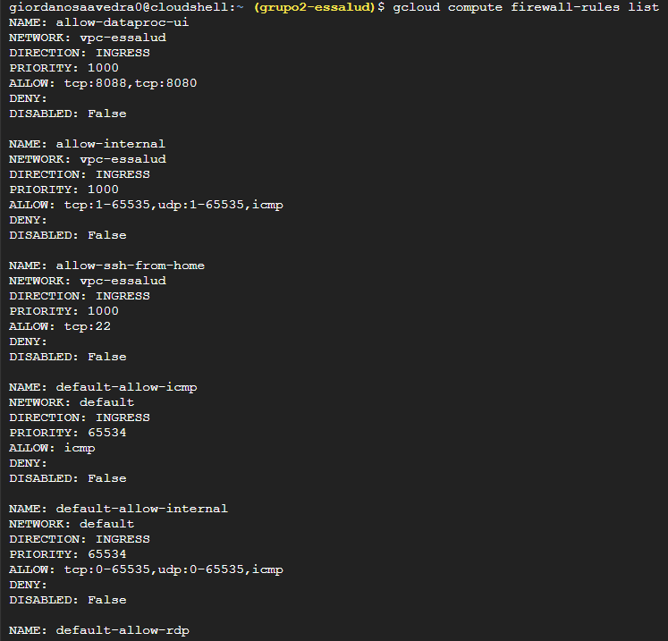
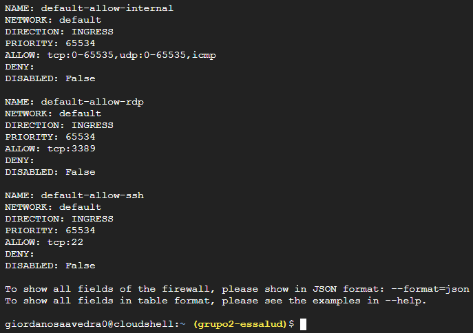

```bash
gcloud kms keyrings list --location=us-central1 --project=$PROJECT

gcloud kms keys list   --location=us-central1   --keyring=kr-essalud   --project=$PROJECT
```

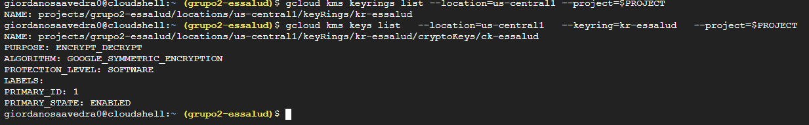

```bash
gsutil ls -L -b gs://grupo2-essalud-datalake
```

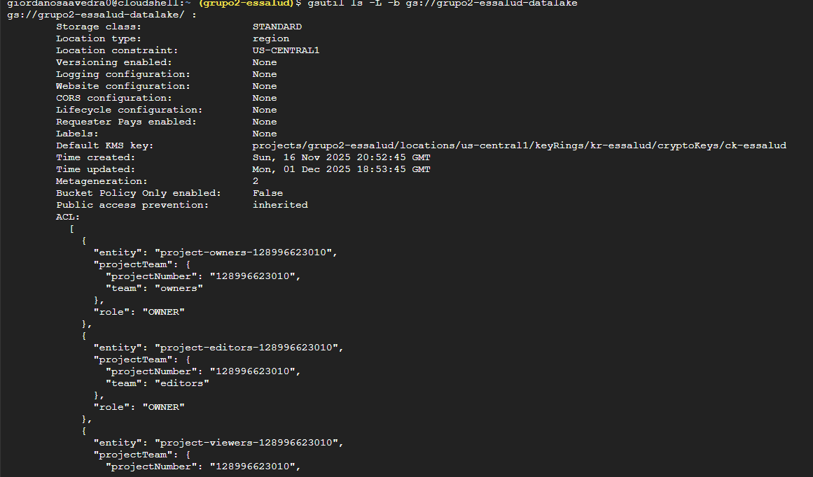
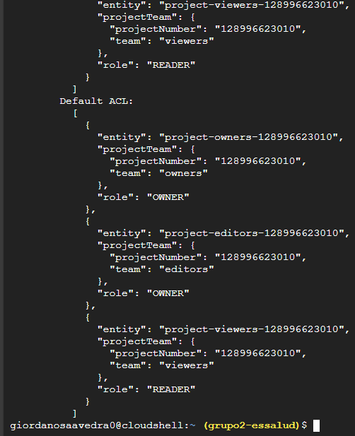

```bash
gcloud logging sinks list
```


