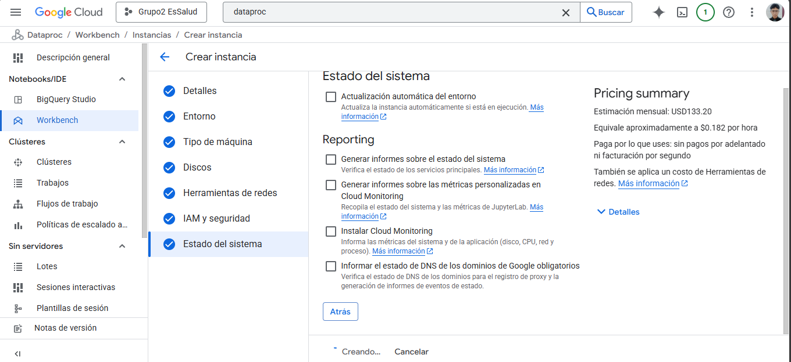
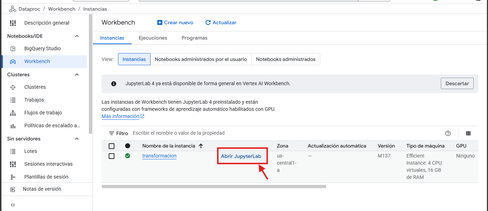
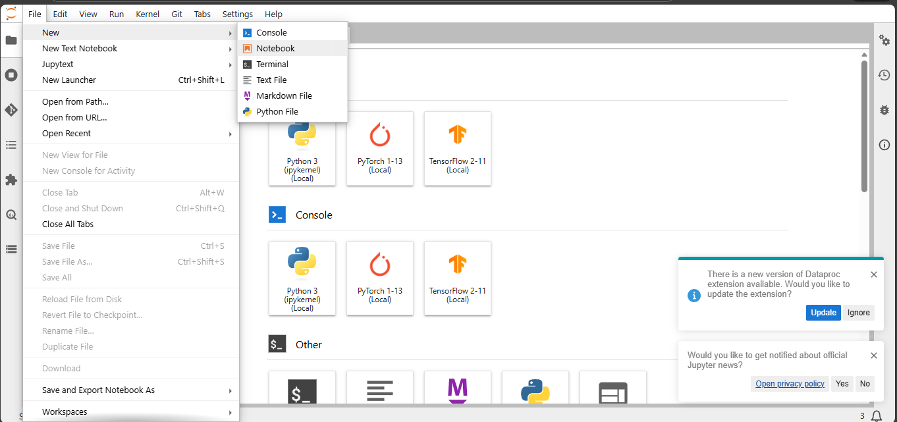
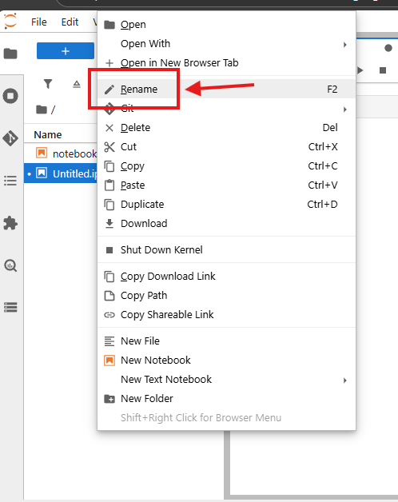

# Transformacion de datos

Primero creamos una instancia llamada "transformacion" para hacer nuestros jupyter notebooks para testear la transformacion y lugo ya descargarla para python

Una vez creado damos click en "Abrir JupyterLab"

Una vez dentro del JupyterLab, SELECCIONAMOS "fILE" -> "new" -> "notebook"

Luego de eso nos pedirá seleccionar el kernel y lo dejamos con ipykernel y damos "SELECT"

Ahora damos click derecho al notebook y le ponemos el nombre que deseemos

En este caso tendremos dos notebooks:

- [Notebook transformación de Bronce a Plata]()
- [Notebook transformación de Plata a Oro]()

