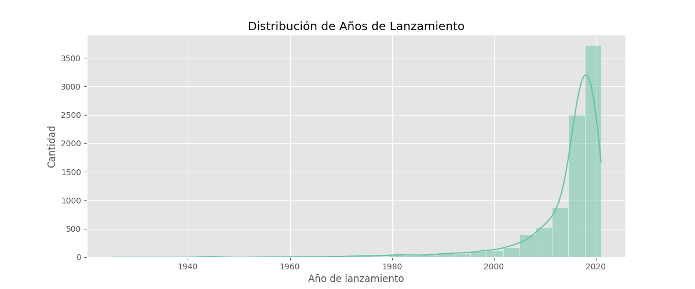
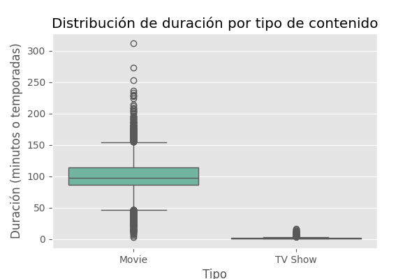

# Mini Proyecto — Análisis Exploratorio de Netflix

Este repositorio contiene el mini proyecto del Grupo 05 (Nettalco) para la asignatura SI807_Cloud_BI_2025. El objetivo es realizar un análisis exploratorio (EDA) sobre el conjunto de datos de títulos de Netflix, limpiar los datos y generar visualizaciones que resumen hallazgos relevantes (distribución por año, duración por tipo, países y directores más frecuentes, etc.).

## Contenido

- Datos procesados: `data/processed/netflix_clean.csv`
- Datos crudos: `data/raw/netflix_titles.csv`
- Notebook de trabajo: `notebooks/grupo05_eda.ipynb`
- Scripts (si existen): `scripts/`
- Resultados / gráficos: `results/grupo05_graficos/` (aquí se guardan las imágenes generadas)

> Nota: Las rutas anteriores son relativas al directorio `grupo05_nettalco/Mini_Proyecto`.

## Resumen del proyecto

Se realiza un EDA para responder preguntas como:

- ¿Cómo se distribuyen los títulos por año de lanzamiento?
- ¿Cuál es la distribución de duración por tipo de contenido (Movie vs TV Show)?
- ¿Cuáles son los directores y países con más títulos en el dataset?
- Visualizar las principales tendencias y outliers.

El dataset principal ya procesado se encuentra en `data/processed/netflix_clean.csv` y contiene columnas útiles como `type`, `title`, `director`, `country`, `date_added`, `release_year`, `rating`, `duration`, `listed_in`, `description` y `duration_num` (duración en minutos o número de temporadas convertido a valor numérico).

## Estructura de datos (breve)

- `show_id`: identificador del título
- `type`: "Movie" o "TV Show"
- `title`: título
- `director`: director(es)
- `country`: países de producción
- `date_added`: fecha de incorporación a Netflix
- `release_year`: año de publicación
- `duration`: texto original (ej. "90 min", "2 Seasons")
- `duration_num`: valor numérico extraído (ej. 90.0 para películas, 2.0 para TV Shows)

## Proceso reproducible (pasos)

1. Crear un entorno virtual (recomendado) e instalar dependencias.

	PowerShell (Windows):

	```powershell
	# Crear y activar virtualenv
	python -m venv .venv; .\.venv\Scripts\Activate.ps1

	# Instalar paquetes (ejemplo)
	pip install pandas matplotlib seaborn jupyterlab notebook
	```

2. Abrir y ejecutar el notebook de EDA:

	- `notebooks/grupo05_eda.ipynb` contiene la carga de `data/processed/netflix_clean.csv`, el preprocesamiento (si aplica) y las visualizaciones.

	Puedes abrirlo desde JupyterLab o ejecutar celdas en Jupyter Notebook.

3. Generar y guardar gráficos en `results/grupo05_graficos/`.

	Ejemplo de snippet de Python para cargar datos y generar una figura (resumen):

	```python
	import pandas as pd
	import seaborn as sns
	import matplotlib.pyplot as plt

	df = pd.read_csv('data/processed/netflix_clean.csv')

	# Histograma del año de lanzamiento
	plt.figure(figsize=(10,4))
	sns.histplot(df['release_year'].dropna(), bins=30, kde=True)
	plt.title('Distribución de Años de Lanzamiento')
	plt.xlabel('Año de lanzamiento')
	plt.ylabel('Cantidad')
	plt.tight_layout()
	plt.savefig('results/grupo05_graficos/launch_year_distribution.png', dpi=150)
	plt.close()
	```

4. Repetir para las otras visualizaciones (boxplot duración por tipo, top directores, top países, etc.).

## Visualizaciones y resultados

En `results/grupo05_graficos/` se esperan imágenes como (nombres sugeridos):

- `launch_year_distribution.png` — Distribución de años de lanzamiento
- `duration_by_type_boxplot.png` — Boxplot de duración por tipo (Movie vs TV Show)
- `type_count.png` — Conteo por tipo
- `top_directors.png` — Top 10 directores con más títulos
- `top_countries.png` — Top 10 países con más títulos

Puedes incrustar estas imágenes en este README (si ya existen) usando Markdown, por ejemplo:





Si las imágenes no están todavía en `results/grupo05_graficos/`, ejecuta el notebook para generarlas — el notebook guarda automáticamente las figuras en esa carpeta cuando corres las celdas finales.

## Cómo replicar todo desde cero

1. Asegúrate de tener Python 3.8+ instalado.
2. Crear virtualenv e instalar dependencias (ver sección anterior).
3. Ejecutar el notebook `notebooks/grupo05_eda.ipynb` paso a paso.
4. Alternativamente, si existen scripts en `scripts/`, ejecuta el script principal (por ejemplo `scripts/run_eda.py`) que realice: carga -> limpieza -> generación de gráficos.

Ejemplo PowerShell para ejecutar un script (si existe):

```powershell
# Asumiendo script en scripts/run_eda.py
python .\scripts\run_eda.py
```

## Notas y supuestos

- `data/processed/netflix_clean.csv` es el CSV ya limpiado con la columna `duration_num` agregada.
- Los nombres y rutas de imágenes propuestas son sugerencias; el notebook puede usar otros nombres — ajusta los enlaces en este README si cambian.
- Si usas GitHub, recuerda añadir `results/grupo05_graficos/*` al `.gitignore` si no quieres commitear imágenes grandes.

## Archivos importantes

- `data/raw/netflix_titles.csv` — archivo original crudo
- `data/processed/netflix_clean.csv` — archivo limpio usado para EDA
- `notebooks/grupo05_eda.ipynb` — notebook con análisis y código para generar gráficos
- `README.md` — este archivo (guía rápida y reproducible)

## Contacto

Para dudas sobre el notebook o el proceso, contacta con los integrantes del Grupo 05 (ver `grupo05_nettalco/README.md` para detalles del equipo).

[](../README.md)

---

Generado automáticamente: README guía para reproducir el análisis y localizar las imágenes/resultados.
