# 🏭 Proyecto Nettalco - Big Data para Optimización de Procesos

## 📄 Resumen Ejecutivo

Nettalco S.A. es una **empresa textil peruana** especializada en prendas de alta calidad para clientes internacionales (Lands’ End, Lacoste). Actualmente, enfrenta desafíos en **eficiencia operativa y costos**, y este proyecto busca:

* 💰 Reducir costos operativos.
* 📈 Incrementar capacidad de producción en un 20%.
* 📊 Mejorar la toma de decisiones basada en datos.

---

## ☁️ Arquitectura Avanzada en la Nube

**Plataforma:** Google Cloud Platform

| Componente               | Descripción                                                                      |
| ------------------------ | -------------------------------------------------------------------------------- |
| Servicios Básicos        | Compute Engine, Cloud Storage, BigQuery                                          |
| Servicios Avanzados      | Dataproc (Batch), Cloud Functions (microprocesos), Looker Studio (visualización) |
| Data Lake                | Buckets: `raw/`, `trusted/`, `refined/`                                          |
| Procesamiento            | Spark en Dataproc (Batch y Microbatch)                                           |
| Escalabilidad            | Autoscaling en Dataproc, clúster ajustable                                       |
| Alta Disponibilidad & DR | Multi-Zona y replicación de datos                                                |
| Seguridad                | Cloud Identity, IAM granular y Secret Manager                                                      |
| Monitoreo & Alertas      | Stackdriver / Cloud Monitoring                                                   |

> 📌 *Diagrama de Arquitectura:*

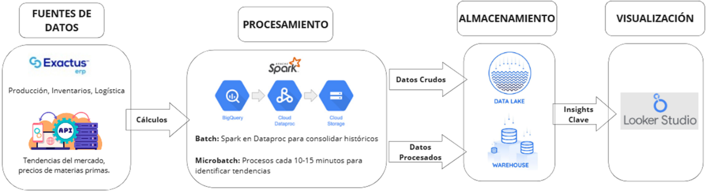

---

## 🔒 Seguridad, IAM, Secret Manager

* 🛡️ Cloud Identity (Organización uni.edu.pe)

Siendo la nube con los correos institucional de la uni, es decir, ya se cuenta con una organización, y con ello también con el uso de cloud identity, es decir, la gestión de identidades ya está administrada por la universidad a nivel organización. Es decir, Cloud Identity ya existe y se está usando, solo que no contamos con los permisos para configurarlo.


* 👥 IAM granular por usuario y servicio.

Asignamos los roles granulares:

```bash
#!/bin/bash

PROJECT_ID="nettalco-data-478503"

# Usuarios con rol Owner
gcloud projects add-iam-policy-binding $PROJECT_ID --member="user:francisco.grijalva.p@uni.pe" --role="roles/owner"
gcloud projects add-iam-policy-binding $PROJECT_ID --member="user:daniel.otero.v@uni.pe" --role="roles/owner"
gcloud projects add-iam-policy-binding $PROJECT_ID --member="user:r.loayza.s@uni.pe" --role="roles/owner"

#Jefe de practicas con rol viewer
gcloud projects add-iam-policy-binding $PROJECT_ID  --member="user:fegarciaa@uni.pe" --role="roles/viewer"

# Service Accounts con roles de Dataproc
gcloud projects add-iam-policy-binding $PROJECT_ID --member="serviceAccount:nettalco-cf-sa@nettalco-data-478503.iam.gserviceaccount.com" --role="roles/dataproc.editor"
gcloud projects add-iam-policy-binding $PROJECT_ID --member="serviceAccount:nettalco-cf-sa@nettalco-data-478503.iam.gserviceaccount.com" --role="roles/dataproc.viewer"
gcloud projects add-iam-policy-binding $PROJECT_ID --member="serviceAccount:nettalco-cf-sa@nettalco-data-478503.iam.gserviceaccount.com" --role="roles/dataproc.worker"
gcloud projects add-iam-policy-binding $PROJECT_ID --member="serviceAccount:467475048380-compute@developer.gserviceaccount.com" --role="roles/dataproc.worker"

# Service Accounts con roles Storage
gcloud projects add-iam-policy-binding $PROJECT_ID --member="serviceAccount:467475048380-compute@developer.gserviceaccount.com" --role="roles/storage.objectCreator"
gcloud projects add-iam-policy-binding $PROJECT_ID --member="serviceAccount:467475048380-compute@developer.gserviceaccount.com" --role="roles/storage.objectViewer"
gcloud projects add-iam-policy-binding $PROJECT_ID --member="serviceAccount:nettalco-cf-sa@nettalco-data-478503.iam.gserviceaccount.com" --role="roles/storage.objectViewer"

# Service Accounts de Cloud Build
gcloud projects add-iam-policy-binding $PROJECT_ID --member="serviceAccount:467475048380@cloudbuild.gserviceaccount.com" --role="roles/cloudbuild.builds.builder"
gcloud projects add-iam-policy-binding $PROJECT_ID --member="serviceAccount:service-467475048380@gcp-sa-cloudbuild.iam.gserviceaccount.com" --role="roles/cloudbuild.serviceAgent"

# Service Accounts de Cloud Functions
gcloud projects add-iam-policy-binding $PROJECT_ID --member="serviceAccount:service-467475048380@gcf-admin-robot.iam.gserviceaccount.com" --role="roles/cloudfunctions.serviceAgent"

# Service Accounts de Cloud Scheduler
gcloud projects add-iam-policy-binding $PROJECT_ID --member="serviceAccount:service-467475048380@gcp-sa-cloudscheduler.iam.gserviceaccount.com" --role="roles/cloudscheduler.serviceAgent"

# Service Accounts de AI Platform
gcloud projects add-iam-policy-binding $PROJECT_ID --member="serviceAccount:service-467475048380@gcp-sa-aiplatform.iam.gserviceaccount.com" --role="roles/aiplatform.serviceAgent"

# Service Accounts de Artifact Registry
gcloud projects add-iam-policy-binding $PROJECT_ID --member="serviceAccount:service-467475048380@gcp-sa-artifactregistry.iam.gserviceaccount.com" --role="roles/artifactregistry.serviceAgent"

# Service Accounts de BigQuery Data Transfer
gcloud projects add-iam-policy-binding $PROJECT_ID --member="serviceAccount:service-467475048380@gcp-sa-bigquerydatatransfer.iam.gserviceaccount.com" --role="roles/bigquerydatatransfer.serviceAgent"

# Service Accounts de Cloud AI Companion
gcloud projects add-iam-policy-binding $PROJECT_ID --member="serviceAccount:service-467475048380@gcp-sa-cloudaicompanion.iam.gserviceaccount.com" --role="roles/cloudaicompanion.serviceAgent"

# Service Accounts de Compute
gcloud projects add-iam-policy-binding $PROJECT_ID --member="serviceAccount:service-467475048380@compute-system.iam.gserviceaccount.com" --role="roles/compute.serviceAgent"

# Service Accounts de GKE / Container
gcloud projects add-iam-policy-binding $PROJECT_ID --member="serviceAccount:service-467475048380@container-engine-robot.iam.gserviceaccount.com" --role="roles/container.serviceAgent"
gcloud projects add-iam-policy-binding $PROJECT_ID --member="serviceAccount:service-467475048380@containerregistry.iam.gserviceaccount.com" --role="roles/containerregistry.ServiceAgent"

# Service Accounts de Eventarc
gcloud projects add-iam-policy-binding $PROJECT_ID --member="serviceAccount:service-467475048380@gcp-sa-eventarc.iam.gserviceaccount.com" --role="roles/eventarc.serviceAgent"

# Service Accounts de Pub/Sub
gcloud projects add-iam-policy-binding $PROJECT_ID --member="serviceAccount:service-467475048380@gcp-sa-pubsub.iam.gserviceaccount.com" --role="roles/pubsub.serviceAgent"

# Service Accounts de Cloud Run / Serverless
gcloud projects add-iam-policy-binding $PROJECT_ID --member="serviceAccount:service-467475048380@serverless-robot-prod.iam.gserviceaccount.com" --role="roles/run.serviceAgent"

# Service Accounts con acceso a Logging y Secret Manager
gcloud projects add-iam-policy-binding $PROJECT_ID --member="serviceAccount:nettalco-cf-sa@nettalco-data-478503.iam.gserviceaccount.com" --role="roles/logging.logWriter"
gcloud projects add-iam-policy-binding $PROJECT_ID --member="serviceAccount:nettalco-cf-sa@nettalco-data-478503.iam.gserviceaccount.com" --role="roles/secretmanager.secretAccessor"
```

Para poder verlo desde el terminal (Shell) aplicamos:

```bash
gcloud projects get-iam-policy nettalco-data-478503 --flatten="bindings[].members" --format="table(bindings.members, bindings.role)"
```

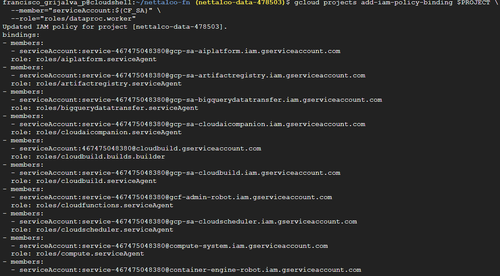

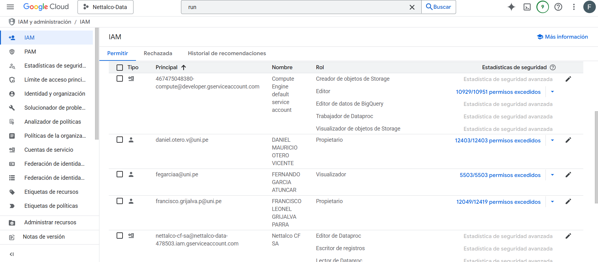

* 🔑 Secret Manager

Configuración segura y credenciales usadas en el batch.

```bash
echo -n '{
  "PROJECT_ID": "nettalco-data-478503",
  "REGION": "us-east1",
  "CLUSTER_NAME": "nettalco-cluster",
  "PYSPARK_FILE": "gs://nettalco-data-bd_grupo05/job/procesamiento_nettalco_etl.py"
}' | gcloud secrets versions add nettalco_config --data-file=-
```
---

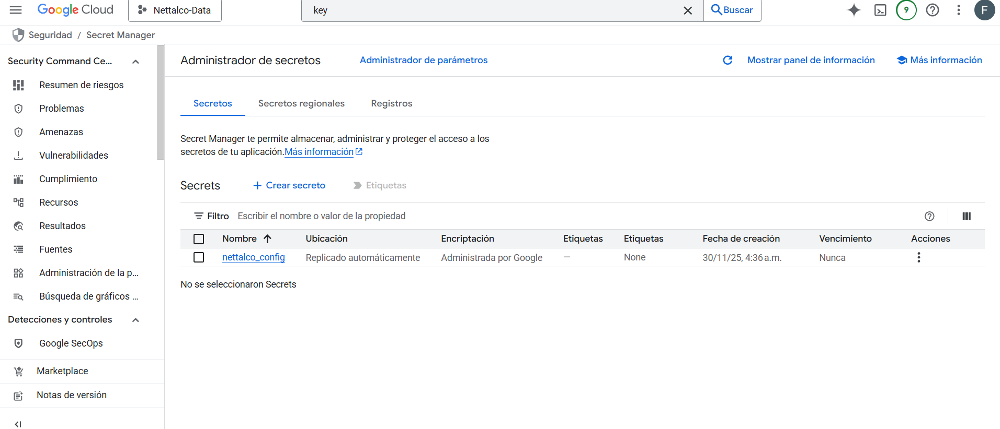

## 🗄️ Carga en Buckets / Data Lake

* 🏗️ Estructura de buckets: `raw/`, `trusted/`, `refined/`.

Para crearlo inicialmente vacio:

```bash
mkdir -p raw trusted refined
gsutil cp -r raw gs://nettalco-data-bd_grupo05/raw/
gsutil cp -r trusted gs://nettalco-data-bd_grupo05/trusted/
gsutil cp -r refined gs://nettalco-data-bd_grupo05/refined/
```

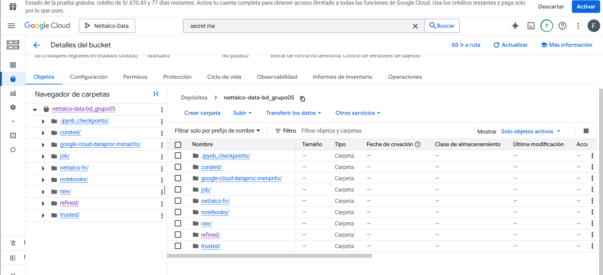

* ⚡ Upload automatizado con `gsutil` y scripts Python/PySpark.

```bash
#!/bin/bash
BUCKET=gs://nettalco-data-bd_grupo05/raw
LOCAL_PATH=/ruta/a/archivos

for file in $LOCAL_PATH/*; do
  gsutil cp $file $BUCKET/
done
```

* 🔄 Versionamiento habilitado.

Habiitamos versionamiento en `nettalco-data-bd_grupo05`

```bash
gsutil versioning set on gs://nettalco-data-bd_grupo05
```

* 🗑️ Lifecycle rules configuradas.

```bash
cat > lifecycle.json <<EOF
{
  "rule": [
    {
      "action": {"type": "Delete"},
      "condition": {"age": 30, "matchesPrefix": "raw/"}
    }
  ]
}
EOF

gsutil lifecycle set lifecycle.json gs://nettalco-data-bd_grupo05
```

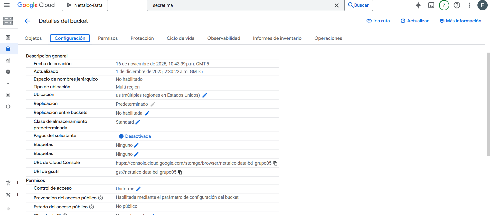
---

## 🔄 Implementación del ETL en la Nube

**Flujo ETL:** Extract → Transform → Load

### 🛠️ Extracción

* Datos internos: ERP Exactus, producción y logística.
* Lectura de CSVs desde Cloud Storage (`raw/`) con PySpark:

```python
# procesamiento_nettalco_etl.py
from pyspark.sql import SparkSession
from pyspark.sql.functions import col, sum as _sum, avg, count, round, when, to_timestamp, hour
from pyspark.sql.window import Window
from pyspark.sql.types import IntegerType
import logging
import os
import sys

# -----------------------------
# Logging (esto va a stdout -> Cloud Logging)
# -----------------------------
logging.basicConfig(stream=sys.stdout, level=logging.INFO,
                    format="%(asctime)s %(levelname)s %(message)s")
logger = logging.getLogger("nettalcoproc")

logger.info("Iniciando job PySpark - Nettalco ETL")

# -----------------------------
# Configuración de Spark
# -----------------------------
spark = SparkSession.builder \
    .appName("Nettalco Big Data Processing - ETL") \
    .config("spark.sql.legacy.timeParserPolicy", "LEGACY") \
    .getOrCreate()

spark.sparkContext.setLogLevel("WARN")
logger.info("SparkSession creada")

# -----------------------------
# Rutas (raw -> trusted -> refined)
# -----------------------------
PROJECT_BUCKET = os.environ.get("PROJECT_BUCKET", "nettalco-data-bd_grupo05")
RAW_PREFIX = f"gs://{PROJECT_BUCKET}/raw/"
TRUSTED_PREFIX = f"gs://{PROJECT_BUCKET}/trusted/"
REFINED_PREFIX = f"gs://{PROJECT_BUCKET}/refined/curated/"

detalle_path = f"{RAW_PREFIX}detalle-produccion-costura.csv"
cliente_path = f"{RAW_PREFIX}produccion-costura-cliente.csv"
linea_path = f"{RAW_PREFIX}produccion-costura-linea-cliente.csv"
segundas_path = f"{RAW_PREFIX}segundas-prendas.csv"

logger.info("Rutas establecidas: RAW=%s, TRUSTED=%s, REFINED=%s", RAW_PREFIX, TRUSTED_PREFIX, REFINED_PREFIX)

# -----------------------------
# Cargar los datos (raw)
# -----------------------------
logger.info("Leyendo archivos raw...")
detalle_produccion = spark.read.csv(detalle_path, header=True, inferSchema=True)
produccion_costura_cliente = spark.read.csv(cliente_path, header=True, inferSchema=True)
produccion_costura_linea_client = spark.read.csv(linea_path, header=True, inferSchema=True)
segundas_prendas = spark.read.csv(segundas_path, header=True, inferSchema=True)

logger.info("Lectura raw completa: detalle=%s, cliente=%s, linea=%s, segundas=%s",
            detalle_produccion.count(), produccion_costura_cliente.count(),
            produccion_costura_linea_client.count(), segundas_prendas.count())
```

### 🔄 Transformación

* Limpieza y tipificación de columnas.
* Conversión de fechas a timestamp.
* Guardado intermedio en formato **parquet** en `trusted/`.

```python
# -----------------------------
# Data typing / limpieza mínima -> trusted
# -----------------------------
logger.info("Transformando datos y escribiendo trusted...")

detalle_produccion = detalle_produccion.withColumn("PRENDAS", col("PRENDAS").cast(IntegerType()))
produccion_costura_cliente = produccion_costura_cliente.withColumn("PRENDAS", col("PRENDAS").cast(IntegerType()))
produccion_costura_linea_client = produccion_costura_linea_client.withColumn("PRENDAS", col("PRENDAS").cast(IntegerType()))
segundas_prendas = segundas_prendas.withColumn("FALLAS_SEGUNDAS", col("FALLAS_SEGUNDAS").cast(IntegerType())) \
                                   .withColumn("INSPECCION_TOTAL", col("INSPECCION_TOTAL").cast(IntegerType()))

# Normalizar fecha a columna timestamp
detalle_produccion = detalle_produccion.withColumn(
    "FECHA_TERMINO_TS",
    to_timestamp("FECHA_TERMINO", "dd/MM/yyyy HH:mm:ss")
)

# Guardar copias "trusted" (formato parquet recomendado para downstream)
trusted_detalle = f"{TRUSTED_PREFIX}detalle-produccion-costura/"
trusted_cliente = f"{TRUSTED_PREFIX}produccion-costura-cliente/"
trusted_linea = f"{TRUSTED_PREFIX}produccion-costura-linea-cliente/"
trusted_segundas = f"{TRUSTED_PREFIX}segundas-prendas/"

detalle_produccion.write.mode("overwrite").parquet(trusted_detalle)
produccion_costura_cliente.write.mode("overwrite").parquet(trusted_cliente)
produccion_costura_linea_client.write.mode("overwrite").parquet(trusted_linea)
segundas_prendas.write.mode("overwrite").parquet(trusted_segundas)

logger.info("Trusted escritos en parquet en: %s, %s, %s, %s",
            trusted_detalle, trusted_cliente, trusted_linea, trusted_segundas)
```

* Cálculo de métricas y datasets refinados (`refined/curated`): total prendas por talla, ventas por cliente, fecha de ventas, tendencias horarias, productos más vendidos, eficiencia operativa, índice ventas cliente, predicción de ventas y comportamiento de clientes.

### 💾 Carga a Data lake(refined/curated) y Data warehouse(BigQuery)

#### Data lake(refined/curated)

* Uso de **Cloud Functions + Pub/Sub** para carga a demanda (cuando llegue un nuevo reporte csv al raw).
* Uso de **Cloud Loggin** para las notificaciones y seguimiento del dataproc.

```python
# -----------------------------
# Procesos analíticos -> refined (curated outputs)
# -----------------------------
logger.info("Generando datasets refinados (refined)...")

# Total prendas por talla
detalle_produccion.groupBy("TALLA") \
    .agg(_sum("PRENDAS").alias("TOTAL_PRENDAS")) \
    .orderBy("TALLA") \
    .write.mode("overwrite").option("header", "true").csv(f"{REFINED_PREFIX}total_prendas_por_talla")

# Volumen de ventas por cliente
produccion_costura_cliente.groupBy("TCODICLIE") \
    .agg(_sum("PRENDAS").alias("TOTAL_PRENDAS")) \
    .orderBy("TCODICLIE") \
    .write.mode("overwrite").option("header", "true").csv(f"{REFINED_PREFIX}volumen_ventas_por_cliente")

# Fecha ventas
produccion_costura_cliente.groupBy("FECHA") \
    .agg(_sum("PRENDAS").alias("TOTAL_PRENDAS")) \
    .orderBy("FECHA") \
    .write.mode("overwrite").option("header", "true").csv(f"{REFINED_PREFIX}fecha_ventas")

# Tendencias por franja horaria
detalle_produccion = detalle_produccion.withColumn("HORA", hour("FECHA_TERMINO_TS"))
tendencias = detalle_produccion.withColumn(
    "FRANJA_HORARIA",
    when((col("HORA") >= 6) & (col("HORA") <= 11), "Mañana")
    .when((col("HORA") >= 12) & (col("HORA") <= 17), "Tarde")
    .when((col("HORA") >= 18) & (col("HORA") <= 23), "Noche")
    .otherwise("Madrugada")
).groupBy("ORDEN_PRODUCCION", "FRANJA_HORARIA") \
 .agg(count("*").alias("TRANSACCIONES"), _sum("PRENDAS").alias("TOTAL_PRENDAS")) \
 .orderBy("ORDEN_PRODUCCION", "FRANJA_HORARIA")

tendencias.write.mode("overwrite").option("header", "true").csv(f"{REFINED_PREFIX}tendencias_ventas_por_franja_horaria")

# Productos más vendidos
detalle_produccion.groupBy("ESTILO") \
    .agg(_sum("PRENDAS").alias("TOTAL_PRENDAS")) \
    .orderBy("ESTILO") \
    .write.mode("overwrite").option("header", "true").csv(f"{REFINED_PREFIX}productos_mas_vendidos")

# Eficiencia operativa
segundas_prendas.groupBy("FECHA") \
    .agg(
        round(
            (1 - (_sum("FALLAS_SEGUNDAS") / _sum("INSPECCION_TOTAL"))) * 100, 2
        ).alias("EFICIENCIA_PORCENTUAL")
    ) \
    .orderBy("FECHA") \
    .write.mode("overwrite").option("header", "true").csv(f"{REFINED_PREFIX}eficiencia_operativa")

# Índice de ventas por cliente y línea
produccion_costura_linea_client.groupBy("TCODICLIE", "LINEA") \
    .agg(_sum("PRENDAS").alias("TOTAL_PRENDAS")) \
    .orderBy("TCODICLIE") \
    .write.mode("overwrite").option("header", "true").csv(f"{REFINED_PREFIX}indice_ventas_cliente")

# Predicción de ventas (promedio móvil 7 días)
detalle_produccion.groupBy("FECHA_TERMINO_TS", "ESTILO") \
    .agg(_sum("PRENDAS").alias("TOTAL_PRENDAS")) \
    .withColumn(
        "PROMEDIO_MOVIL",
        avg("TOTAL_PRENDAS").over(Window.partitionBy("ESTILO").orderBy("FECHA_TERMINO_TS").rowsBetween(-6, 0))
    ) \
    .write.mode("overwrite").option("header", "true").csv(f"{REFINED_PREFIX}prediccion_ventas")

# Comportamiento de clientes
produccion_costura_cliente.groupBy("TCODICLIE") \
    .agg(count("FECHA").alias("FRECUENCIA_COMPRA"), avg("PRENDAS").alias("PROMEDIO_PRENDAS")) \
    .orderBy("TCODICLIE") \
    .write.mode("overwrite").option("header", "true").csv(f"{REFINED_PREFIX}comportamiento_clientes")

logger.info("Refined outputs escritos en %s", REFINED_PREFIX)

logger.info("Job finalizado correctamente")
spark.stop()
```
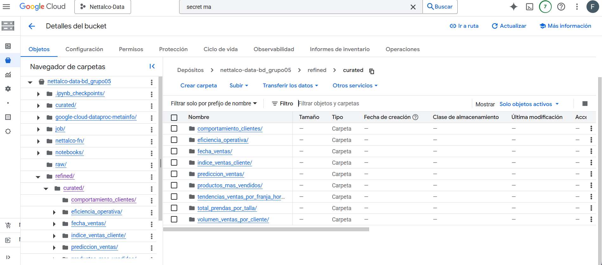

#### Data warehouse(BigQuery)

* Uso de **Cloud Functions + Cloud Scheduler** para carga diaria.
* Tabla de logs en BigQuery para registrar actualizaciones.

```python
import functions_framework
from google.cloud import bigquery
from datetime import datetime

# Configuración de tablas y carpetas
TABLES_TO_LOAD = {
    "total_prendas_por_talla": "ventas_nettalco.total_prendas_por_talla",
    "volumen_ventas_por_cliente": "ventas_nettalco.volumen_ventas_por_cliente",
    "fecha_ventas": "ventas_nettalco.fecha_ventas",
    "tendencias_ventas_por_franja_horaria": "ventas_nettalco.tendencias_ventas_por_franja_horaria",
    "productos_mas_vendidos": "ventas_nettalco.productos_mas_vendidos",
    "eficiencia_operativa": "ventas_nettalco.eficiencia_operativa",
    "indice_ventas_cliente": "ventas_nettalco.indice_ventas_cliente",
    "prediccion_ventas": "ventas_nettalco.prediccion_ventas",
    "comportamiento_clientes": "ventas_nettalco.comportamiento_clientes"
}

BUCKET = "nettalco-data-bd_grupo05"
PREFIX = "refined/curated"

client = bigquery.Client()
SCRIPT_NAME = "daily_bq_update.py"  # Para registrar en log

def load_csv_to_bq(table_name, gcs_path):
    """
    Carga CSV desde GCS a BigQuery y reemplaza datos existentes.
    """
    job_config = bigquery.LoadJobConfig(
        source_format=bigquery.SourceFormat.CSV,
        autodetect=True,
        write_disposition="WRITE_TRUNCATE"  # reemplaza datos existentes
    )
    load_job = client.load_table_from_uri(
        gcs_path,
        table_name,
        job_config=job_config
    )
    load_job.result()  # espera a que termine
    print(f"Cargado {gcs_path} a {table_name}")
    log_update(table_name)

def log_update(table_name):
    table_id = "ventas_nettalco.log"
    rows_to_insert = [
        {
            "tabla": table_name,
            "fecha_actualizacion": datetime.utcnow().isoformat(),  # convierte a string
            "fuente": SCRIPT_NAME
        }
    ]
    errors = client.insert_rows_json(table_id, rows_to_insert)
    if errors:
        print(f"Error insertando log para {table_name}: {errors}")
    else:
        print(f"Log insertado correctamente para {table_name}")

@functions_framework.http
def load_refined_to_bq(request):
    """
    Función HTTP que recorre todas las carpetas de refined/curated y carga CSV a BigQuery.
    Luego inserta un log por cada tabla cargada.
    """
    try:
        for folder, table in TABLES_TO_LOAD.items():
            gcs_path = f"gs://{BUCKET}/{PREFIX}/{folder}/*.csv"
            print(f"Cargando {gcs_path} a {table}")
            load_csv_to_bq(table, gcs_path)
        return "Carga completa a BigQuery y logs insertados", 200
    except Exception as e:
        print(f"Error ejecutando load_refined_to_bq: {e}")
        return f"Error en la carga: {e}", 500
```


### ⚡ Automatización

* **Cloud Function:** La cual está dentro de cloud run, se crean las funciones que llamarán para correr los batch's-

Para refined:

```bash
cd ~/nettalco-fn
gcloud functions deploy nettalco-dataproc-raw-trigger \
  --runtime python311 \
  --trigger-topic nettalco-raw-topic \
  --region us-central1 \
  --timeout 540s \
  --memory 1024MB \
  --entry-point trigger_dataproc \
  --source ./
```
Para Bigquery:

```bash
cd ~/nettalco-bq

gcloud functions deploy daily-bq-update \
  --runtime python311 \
  --trigger-http \
  --allow-unauthenticated \
  --region us-central1 \
  --timeout 540s \
  --memory 1024MB \
  --entry-point load_refined_to_bq \
  --source ./
```

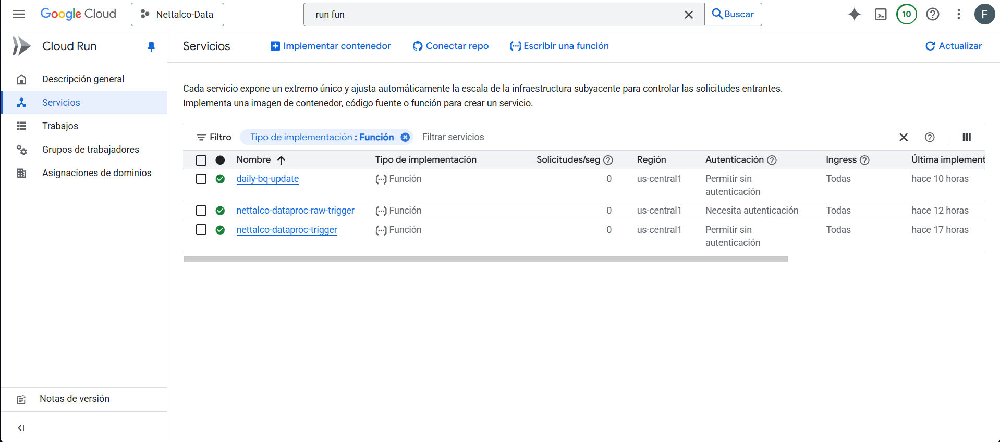

* **Cloud Run:** Procesamiento ETL a demanda cuando se agregan archivos a `raw/`.

```python
import functions_framework
import json
import base64
from google.cloud import secretmanager
from google.cloud import dataproc_v1

def load_config():
    """
    Carga la configuración desde Secret Manager
    """
    client = secretmanager.SecretManagerServiceClient()
    name = "projects/467475048380/secrets/nettalco_config/versions/latest"
    response = client.access_secret_version(request={"name": name})
    return json.loads(response.payload.data.decode("utf-8"))

@functions_framework.cloud_event
def trigger_dataproc(cloud_event):
    """
    Cloud Function 2nd gen disparada por Pub/Sub cuando llega un archivo a raw/.
    Lanza un Job en Dataproc usando la configuración desde Secret Manager.
    """
    try:
        # Leer configuración
        config = load_config()
        project_id = config["PROJECT_ID"]
        region = config["REGION"]
        cluster_name = config["CLUSTER_NAME"]
        pyspark_file = config["PYSPARK_FILE"]

        # Extraer mensaje de Pub/Sub
        pubsub_message = cloud_event.data.get("message")
        if not pubsub_message or "data" not in pubsub_message:
            print("No se encontró el mensaje de Pub/Sub o 'data' vacío. Ignorando.")
            return

        # Decodificar base64 y parsear JSON
        payload = base64.b64decode(pubsub_message["data"]).decode("utf-8")
        event_data = json.loads(payload)

        # Obtener el nombre real del archivo
        file_name = event_data.get("name")
        if not file_name:
            print("No se encontró el nombre del archivo en el evento. Ignorando.")
            return

        # Verificar que esté en raw/
        if "raw/" not in file_name:
            print(f"Ignorando archivo que no está en raw/: {file_name}")
            return

        print(f"Nuevo archivo detectado en raw/: {file_name}")

        # Crear cliente Dataproc
        job_client = dataproc_v1.JobControllerClient(
            client_options={"api_endpoint": f"{region}-dataproc.googleapis.com:443"}
        )

        # Configurar Job PySpark
        job = {
            "placement": {"cluster_name": cluster_name},
            "pyspark_job": {
                "main_python_file_uri": pyspark_file,
                "args": [f"gs://{project_id}-bd_grupo05/{file_name}"]
            },
        }

        # Enviar Job a Dataproc
        response = job_client.submit_job(
            project_id=project_id,
            region=region,
            job=job
        )
        print(f"Dataproc Job lanzado correctamente: {response.reference.job_id}")

    except Exception as e:
        print(f"Error al lanzar Dataproc Job: {e}")
        raise
```
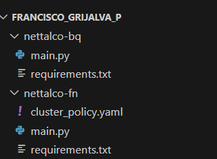

* **Pub/Sub:** Trigger para lanzar jobs Dataproc.

```bash
gcloud pubsub topics create nettalco-raw-topic

gsutil notification create \
  -t nettalco-raw-topic \
  -f json \
  -p raw/ \
  gs://nettalco-data-bd_grupo05

```
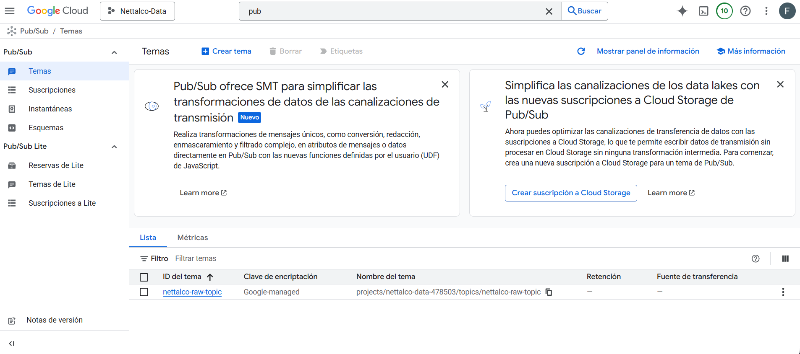

* **Cloud Scheduler:** Job diario `daily-bq-load` para actualizar BigQuery.
```bash
gcloud scheduler jobs create http daily-bq-load \
  --schedule "0 0 * * *" \
  --uri "https://us-central1-nettalco-data-478503.cloudfunctions.net/daily-bq-update" \
  --http-method GET \
  --location us-central1
```
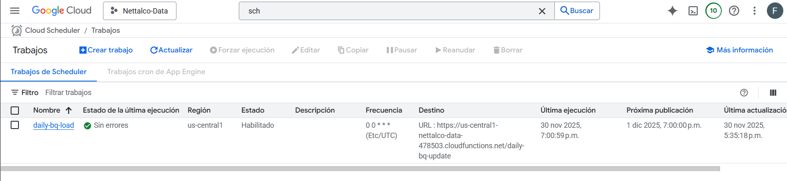

### 🛡️ Control de errores y monitoreo

* **Cloud Logging:** Registro de ejecución de jobs ETL y Cloud Functions.

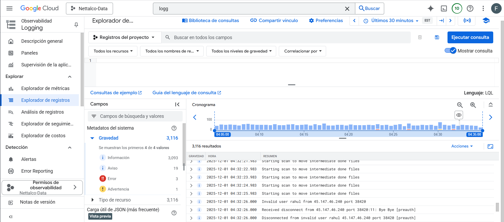

* Validaciones implementadas en PySpark y logs de BigQuery.

Se crea una tabla log en el conjunto de datos ventas_nettalco

```SQL
CREATE TABLE IF NOT EXISTS ventas_nettalco.log (
    tabla STRING,
    fecha_actualizacion TIMESTAMP,
    fuente STRING
);
```

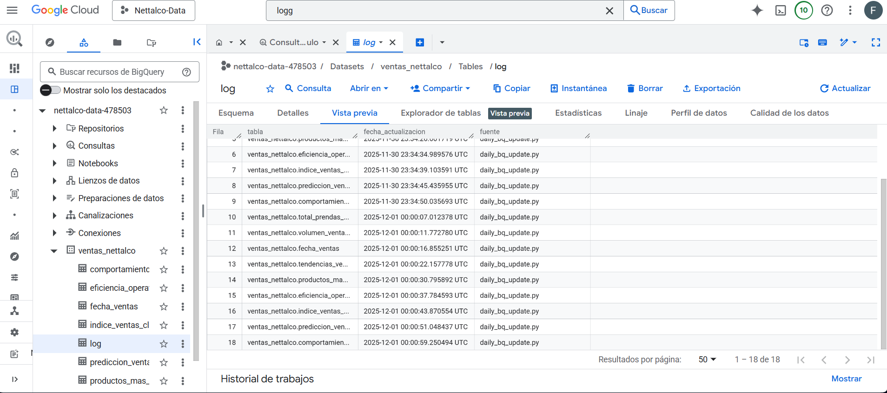

### 👍 Escalabilidad Horizontal

En cluster en dataproc cuenta con Autoscalling, implementadose con una política creada.

```bash
gcloud dataproc clusters update nettalco-cluster \
    --region us-east1 \
    --autoscaling-policy nettalo-autoscale
```
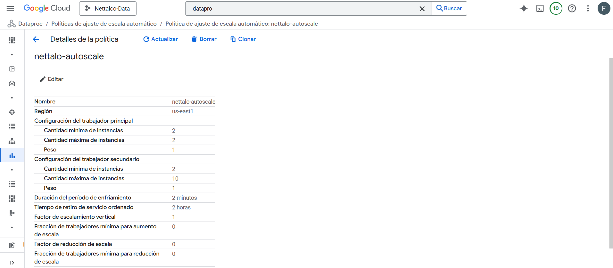

## 👨🏼‍💻 Validación SQL

Visto ya en las evidencias del readme.md de PC3 en 🗂️ 4.3 Validación de datos en BigQuery

[Ver README de PC3](../PC3/readme.md)

## 📊 Visor Bi en la nube

Visto ya en las evidencias del readme.md de PC3 en 🗂️ 5. Dashboard en Looker

[Ver README de PC3](../PC3/readme.md)


**Link del Dashboard:** [Dashboard Looker Studio](https://lookerstudio.google.com/u/0/reporting/9139c4d1-2f52-4bd1-9e86-97b7554b2d58)
