# 📊 Visualización Analítica de Riesgos Financieros

**Proyecto:** Grupo6 – Scotiabank  

**Curso:** Sistema de Inteligencia de Negocios - SI807-U

**Capa Analítica:** Google BigQuery (Capa Oro) + Power BI  

---

## 1. Contexto del Negocio

Las entidades financieras operan en un entorno altamente regulado y expuesto a múltiples tipos de riesgo, lo que exige contar con información confiable, consolidada y oportuna para la toma de decisiones estratégicas y regulatorias.

En el caso del banco analizado, la información de riesgos y desempeño financiero se encuentra distribuida en múltiples fuentes, con altos niveles de procesamiento manual y dependencia de entidades externas.

Ante este escenario, se plantea el diseño de una **solución analítica centralizada** que permita integrar, procesar y visualizar indicadores clave de riesgo y gestión, facilitando el monitoreo continuo y reduciendo riesgos operativos.

---

## 2. Problemática Identificada

### 2.1. Dificultad para explicar las variaciones del capital requerido
El banco no cuenta con un mecanismo uniforme y robusto que permita calcular, validar y explicar las variaciones del capital económico y regulatorio frente a los distintos tipos de riesgo:
- Crédito  
- Mercado  
- Operativo  
- Liquidez  

### 2.2. Poco control sobre indicadores comparativos externos (SBS, BCR)
La evaluación del desempeño frente al sector depende de indicadores generados por entidades externas, sin acceso automatizado ni mecanismos de integración directa, incrementando:
- Riesgo operativo  
- Latencia en el análisis  

### 2.3. Múltiples fuentes de datos internas
Diversas áreas calculan y mantienen información similar o duplicada, generando:
- Inconsistencias en datos financieros y de riesgos  
- Dificultad en la trazabilidad de la información  

### 2.4. Falta de consolidación para el monitoreo y la toma de decisiones
No existe un sistema centralizado que integre indicadores críticos como:
- Morosidad  
- Liquidez  
- Participación de mercado  

Lo cual limita una visión integral del negocio.

### 2.5. Alto esfuerzo manual en la consolidación de información de riesgos
La recopilación de datos desde distintas unidades de riesgo se realiza de forma manual y poco automatizada, afectando:
- Eficiencia operativa  
- Confiabilidad de la información  

---

## 3. Objetivo de la Solución

Implementar una **plataforma de visualización analítica en la nube**, basada en **Google BigQuery y Power BI**, que permita:

- Centralizar la información de riesgos en la **Capa Oro del Data Lake**
- Calcular y visualizar **KPIs regulatorios y gerenciales**
- Facilitar el análisis histórico y comparativo
- Reducir la dependencia de procesos manuales y fuentes dispersas

---

## 4. KPIs Implementados en los Dashboards

| KPI | Descripción | Fórmula | Unidad | Frecuencia | Umbrales de Decisión |
|----|------------|---------|--------|------------|---------------------|
| **Loans to Deposits** | Relación entre fondos disponibles y créditos concedidos | Colocaciones Brutas / Depósitos | % | Mensual | 🟢 ≤ 100%<br>🟡 100% – 120%<br>🔴 > 120% |
| **Ratio de Capital Global** | Patrimonio efectivo respecto a activos ponderados por riesgo | Patrimonio Efectivo / Requerimiento Patrimonial | % | Mensual | 🟢 ≥ 11%<br>🟡 10% – 11%<br>🔴 < 10% |
| **Morosidad** | Nivel de créditos atrasados | Créditos Atrasados / Total Créditos Directos | % | Mensual | 🟢 ≤ 4%<br>🟡 4% – 8%<br>🔴 > 8% |
| **Crecimiento de Cartera** | Variación interanual de créditos | (Créditos actuales − Créditos año anterior) / Créditos año anterior | % | Mensual | 🟢 > 0%<br>🟡 0% a -5%<br>🔴 < -5% |
| **Sensibilidad al Tipo de Cambio** | Exposición a fluctuaciones cambiarias | (Activos ME − Pasivos ME) / Patrimonio × %ΔTC | Millones S/ | Mensual | 🟢 < 2%<br>🟡 2% – 5%<br>🔴 > 5% |
| **Ratio de Liquidez** | Cobertura de obligaciones de corto plazo | Activos Líquidos / Obligaciones CP | % | Mensual | 🟢 ≥ 100%<br>🟡 90% – 100%<br>🔴 < 90% |

---

## 5. Arquitectura de la Visualización

- **Fuente de datos:** Google BigQuery – *Capa Oro*
- **Modelo:** Esquema estrella (tabla de hechos + dimensiones)
- **Herramienta de visualización:** Power BI Desktop
- **Autenticación:** Cuenta de Servicio GCP

---

## 6. Creación de Cuenta de Servicio para Visualización (CLI)

### 6.1. Configuración del proyecto
```bash
gcloud config set project grupo6-scotiabank
```

### 6.1. Configuración del proyecto
```bash
gcloud config set project grupo6-scotiabank
```

### 6.2. Creación de la cuenta de servicio
```bash
gcloud iam service-accounts create sa-visualizacion-dashboard \
  --display-name="Cuenta de Servicio - Visualización Dashboards Power BI"
```


## 7. Asignación de Roles (Acceso Simplificado)

Para garantizar compatibilidad con datasets que utilizan ACL clásico y facilitar la conexión desde Power BI, se asignaron los siguientes roles a nivel proyecto:
```bash
gcloud projects add-iam-policy-binding grupo6-scotiabank \
  --member="serviceAccount:sa-visualizacion-dashboard@grupo6-scotiabank.iam.gserviceaccount.com" \
  --role="roles/bigquery.user"
```
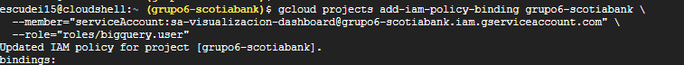

### Roles implícitos habilitados:

- Ejecución de consultas

- Lectura de datasets

- Acceso a metadata

Compatibilidad con Power BI (ADBC)

## 8. Generación de Clave JSON (Credencial Temporal)
```bash
gcloud iam service-accounts keys create \
  sa-visualizacion-dashboard-key.json \
  --iam-account=sa-visualizacion-dashboard@grupo6-scotiabank.iam.gserviceaccount.com
```
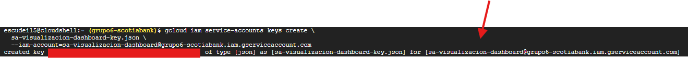

La clave se genera en el directorio de ejecución de Cloud Shell.

### Descarga a entorno local
```bash
cloudshell download sa-visualizacion-dashboard-key.json
```
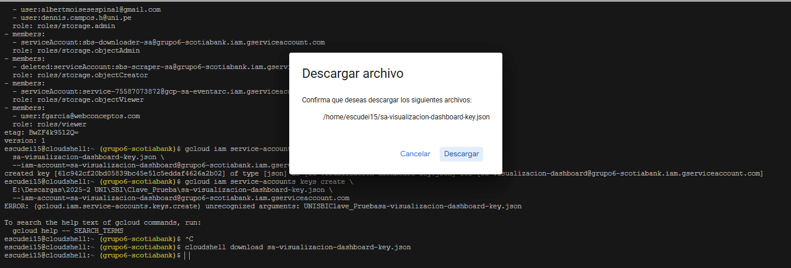
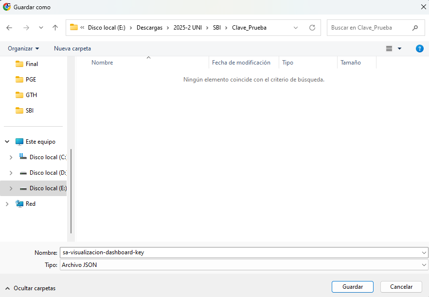
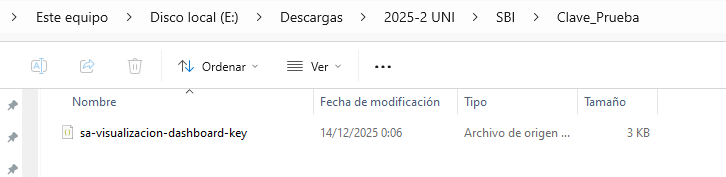
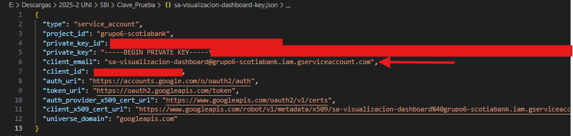

**Nota:** Esta clave es de uso temporal (5 días). Finalizado el periodo de evaluación, la clave debe ser revocada.

## 9. Autenticación en Power BI con BigQuery

1) Abrir Power BI Desktop

2) Seleccionar Obtener datos → Google BigQuery

3) Elegir Cuenta de Servicio como método de autenticación

4) Ingresar el contenido del archivo JSON

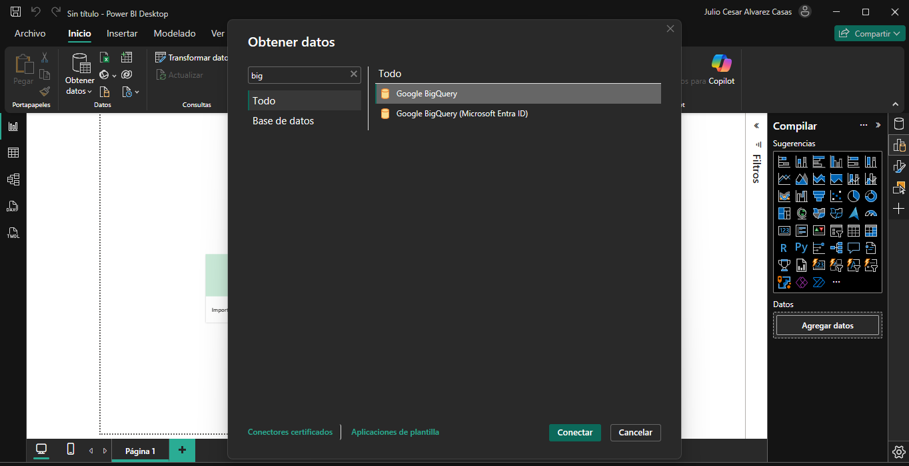
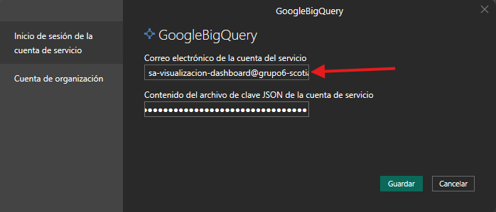

Seleccionar:

- Proyecto: grupo6-scotiabank

- Dataset: oro

- Tablas de hechos y dimensiones

Construir el modelo estrella en Power BI

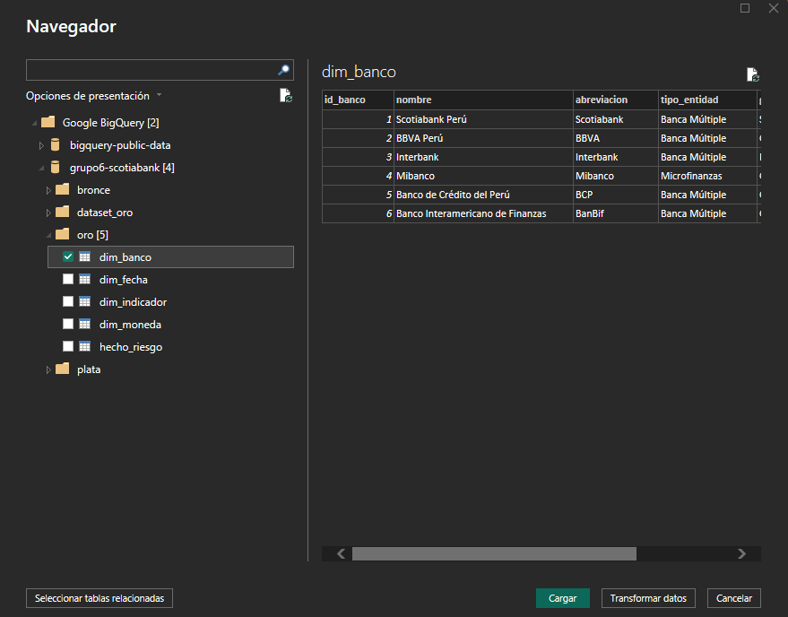

## 10. Reproducibilidad

Para replicar los dashboards:

Descargar el archivo .pbix desde el repositorio.

1) Crear o reutilizar una cuenta de servicio con permisos equivalentes.

2) Generar una clave JSON.

3) Reconfigurar el origen de datos en Power BI.

4) Actualizar el modelo y visualizar los KPIs.

Revisar los archivos en la carpeta docs/.

## 11. Tableros Analíticos y Enfoque de Benchmarking

La solución de Business Intelligence desarrollada se materializa en cinco tableros analíticos integrados, construidos sobre la capa oro del Data Warehouse en Google BigQuery y consumidos desde Power BI. Estos tableros permiten abordar de manera directa las problemáticas identificadas en el negocio, particularmente la falta de consolidación de información, el alto esfuerzo manual y la limitada capacidad de explicar y comparar los indicadores de riesgo y desempeño financiero del banco.

Cada tablero cumple un rol específico dentro del proceso de análisis, combinando indicadores operativos, gerenciales y comparativos, y habilitando un enfoque de benchmarking bancario frente al sistema financiero.

### 11.1. Tablero 1 – Apetito de Riesgo Consolidado

Este tablero proporciona una vista ejecutiva y centralizada del perfil de riesgo del banco para un periodo determinado (año y mes), permitiendo evaluar de forma inmediata el cumplimiento de los límites de apetito de riesgo definidos por la entidad.

Se visualizan los siguientes indicadores clave:

- Morosidad

- Ratio de Capital Global

- Loans to Deposits

- Ratio de Liquidez

- Sensibilidad al Tipo de Cambio

- Crecimiento de la Cartera de Créditos

El uso de visualizaciones tipo gauge y semáforos facilita identificar si cada KPI se encuentra dentro de rangos aceptables, en zona de alerta o en situación crítica.
Este tablero responde directamente a la problemática de dificultad para explicar las variaciones del capital y del perfil de riesgo, al consolidar en una sola vista los principales indicadores regulatorios y de gestión.

Desde el enfoque de benchmarking, permite contrastar el desempeño del banco frente a umbrales prudenciales del sistema financiero (SBS/Basilea), funcionando como punto de referencia para análisis comparativos posteriores.

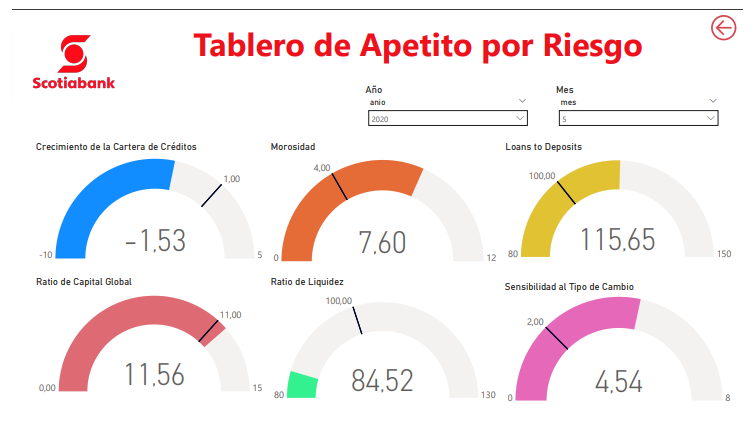

### 11.2. Tablero 2 – Apetito de Riesgo Financiero y Operativo

El segundo tablero profundiza en el análisis del riesgo financiero y operativo, incorporando variables que impactan directamente en la estabilidad patrimonial y en la eficiencia operativa del banco.

Incluye indicadores como:

- Morosidad

- Loans to Deposits

- Ratio de Capital Global

- Pérdidas Operativas

La integración de pérdidas operativas permite ampliar el análisis más allá del riesgo crediticio, abordando la problemática de falta de una visión integral del riesgo y reduciendo la dependencia de reportes aislados por área.

En términos de benchmarking, este tablero facilita evaluar qué tan eficiente es el banco en el control de pérdidas y en el uso de su capital, comparándolo con prácticas observadas en el sector bancario.

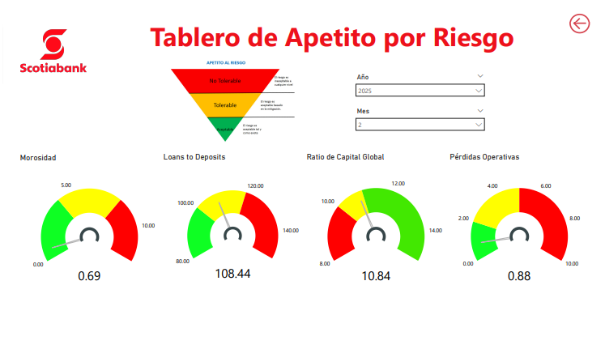

### 11.3. Tablero 3 – Riesgo de Crecimiento, Liquidez y Mercado

El tercer tablero se orienta a analizar el equilibrio entre crecimiento del negocio y sostenibilidad financiera, incorporando riesgos de mercado y fondeo.

Los principales KPIs visualizados son:

- Crecimiento de la Cartera de Créditos

- Participación de Depósitos

- Ratio de Liquidez

- Sensibilidad al Tipo de Cambio

Este tablero permite identificar si el crecimiento del crédito está adecuadamente respaldado por la captación de depósitos y si el banco mantiene una exposición controlada frente a variaciones cambiarias.
Atiende directamente la problemática de falta de consolidación para la toma de decisiones, al integrar crecimiento, liquidez y mercado en un único análisis.

Desde el enfoque comparativo, habilita el benchmarking de estrategias de crecimiento y gestión de liquidez entre el banco y otras entidades del sistema financiero.

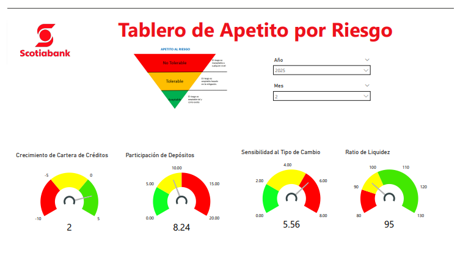

### 11.4. Tablero 4 – Comparativo Histórico Multibanco por Indicador

Este tablero introduce un análisis histórico y comparativo, permitiendo evaluar la evolución de los principales indicadores de riesgo y desempeño financiero en el tiempo.

El usuario puede seleccionar:

- Un indicador específico

- Uno o varios bancos del sistema financiero

- Un rango temporal determinado

La visualización temporal facilita identificar tendencias estructurales, cambios en el perfil de riesgo y brechas de desempeño entre el banco y sus competidores.
Este tablero responde a la problemática de poco control sobre indicadores comparativos externos, al integrar información sectorial en una plataforma analítica centralizada.

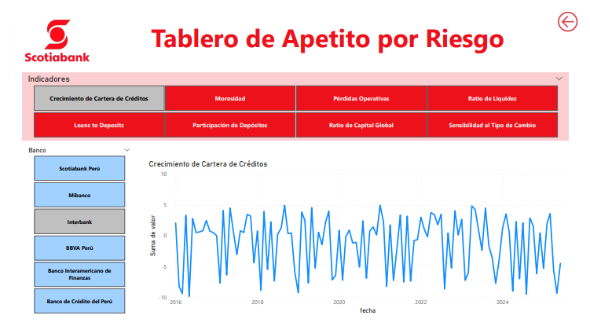

### 11.5. Tablero 5 – Comparativo Evolutivo Detallado por Banco

El quinto tablero permite realizar un análisis granular y dinámico, mostrando la evolución mensual de los indicadores seleccionados para distintos bancos.

Este enfoque facilita:

- Detectar variaciones abruptas

- Analizar volatilidad de indicadores

- Evaluar el impacto de eventos macroeconómicos o regulatorios

Desde la perspectiva de benchmarking, este tablero permite medir la resiliencia y capacidad de adaptación del banco frente a sus competidores, aportando una visión comparativa de corto y mediano plazo que no es posible obtener mediante reportes estáticos.

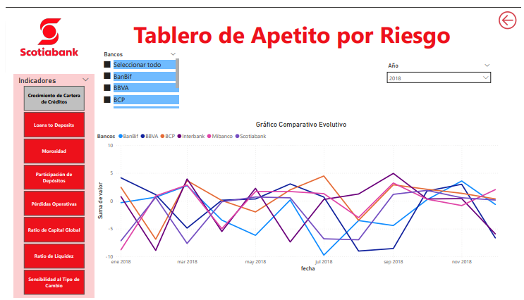

## Conclusión

La solución de Business Intelligence implementada consolida y automatiza la gestión de indicadores financieros y de riesgo del banco, permitiendo un monitoreo efectivo del apetito de riesgo y un análisis comparativo frente al sistema financiero mediante cinco tableros analíticos. El uso de BigQuery y Power BI reduce el esfuerzo manual, mejora la consistencia de los datos y fortalece la toma de decisiones estratégicas y regulatorias. Adicionalmente, la gestión controlada de accesos mediante cuentas de servicio garantiza la seguridad de la información, eliminando credenciales temporales una vez concluido el periodo de uso.

## Eliminación de Claves de la Cuenta de Servicio (Post-Evaluación)

En cumplimiento de buenas prácticas de seguridad, las claves de la cuenta de servicio deben eliminarse una vez finalizado el periodo de uso o evaluación.

Consideraciones

- Cada cuenta de servicio puede tener un máximo de 10 claves activas.

- Se recomienda eliminar claves antiguas antes de generar nuevas.

Comando CLI para eliminar una clave existente
```bash
gcloud iam service-accounts keys delete KEY_ID \
  --iam-account=sa-visualizacion-dashboard@grupo6-scotiabank.iam.gserviceaccount.com
```

Este comando revoca inmediatamente el acceso asociado a la clave, asegurando el principio de mínimo privilegio y evitando accesos no autorizados posteriores.

