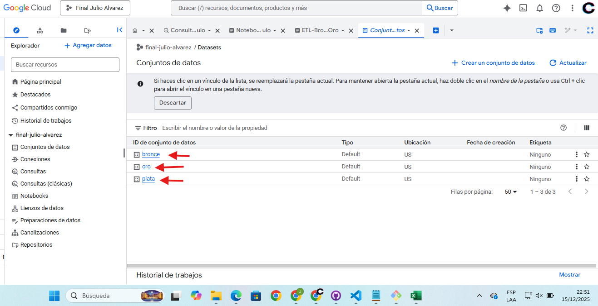
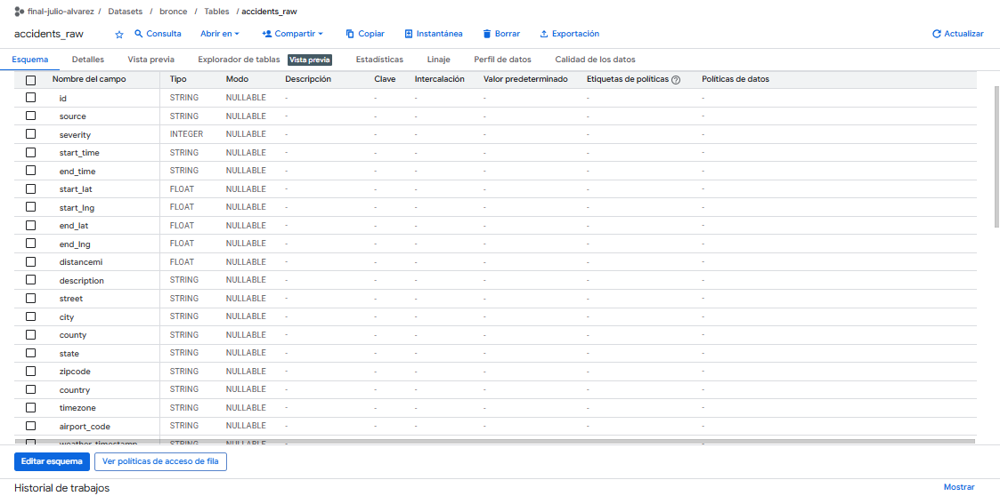
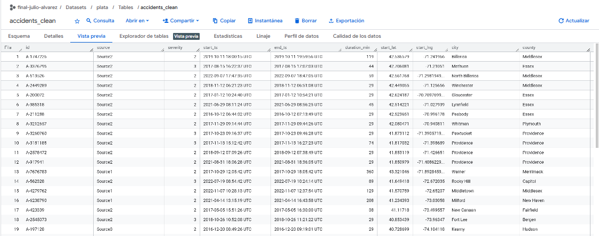
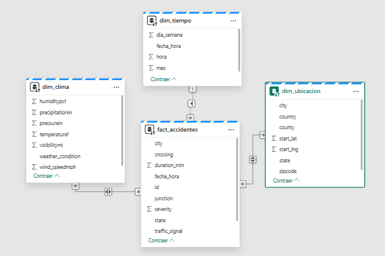
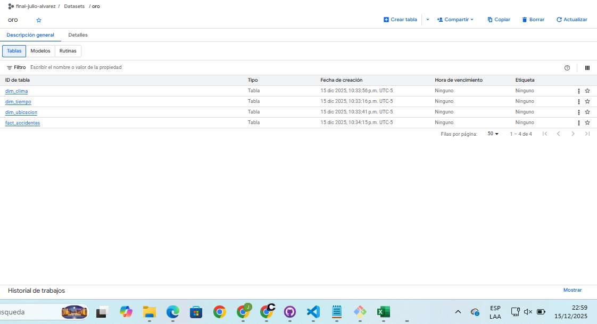
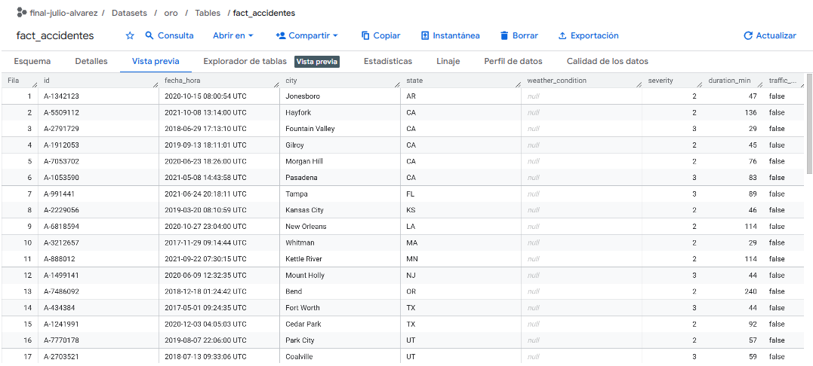
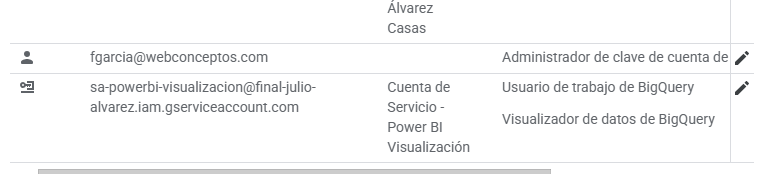
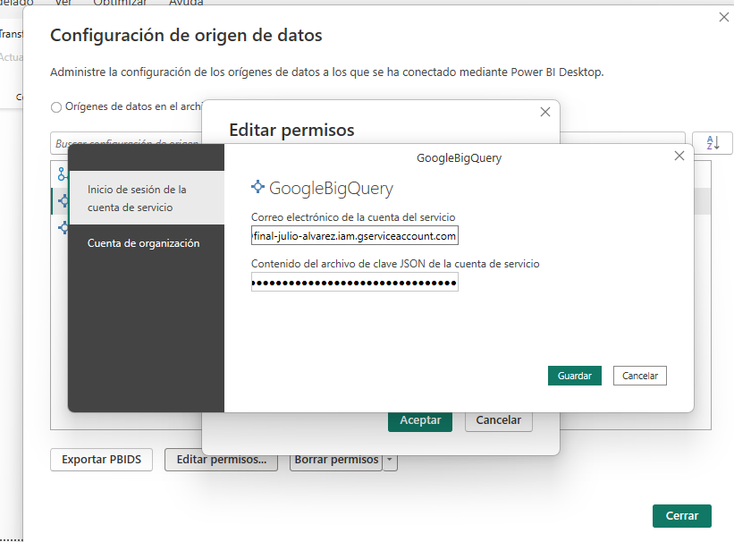
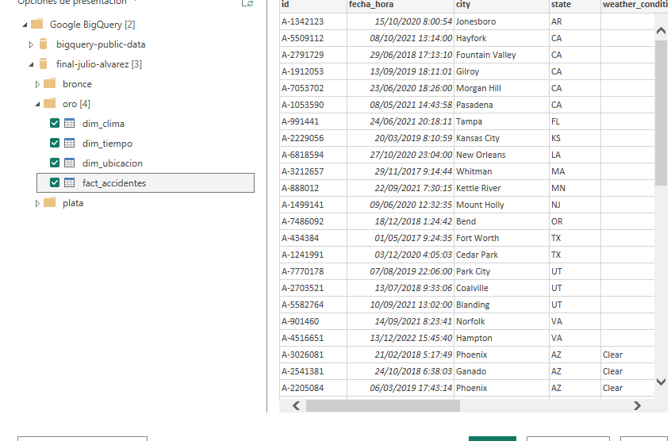
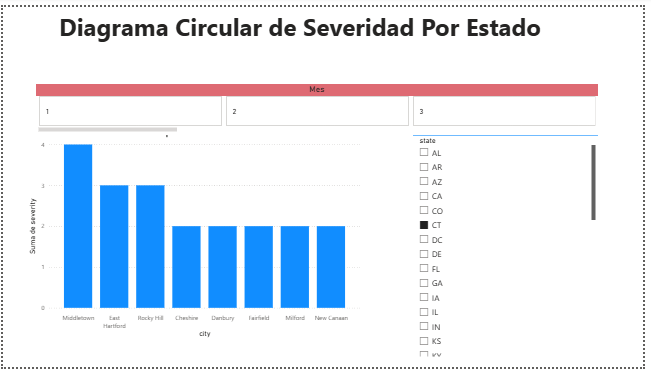

# DESARROLLO EXAMEN FINAL- Julio Cesar Alvarez Casas

## Pregunta 3

## 3.1. Justificación de Nube, despliege de servicios y EDA Inicial


La selección de la plataforma cloud se basó en los siguientes criterios técnicos, aplicables a cualquier tipo de CSV:

- Soporte nativo para almacenamiento de archivos CSV.
- Escalabilidad automática para cargas batch.
- Modelo serverless (sin gestión de infraestructura).
- Bajo costo para ejecuciones esporádicas.
- Seguridad por defecto y trazabilidad.
- Integración directa con Python para análisis exploratorio.
- Compatibilidad con arquitectura Medallion (Bronce–Plata–Oro).

---

### Comparación General: AWS vs Azure vs GCP

| Criterio | AWS | Azure | GCP |
|--------|-----|-------|-----|
| Almacenamiento de CSV | S3 (requiere configuración manual de seguridad) | ADLS Gen2 | Cloud Storage (seguridad por defecto) |
| Procesamiento batch | EMR / Glue (basado en clústeres) | Synapse Spark Pools | Dataproc Serverless |
| Gestión de infraestructura | Media–Alta | Media | Mínima |
| Escalamiento automático | Parcial | Parcial | Completo |
| Costos para uso académico | Moderados | Altos | Muy bajos / Free Tier |
| Integración con Python | Buena | Buena | Nativa y directa |
| Curva de aprendizaje | Media | Media–Alta | Baja |

---

### Ventajas Clave de GCP para Ingestión de CSV (Capa Bronce)

Google Cloud Platform resulta especialmente adecuada para escenarios donde:

- El dataset es desconocido hasta el momento del examen.
- Se requiere cargar archivos CSV rápidamente mediante CLI.
- Se necesita ejecutar scripts Python de EDA sin aprovisionar clústeres.
- Las ejecuciones son puntuales o de baja frecuencia.

Ventajas técnicas principales:

- Cloud Storage permite almacenar archivos CSV sin esquema previo.
- Cifrado automático y auditoría habilitados por defecto.
- Dataproc Serverless permite ejecutar procesamiento bajo demanda.
- Facturación por uso real, evitando costos fijos.
- Ecosistema integrado que facilita la evolución hacia capas Plata y Oro.

---

### Adecuación a Arquitectura Medallion

GCP se adapta de forma natural a una arquitectura Medallion:

```bash
/bronce
├── raw → CSV originales cargados vía CLI
├── processed → CSV con validaciones básicas y normalización inicial
└── curated → Datos listos para consumo analítico inicial
```
### Adecuación a Arquitectura Medallion
Antes de ejecutar el despliegue, se debe contar con la siguiente estructura local:
```bash
.
├── deploy.sh
├── destroy.sh
└── csv/
|    ├── archivo1.csv
|    ├── archivo2.csv
|    └── ...
└── zip/
```

Para este caso el Dataset a usar es el siguiente:


La carpeta csv/ contendrá todos los archivos CSV proporcionados en el examen.


## Autenticarse en GCP

## Pre-requisitos

### Instalar Google Cloud SDK (gcloud CLI)

**En Windows:**
```powershell
# Descargar e instalar desde:
# https://cloud.google.com/sdk/docs/install

# Verificar instalación
gcloud --version
```

**En macOS/Linux:**
```bash
# Descargar instalador
curl https://sdk.cloud.google.com | bash

# Reiniciar terminal y verificar
gcloud --version
```


```bash
# Iniciar sesión con tu cuenta de Google
gcloud auth login
# Esto abrirá tu navegador para autenticación
```


### Asignar permisos de ejecución
```bash
chmod +x deploy.sh destroy.sh
```
### Despliegue automático de la Capa Bronce

En este archivo se crea el proyecto, el ID, se vincula con una cuenta de facturación (valor que debe ser modificado para cada usuario), se crea el bucket. 

```bash
./deploy.sh
```

### Ejecucion del deploy


### Evidencia proyecto creado


### Estructura Generada GCP


### Desarrollo del Eda

El análisis exploratorio fue desarrolladoe en el archivo eda.ipynb del repositorio.


## 3.2. Estrella completo,ETL ejecutado en vivo,KPIs generados y validados. Scripts correctos

Para el desarrollo del modelo estrella en este caso, se esta tomando el dataset reducido de 1000 filas visto que el archivo total tiene un peso de 2.8g. Justificación de limitaciones de tiempo.


Para poder usar spark se seleciono la reguion de us-central1 y se habilitaron las apis necesarias.


### Desarrollo de capas Bronce-Plata-Oro

### Enfoque de Transformación (ETL)

El proceso de transformación de datos se implementó siguiendo el patrón Medallion Architecture (Bronce → Plata → Oro) sobre Google Cloud Platform, utilizando BigQuery como motor analítico y notebooks en Python para la ejecución de los procesos ETL.

Cada capa cumple una función específica:

- BRONCE: ingestión de datos crudos desde Google Cloud Storage.

- PLATA: limpieza, estandarización, enriquecimiento y tipificación de los datos.

- ORO: modelado dimensional y cálculo de indicadores clave (KPIs).



Los scripts utilizados para cada etapa se encuentran en la carpeta:
```bash
/Notebook-Big-Query
```
### Capa Bronce – Carga directamente el csv

Despues del EDA incial se procede la ingesta de datos a la capa bronce, en esta capa simplemente se cargan los datos tal cual estan en el csv.



### Capa PLATA – Transformación y Limpieza

En la capa PLATA se construyó la tabla plata.accidents_clean, cuyo objetivo es dejar los datos en condiciones óptimas para análisis analítico y modelado dimensional.

Las transformaciones realizadas incluyen:

- Conversión de campos temporales a tipos TIMESTAMP.

- Cálculo de la duración del accidente.

- Normalización de variables climáticas.

- Tipificación de atributos temporales (hora, día de la semana, mes).

Filtrado de registros inconsistentes.

📌 Scripts ETL
Los scripts de transformación de BRONCE a PLATA se encuentran documentados y ejecutados en los notebooks disponibles en la carpeta Notebook-Big-Query.

📷 Evidencia – Tabla PLATA creada


### 3. Capa ORO – Modelo Dimensional
### 3.1 Justificación del Modelo Estrella

Se implementó un modelo estrella mínimo, adecuado para análisis OLAP y herramientas de Business Intelligence, debido a las siguientes razones técnicas:

- Optimiza el rendimiento de consultas agregadas.

- Simplifica la interpretación de los datos para usuarios de negocio.

- Facilita la generación de KPIs y dashboards.

- Se alinea con buenas prácticas de modelado dimensional.

El modelo está compuesto por:

1)Tabla de hechos: fact_accidentes

2)Tablas de dimensión: tiempo, ubicación y clima.

```bash

                    ||--------------------||
                    ||     DIM_TIEMPO     ||
                    ||--------------------||
                    || PK fecha_hora      ||
                    || hora               ||
                    || dia_semana         ||
                    || mes                ||
                    ||--------------------||
                               ||
                               ||
                               ||
                               ||
||--------------------||        ||        ||------------------------||
||  DIM_UBICACION     ||========||========||    FACT_ACCIDENTES     ||
||--------------------||        ||        ||------------------------||
|| PK city            ||        ||        || PK id                 ||
|| state              ||        ||        || FK fecha_hora         ||
|| start_lat          ||        ||        || FK city               ||
|| start_lng          ||        ||        || FK weather_condition  ||
||--------------------||        ||        || severity               ||
                               ||        || duration_min           ||
                               ||        || traffic_signal         ||
                               ||        || junction               ||
                               ||        || crossing               ||
                               ||        ||------------------------||
                               ||
                               ||
                               ||
                    ||--------------------||
                    ||     DIM_CLIMA      ||
                    ||--------------------||
                    || PK weather_condition||
                    || temperaturef       ||
                    || humiditypct        ||
                    || pressurein         ||
                    || visibilitymi       ||
                    || wind_speedmph      ||
                    || precipitationin    ||
                    ||--------------------||
```




### Tablas de Dimensión

Las dimensiones fueron generadas a partir de la capa PLATA mediante scripts SQL ejecutados desde notebooks.

- Dimensión Tiempo (dim_tiempo)
Permite analizar accidentes por hora, día y mes.

- Dimensión Ubicación (dim_ubicacion)
Facilita el análisis geográfico por ciudad y estado.

- Dimensión Clima (dim_clima)
Permite evaluar la relación entre accidentes y condiciones meteorológicas.

📌 Referencia de scripts
La creación de las tablas de dimensión se encuentra implementada en los notebooks disponibles en Notebook-Big-Query.


### Tabla de Hechos – fact_accidentes

La tabla de hechos centraliza las métricas principales del negocio y se relaciona con las dimensiones mediante claves naturales.

Contiene:

- Severidad del accidente.

- Duración del evento.

- Indicadores viales relevantes.

- Referencias temporales, geográficas y climáticas.

📌 Referencia de scripts
El proceso de construcción de la tabla de hechos está documentado en los notebooks de la carpeta Notebook-Big-Query.






## 3.3. Visualización

Para la visualizacion se creo una cuenta de servicio la cual generará una llave para la cuentaque podra ser utilizada como credenciales en PowerBI.


### Creación de la cuenta de servicio

Esta sera la cuenta de servicio que permitira la visualización del PowerBI
```bash
gcloud iam service-accounts create sa-powerbi-visualizacion \
  --display-name="Cuenta de Servicio - Power BI Visualización" \
  --project=final-julio-alvarez
```

## Generación de Clave JSON (Credencial Temporal)
```bash
gcloud iam service-accounts keys create sa-powerbi-visualizacion-key.json \
  --iam-account=sa-powerbi-visualizacion@final-julio-alvarez.iam.gserviceaccount.com
```


La clave se genera en el directorio de ejecución de Cloud Shell.

### Descarga a entorno local
```bash
cloudshell download sa-powerbi-visualizacion-key.json
```


## Asignación de Roles (Acceso Simplificado)

Para garantizar compatibilidad con datasets que utilizan ACL clásico y facilitar la conexión desde Power BI, se asignaron los siguientes roles a nivel proyecto:
```bash
gcloud projects add-iam-policy-binding final-julio-alvarez \
  --member="serviceAccount:sa-powerbi-visualizacion@final-julio-alvarez.iam.gserviceaccount.com" \
  --role="roles/bigquery.dataViewer"
```

```bash
gcloud projects add-iam-policy-binding final-julio-alvarez \
  --member="serviceAccount:sa-powerbi-visualizacion@final-julio-alvarez.iam.gserviceaccount.com" \
  --role="roles/bigquery.jobUser"
```
```bash
gcloud projects add-iam-policy-binding final-julio-alvarez \
  --member="serviceAccount:sa-powerbi-visualizacion@final-julio-alvarez.iam.gserviceaccount.com" \
  --role="roles/bigquery.user"
```

En cumplimiento de buenas prácticas de seguridad, las claves de la cuenta de servicio deben eliminarse una vez finalizado el periodo de uso o evaluación.

Consideraciones

- Cada cuenta de servicio puede tener un máximo de 10 claves activas.

- Se recomienda eliminar claves antiguas antes de generar nuevas.

Comando CLI para eliminar una clave existente
```bash
gcloud iam service-accounts keys delete KEY_ID \
  --iam-account=sa-powerbi-visualizacion@final-julio-alvarez.iam.gserviceaccount.com
```

Este comando revoca inmediatamente el acceso asociado a la clave, asegurando el principio de mínimo privilegio y evitando accesos no autorizados posteriores.

## Replicación para el Docente

### Rol otorgado

Las claves de acceso para las cuentas de usuario deberan ser descargadas en el dispositivo del usuario y evitar ser compartidas o subidas a un repositorio público. Por tal motivo se asigno un rol de administrador de cuentas de servicio lo que le permite crear su propia clave de acceso para replicación del Dashboard.

```bash
gcloud projects add-iam-policy-binding final-julio-alvarez \
  --member=user:fgarcia@webconceptos.com \
  --role="roles/iam.serviceAccountKeyAdmin" \
  --project=final-julio-alvarez
```


Con este rol el usuario puede:

- Crear claves

- Eliminar claves

- Descargar el JSON al momento de crearlas

Replicar:
```bash
gcloud iam service-accounts keys create sa-powerbi-visualizacion-key.json \
  --iam-account=sa-powerbi-visualizacion@final-julio-alvarez.iam.gserviceaccount.com \
  --project=final-julio-alvarez
```



Descargar Clave:

```bash
cloudshell download sa-powerbi-visualizacion-key.json
```





Una vez puesta las credenciales, se procede a crear el dashboard comparativo.

En el primero se hace un comparativo con un grafico pareto del nivel de severidad de los accidentes por ciudad y estado, donde se puede analizar los estados y ciudadades con mayor nivel accidentes en los Estados Unidos



En el segundo tablero se puede ver una comparativa circular por ciudad dependiendo el tipo de condicion climática asociada.


El archivo power BI esta cargado en la carpeta de desarrollo, para que pueda ser usado.