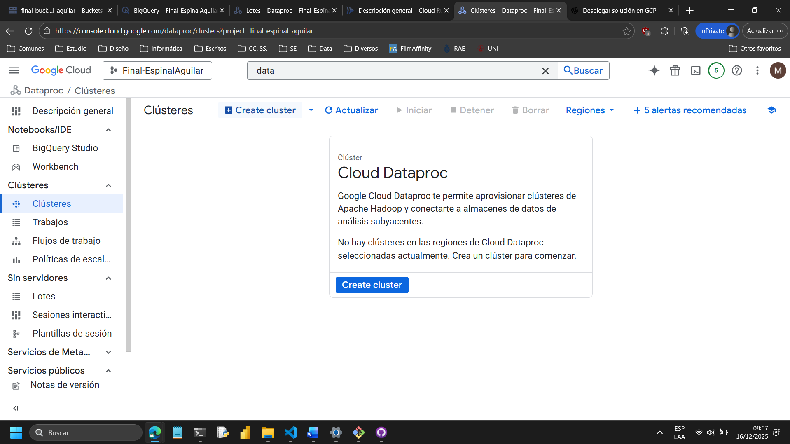
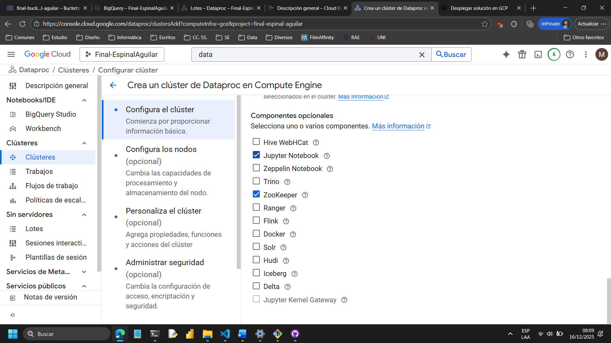
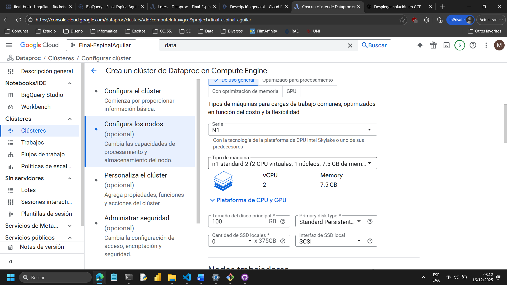
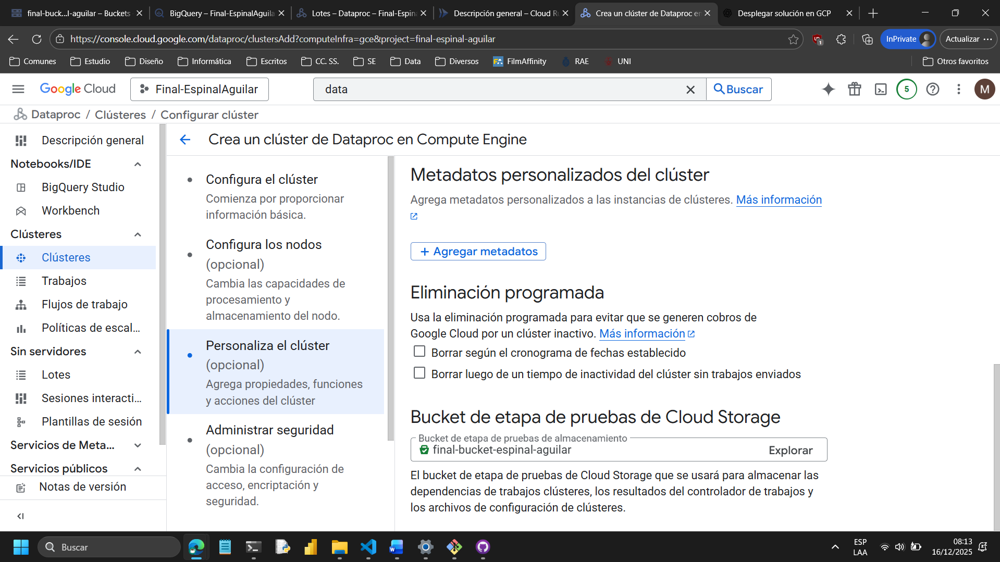
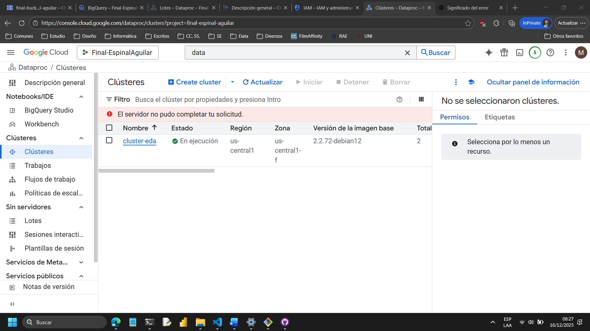
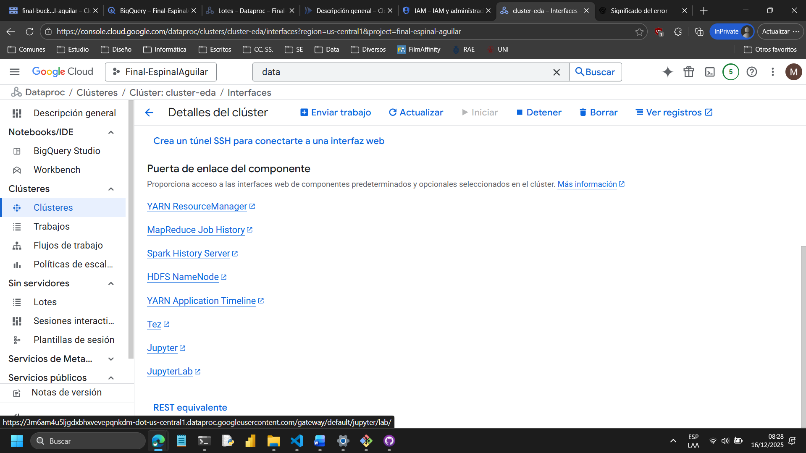
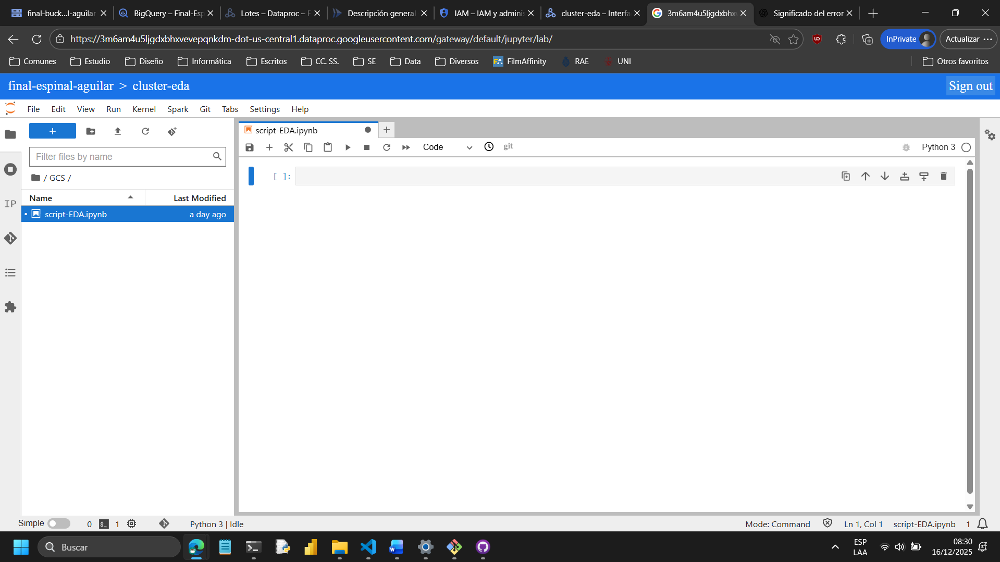

# 2. Análisis Exploratorio de Datos (EDA)

## 2.1 Objetivo del EDA

El Análisis Exploratorio de Datos (EDA) tiene como objetivo **comprender la estructura, calidad y comportamiento de los datos fuente** antes de su procesamiento dentro de la arquitectura Medallion.

Esta etapa permite:

* Identificar valores nulos e inconsistencias
* Analizar distribuciones y outliers
* Validar supuestos de negocio
* Definir transformaciones posteriores para las capas Plata y Oro

El EDA se ejecuta en un entorno **distribuido y reproducible**, utilizando **Google Cloud Dataproc con JupyterLab**.

---

## 2.2 Entorno de ejecución

El análisis se realizó sobre un **clúster Dataproc temporal**, configurado específicamente para tareas de EDA y exploración interactiva.

### Características del entorno

* Servicio: Google Cloud Dataproc
* Interfaz: JupyterLab
* Lenguaje: Python
* Origen de datos: Cloud Storage (capa Raw)

---

## 2.3 Creación del clúster Dataproc para EDA

La creación del clúster se puede replicar mediante la siguiente **línea de comandos**.

### Comando de creación del clúster

```bash
gcloud dataproc clusters create cluster-7c9d \
  --enable-component-gateway \
  --bucket final-bucket-espinal-aguilar \
  --region us-central1 \
  --no-address \
  --master-machine-type n1-standard-2 \
  --master-boot-disk-size 100 \
  --num-workers 2 \
  --worker-machine-type n1-standard-2 \
  --worker-boot-disk-size 200 \
  --image-version 2.2-debian12 \
  --optional-components JUPYTER,ZOOKEEPER \
  --scopes 'https://www.googleapis.com/auth/cloud-platform' \
  --project final-espinal-aguilar
```

📌 **Nota:**
El clúster fue creado exclusivamente para EDA y puede ser eliminado una vez finalizado el análisis. Los otros servicios de Dataproc son serveless.

---

### Evidencia del proceso de creación



**Activación de JupyterLab**




**Configuración de nodos**



**Selección del bucket para guardar los notebooks**



**Clúster en ejecución**



---

## 2.4 Acceso a JupyterLab

Una vez creado el clúster, el acceso a JupyterLab en la pestaña de servicios web del cluster que hemos credo.





---

## 2.5 Estructura del análisis EDA

El análisis exploratorio se desarrolló dentro de un notebook Jupyter, el cual se almacena en el repositorio en:

```text
docs/scripts/
└── script-EDA.ipynb
```
Donde se guarda el codigo y los logs del proceso.

---

## 2.6 Inicialización del notebook

Al inicio del notebook se importan las librerías necesarias y se configura el entorno.

```python
# Manipulación de datos
import pandas as pd
import numpy as np

# Visualización
import matplotlib.pyplot as plt
import seaborn as sns

# Estadística
from scipy import stats
from sklearn.preprocessing import StandardScaler

# Utilidades
import missingno as msno
import warnings
warnings.filterwarnings('ignore')

# GCP
from google.cloud import storage
```

---

## 2.7 Conexión a Cloud Storage

El notebook se conecta directamente a **Cloud Storage** para explorar los datos de la capa Raw.

### Listado de buckets disponibles

```python
client = storage.Client()
for bucket in client.list_buckets():
    print(bucket.name)
```

### Listado de archivos del bucket de datos

```python
bucket = client.bucket("final-bucket-espinal-aguilar")
blobs = bucket.list_blobs()

for b in blobs:
    if not b.name.startswith(('.ipynb_checkpoints/', 'google-cloud-dataproc-metainfo/')):
        print(b.name)
```

Esta validación permite confirmar la disponibilidad y estructura de los archivos antes de su carga para análisis.

---

## 2.8 Resultados del EDA


