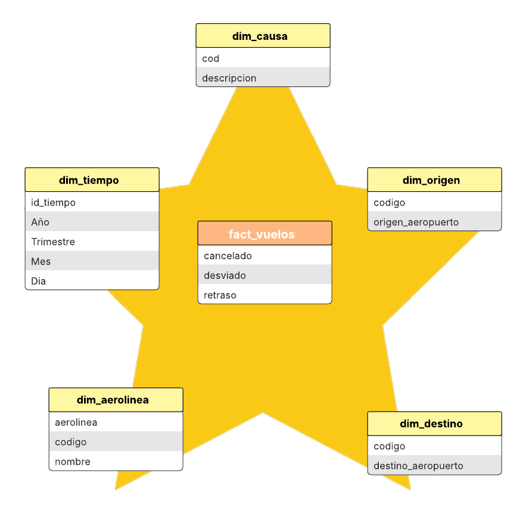

# 📁 03. Modelo Dimensional

## 3.1. Diagrama del modelo dimensional

El siguiente diagrama representa la **estructura lógica del modelo dimensional tipo estrella (star schema)** implementado en la **capa Oro**, el cual facilita el análisis analítico y la agregación eficiente de métricas a través de múltiples ejes de negocio.



---

## 3.2. Tablas de dimensión

Las **tablas de dimensión** contienen atributos descriptivos que permiten **segmentar, filtrar y contextualizar** las métricas almacenadas en la tabla de hechos.

Las dimensiones definidas en el modelo son las siguientes:

* `dim_tiempo`: atributos temporales derivados de la fecha del vuelo (año, mes, día, día de la semana).
* `dim_aerolinea`: información descriptiva de la aerolínea operadora.
* `dim_origen`: aeropuerto de origen del vuelo.
* `dim_destino`: aeropuerto de destino del vuelo.
* `dim_causa`: causas asociadas a los retrasos del vuelo.

---

## 3.3. Tabla de hechos

La **tabla de hechos `fact_vuelos`** centraliza las **métricas cuantitativas** relacionadas con la operación de los vuelos, permitiendo realizar análisis analíticos eficientes y agregaciones a través de las distintas dimensiones del modelo (tiempo, aerolínea, origen, destino y causa de retraso).

Entre las principales métricas y atributos incluidos se encuentran:

* **dep_delay**: minutos de retraso en la salida del vuelo.
* **arr_delay**: minutos de retraso en la llegada del vuelo.
* **delay_by_cause**: minutos totales de retraso acumulados por causas operativas.
* **vuelos_retrasados**: indicador de vuelos con retraso (derivado de reglas de negocio).
* **sk_tiempo, sk_aerolinea, sk_origen, sk_destino, sk_causa**: claves sustitutas (surrogate keys) que referencian a las tablas de dimensión correspondientes.


---

## 3.4. Scripts de generación

La construcción de las capas asociadas al **modelo dimensional** —y, por consiguiente, la materialización del modelo estrella en la **capa Oro**— se realiza mediante un **job de Apache Spark**, implementado en el siguiente archivo:

```text
resources/SparkJobs/jb_medallion.py
```

Dicho script forma parte del directorio `resources` y es ejecutado **de manera automática** por el componente `final-dispatcher` cuando se detecta la llegada de un nuevo archivo en la ruta `bronce/raw` del bucket de **Google Cloud Storage (GCS)**.

Como resultado, la **reproducibilidad y automatización del proceso ETL** quedan garantizadas una vez que el entorno ha sido desplegado correctamente mediante la ejecución del script `deploy.sh`, sin requerir intervenciones manuales adicionales para el procesamiento y carga de datos.