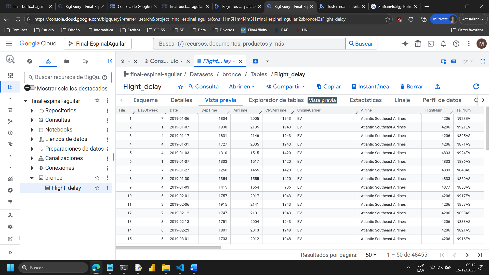
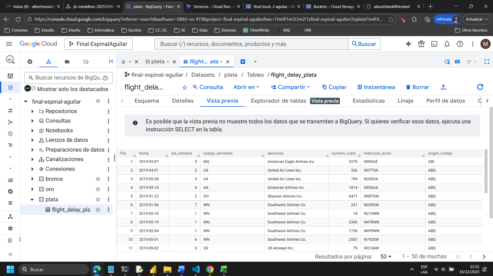
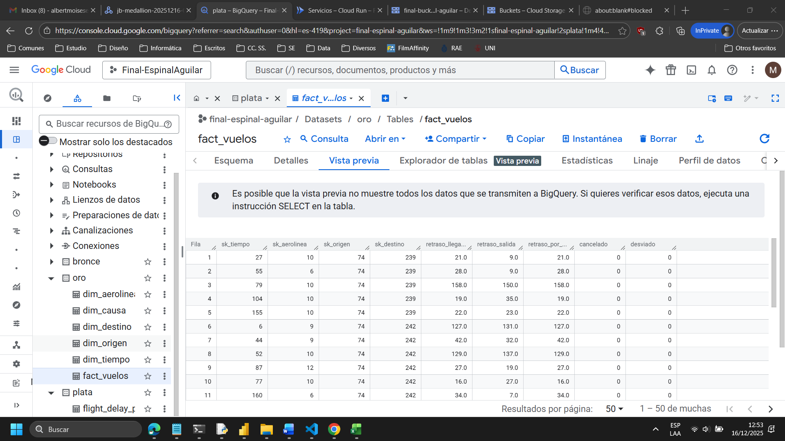

# 📁 04. Procesamiento de Datos

Este capítulo describe en detalle el **flujo de procesamiento ETL** implementado para la ingesta, limpieza, transformación y modelado dimensional de los datos de vuelos, siguiendo el patrón **Medallion Architecture*
---

## 4.1. Capa Bronce



La **capa Bronce** representa el nivel de **ingesta cruda** de los datos, donde la información es almacenada con **mínima intervención** para preservar la fidelidad respecto a la fuente original.

### Transformaciones realizadas

Las principales transformaciones aplicadas en esta capa son:

* **Ingesta estructurada desde archivos fuente** (CSV/XLS) almacenados en Google Cloud Storage.
* **Normalización básica de nombres de columnas**, asegurando consistencia en minúsculas y sin caracteres especiales.
* **Control de formato de fechas**, validando que el campo `date` cumpla con el patrón `yyyy-MM-dd`. Los valores inválidos son convertidos a `NULL` para su posterior tratamiento.
* **Persistencia del esquema original**, sin eliminar columnas ni registros, con el objetivo de mantener un respaldo íntegro de los datos fuente.
* **Registro de eventos del proceso**, incluyendo inicio, fin y métricas básicas de filas procesadas.

Esta capa funciona como **fuente de auditoría**, permitiendo reprocesar información en caso de errores en capas posteriores.

---

## 4.2. Capa Plata



La **capa Plata** se enfoca en la **limpieza, estandarización y enriquecimiento** de los datos, transformando la información cruda en un dataset confiable y analíticamente usable.

### Transformaciones realizadas

Entre las principales transformaciones implementadas se encuentran:

* **Eliminación de duplicados operativos**, utilizando la combinación de los campos `date`, `flightnum`, `origin` y `dest` como clave natural del vuelo.
* **Eliminación de columnas no analíticas**, como `cancellationcode`, que no aportan valor al análisis de retrasos.
* **Corrección y estandarización de valores nulos**, reemplazando nombres de aeropuertos faltantes (`org_airport`, `dest_airport`) por valores descriptivos genéricos cuando solo se dispone del código IATA.
* **Cast explícito de columnas numéricas**, garantizando la correcta tipificación de métricas de retraso, distancia y tiempos de rodaje.
* **Creación de variables derivadas**, como:

  * `retraso`: indicador binario que identifica vuelos con retraso en la llegada.
* **Selección controlada de columnas**, dejando únicamente los atributos relevantes para el modelado dimensional.

El resultado es un **dataset consistente, validado y listo para análisis**, que sirve como insumo directo para la capa Oro.

---

## 4.3. Capa Oro



La **capa Oro** corresponde al nivel de **modelado analítico**, donde los datos son reorganizados siguiendo un **modelo dimensional tipo estrella**, optimizado para consultas de Business Intelligence y análisis exploratorio.

### Transformaciones realizadas

Las transformaciones clave en esta capa incluyen:

* **Construcción de tablas de dimensión** (`dim_tiempo`, `dim_aerolinea`, `dim_origen`, `dim_destino`, `dim_causa`) directamente desde el dataset de la capa Plata.
* **Generación de claves sustitutas (surrogate keys)** para cada dimensión, evitando dependencias con claves naturales.
* **Definición explícita de relaciones dimensionales**, resolviendo las claves foráneas dentro del DataFrame antes de la carga en BigQuery, con el fin de evitar errores de inserción en estructuras vacías.
* **Creación de la tabla de hechos `fact_vuelos`**, centralizando las métricas de retraso y los identificadores de las dimensiones.
* **Carga directa en BigQuery**, utilizando el modo `overwrite` para asegurar consistencia entre ejecuciones del pipeline.

Este diseño permite **consultas eficientes, agregaciones por múltiples dimensiones** y una integración directa con herramientas de visualización.

---

## 4.4. Trazabilidad

### Logs de procesamiento

Los **logs generados durante la ejecución del job de Spark** se encuentran disponibles en el siguiente directorio:

```text
docs/logs/
```

Estos registros permiten auditar:

* Errores de ejecución
* Métricas de procesamiento
* Validaciones aplicadas por capa
* Tiempos de ejecución del pipeline

### Scripts analíticos en BigQuery

Adicionalmente, se incluyen **scripts SQL utilizados para validación y análisis exploratorio en BigQuery**, los cuales se encuentran almacenados en:

```text
docs/scripts/
```