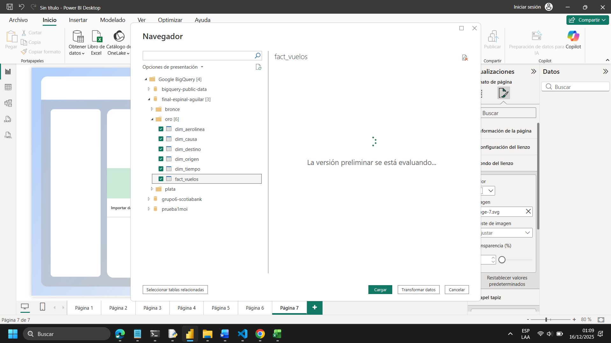
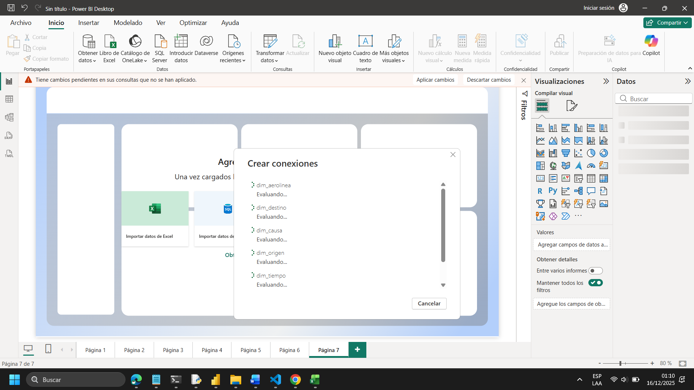
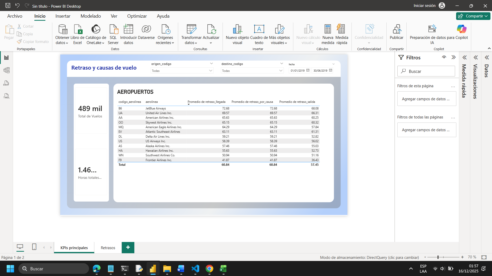
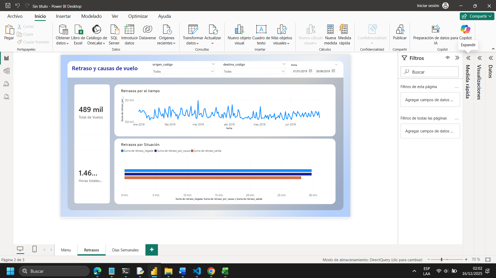
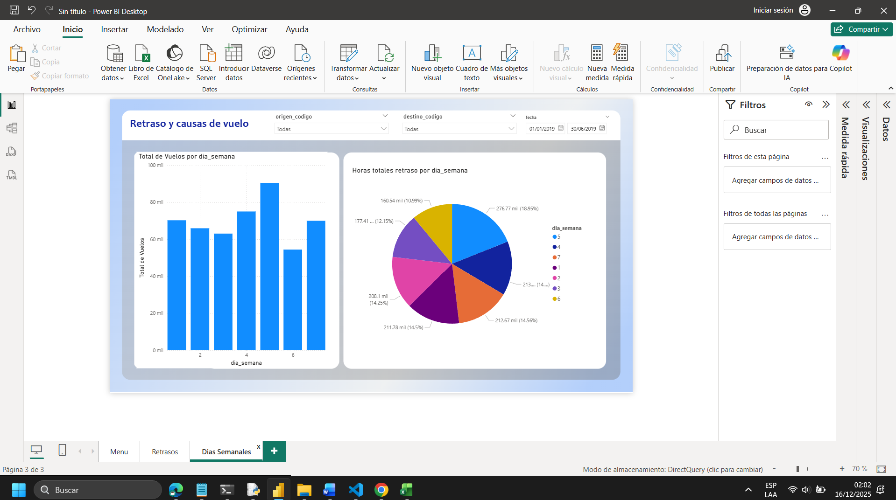

# 5. Visualización de KPIs - Dashboards

## 5.1. Objetivo de la visualización

El objetivo de la capa de visualización es **traducir los datos procesados en la capa Oro en indicadores clave de desempeño (KPIs)** que permitan evaluar el comportamiento de los datos, facilitando la toma de decisiones estratégicas.

Los dashboards fueron diseñados para consumir datos **exclusivamente desde la capa Oro (en BigQuery)**, garantizando consistencia, calidad y trazabilidad de la información.

## Pasos para la Conexión

### 1. Crear Conexión




### 2. Cargar Tablas



---

## 5.2. Dashboards desarrollados

### 📊 Dashboard 1:



### 📈 Dashboard 2:



### 📊 Dashboard 3:



## 5.3. Reproducibilidad de los dashboards

La solución fue diseñada para ser **reproducible y verificable por terceros**, como parte del proceso de evaluación académica.

### Pasos para replicar los dashboards

1. Descargar el archivo `.pbix` correspondiente desde la carpeta:

   ```text
   docs/powerbi/
   ```

2. Abrir el archivo en **Power BI Desktop**.

3. Crear una **cuenta de servicio en GCP** con permisos:

   * `BigQuery Data Viewer`
   * `BigQuery Job User`

4. Generar una **clave JSON** para la cuenta de servicio.

5. En Power BI:

   * Ir a **Transformar datos → Configuración de origen**
   * Reemplazar las credenciales existentes
   * Configurar el nuevo origen apuntando a:

     * Proyecto GCP
     * Dataset de la capa Oro

6. Actualizar el modelo de datos.

7. Validar que los KPIs coincidan con los valores esperados.