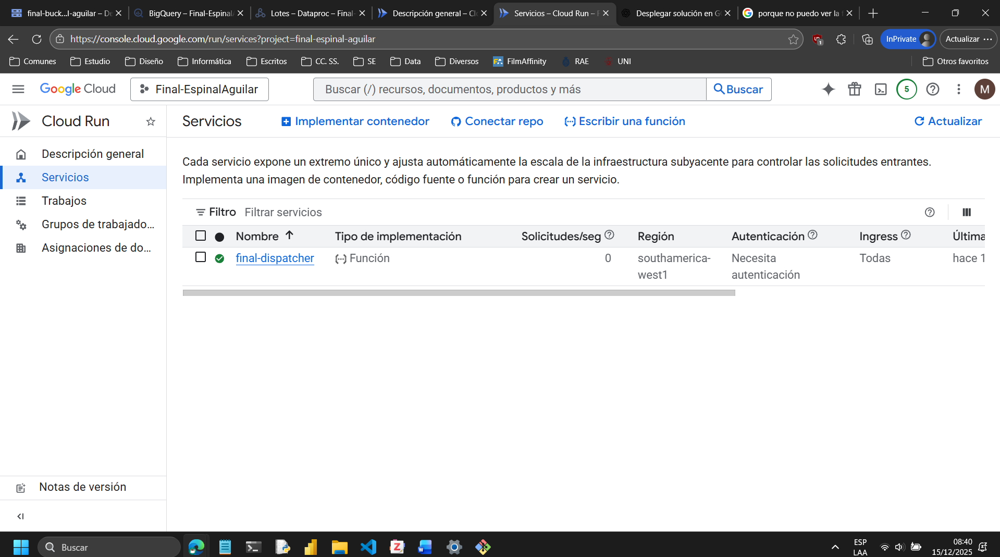
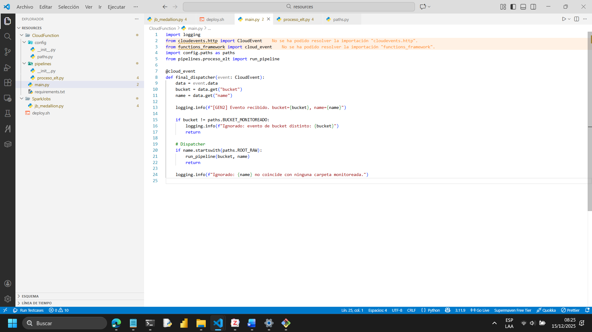
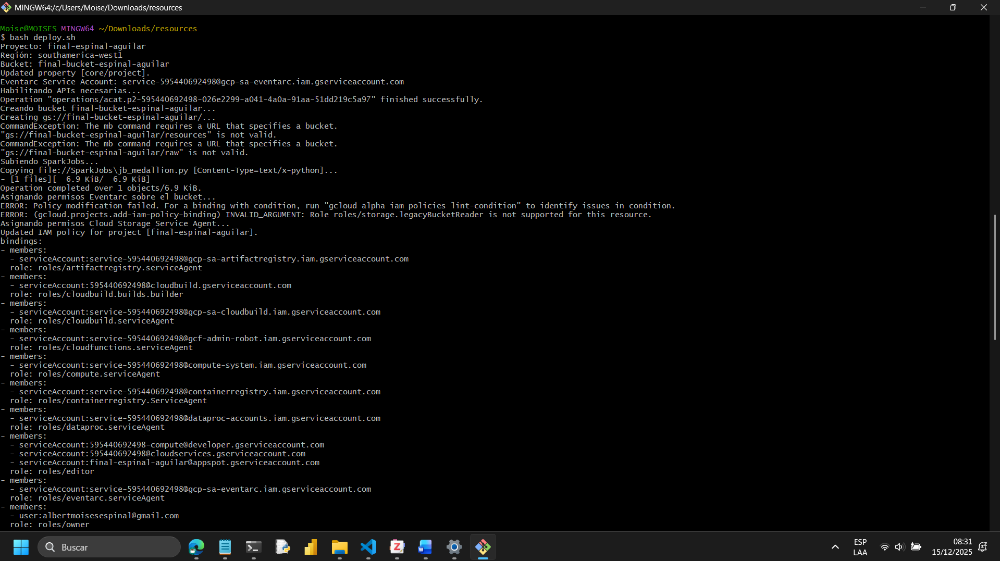
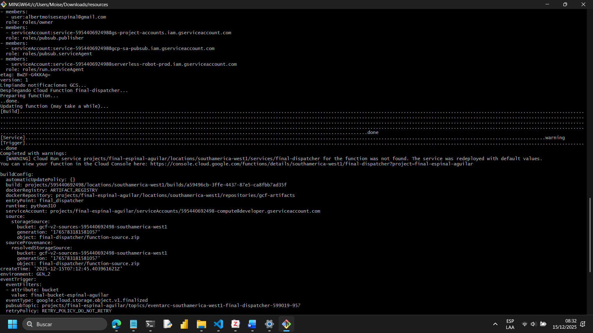
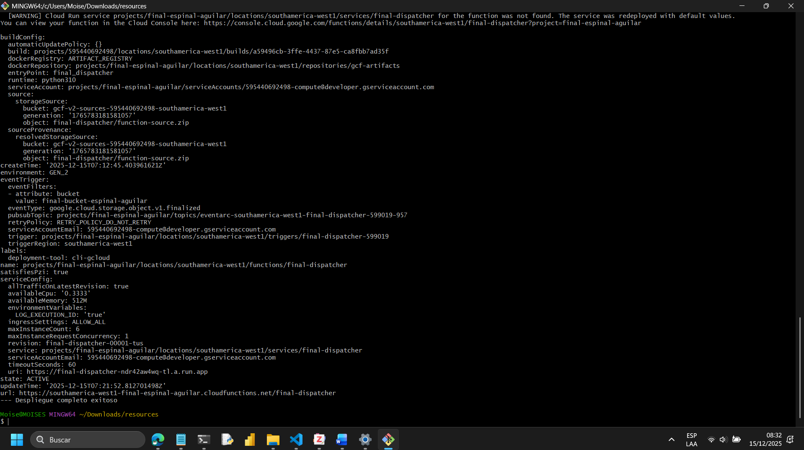
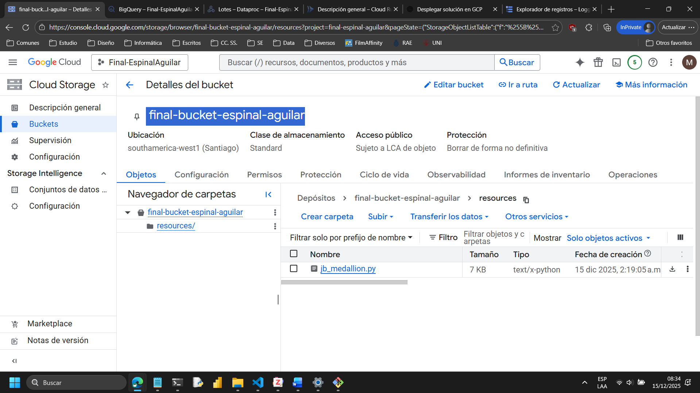

# 📊 Proyecto de Inteligencia de Negocios en Google Cloud Platform

### *Arquitectura Medallion automatizada con GCP, PySpark y Power BI*

## 1. Descripción general

Este proyecto implementa un **pipeline de datos end-to-end** orientado a Inteligencia de Negocios, desplegado íntegramente sobre **Google Cloud Platform (GCP)** y basado en una **arquitectura Medallion (Bronce-Plata-Oro)**.

El flujo está diseñado para ser **event-driven, serverless y reproducible**, integrando:

* Ingesta automática de archivos mediante un **dispatcher en Cloud Functions**
* Persistencia inicial en **BigQuery (capa Bronce)**
* Procesamiento batch distribuido con **PySpark en Dataproc Serverless**
* Transformaciones analíticas hacia capas **Plata y Oro**
* Consumo final de datos mediante **Power BI**

---

## 2. Arquitectura del flujo

1. Un archivo es cargado en un bucket de **Cloud Storage**
2. El **dispatcher** detecta el evento y ejecuta el ELT hacia BigQuery (Bronce)
3. Un job **PySpark** procesa los datos para las capas Plata y Oro
4. Los resultados se almacenan en **BigQuery**
5. **Power BI** consume directamente la capa Oro

#### Evidencia del dispatcher desplegado



---

## 3. Estructura del repositorio

```text
├── 01_Justification_Cloud/
├── 02_EDA/
├── 03_Modelo_Dimensional/
├── 04_Procesamiento/
├── 05_Dashboards/
│
├── docs/
│   ├── imagenes/
│   └── logs/
│
├── resources/
│   ├── CloudFunction/
│   ├── SparkJobs/
│   └── deploy.sh
│
└── README.md
```

---

## 4. Descripción de carpetas

### 📁 `01_Justification_Cloud/`

Justificación técnica y financiera de la elección de **Google Cloud Platform** frente a AWS y Azure.

👉 [Ver más](01_Justificacion_Cloud)

### 📁 `02_EDA/`

Análisis exploratorio de datos y validación de calidad previa al procesamiento.

👉 [Ver más](02_EDA)

### 📁 `03_Modelo_Dimensional/`

Diseño del modelo dimensional utilizado para el análisis en BigQuery y Power BI.

👉 [Ver más](03_Modelo_Dimensional)


### 📁 `04_Procesamiento/`

Reglas de negocio y lógica de transformación para las capas Plata y Oro mediante el **Job de Spark**.

👉 [Ver más](04_Procesamiento)


### 📁 `05_Dashboards/`

Dashboards finales desarrollados en **Power BI** conectados a BigQuery.

👉 [Ver más](05_Dashboards)

---

## 5. Código fuente (`resources/`)

La carpeta `resources/` contiene **todo el código necesario para el despliegue y ejecución del proyecto en GCP**.

### 5.1 Estructura interna

```text
resources/
├── CloudFunction/
│   ├── config/
│   ├── pipelines/
│   ├── main.py
│   └── requirements.txt
│
├── SparkJobs/
│   └── jb_medallion.py
│
└── deploy.sh
```

### Evidencia del código del dispatcher



---

## 6. Despliegue y ejecución del proyecto

El proyecto se despliega **exclusivamente mediante línea de comandos**, utilizando el script `deploy.sh`.

### 6.1 Requisitos previos

* Proyecto en Google Cloud con **billing habilitado**
* Google Cloud SDK (`gcloud`) instalado
* Permisos de **Owner o Editor**
* Acceso a una terminal (Windows, Linux o WSL)

---

### 6.2 Parámetros a configurar

Antes de ejecutar el script, editar `deploy.sh` y ajustar:

```bash
PROJECT_ID="final-espinal-aguilar"
BUCKET_NAME="final-bucket-espinal-aguilar"
```

📌 El nombre del bucket debe ser único a nivel global.

---

### 6.3 Ejecución del script

Desde la carpeta `resources/`:

```bash
bash deploy.sh
```

Durante la ejecución, el script:

1. Configura el proyecto y la región
2. Habilita las APIs necesarias
3. Crea el bucket y su estructura (`raw/`, `resources/`)
4. Sube los scripts PySpark
5. Ejecuta el job Dataproc Serverless
6. Despliega el dispatcher en Cloud Functions

### Evidencia de ejecución del script







---

## 7. Almacenamiento y eventos

El bucket de Cloud Storage actúa como punto de entrada de datos y disparador del pipeline.

### Evidencia del bucket creado



