# 🚀 Laboratorio: Levantar un Clúster Hadoop + Spark + Kafka en Google Cloud Platform (GCP)

En este laboratorio implementamos un clúster Dataproc en Google Cloud Platform (GCP), configuramos almacenamiento en Google Cloud Storage (GCS), procesamos datos utilizando Hadoop y Spark, y realizamos una simulación de transmisión en tiempo real con Apache Kafka y Spark Streaming.

---

## 🧰 Herramientas utilizadas

* **Google Cloud Platform (GCP)**
* **Google Dataproc (Hadoop + Spark)**
* **Google Cloud Storage (GCS)**
* **Apache Kafka**
* **JupyterLab**
* **Spark Streaming**

---

## 🏁 1. Configuración Inicial en GCP

### 1.1 Creación de la cuenta en GCP

Ingresamos a [cloud.google.com](https://cloud.google.com) y activamos la cuenta con créditos gratuitos para nuevos usuarios.


### 1.2 Creación del proyecto

Dentro de la consola:

1. Accedimos al panel de **Proyectos**.
2. Creamos el proyecto llamado: **Lab GCP Grupo 6**.
  
<p align="center">
    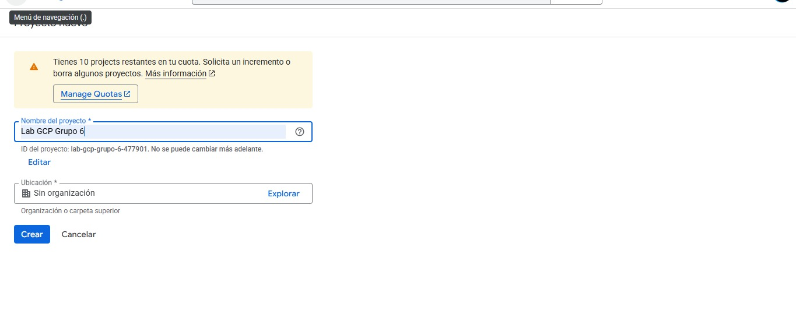
</p>

3. Registramos el **ID del proyecto:** `lab-gcp-grupo-6`.


<p align="center">
    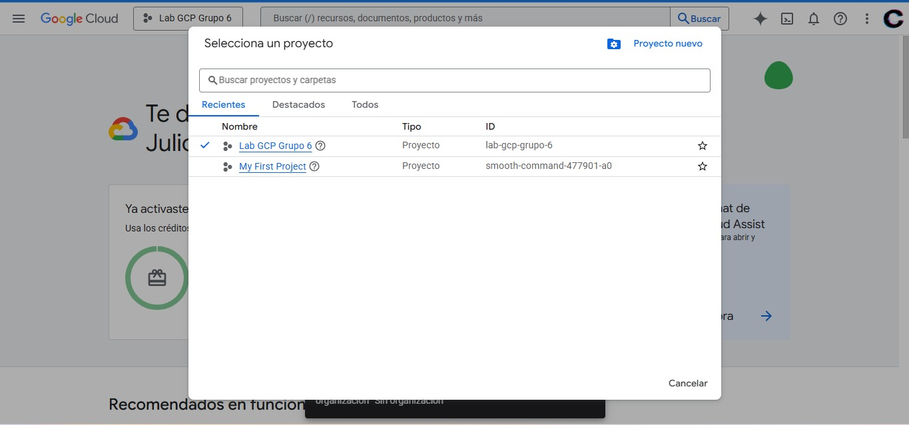
</p>


### 1.3 Habilitación de APIs necesarias

Desde **APIs & Services**, habilitamos:

* **Cloud Dataproc API**

<p align="center">
    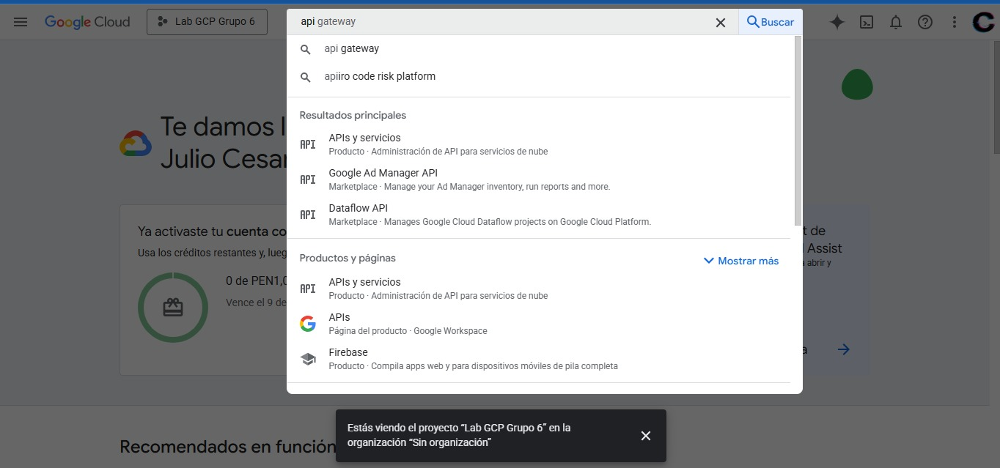
</p>

<p align="center">
    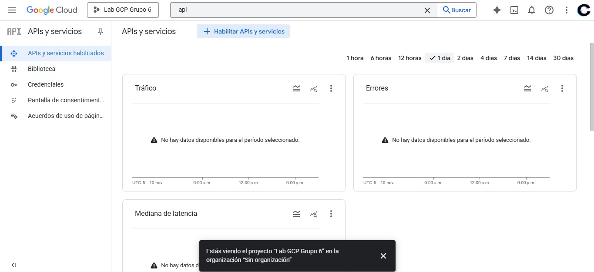
</p>

<p align="center">
    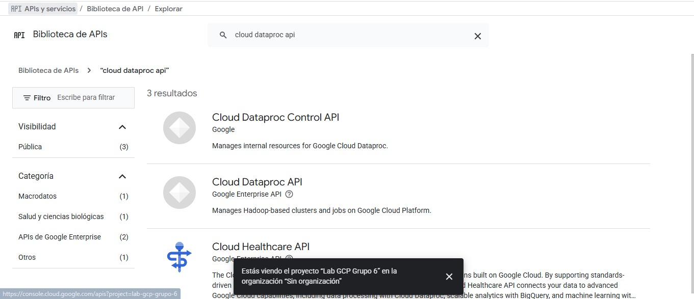
</p>

<p align="center">
    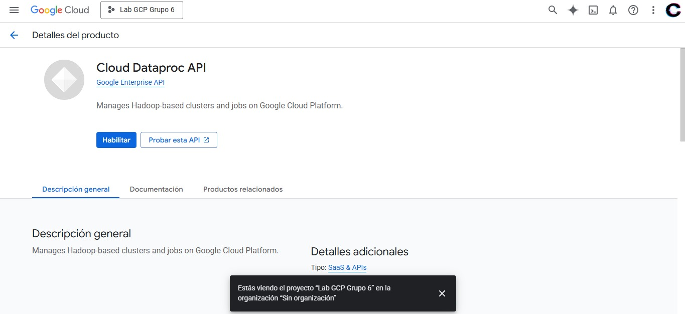
</p>

<p align="center">
    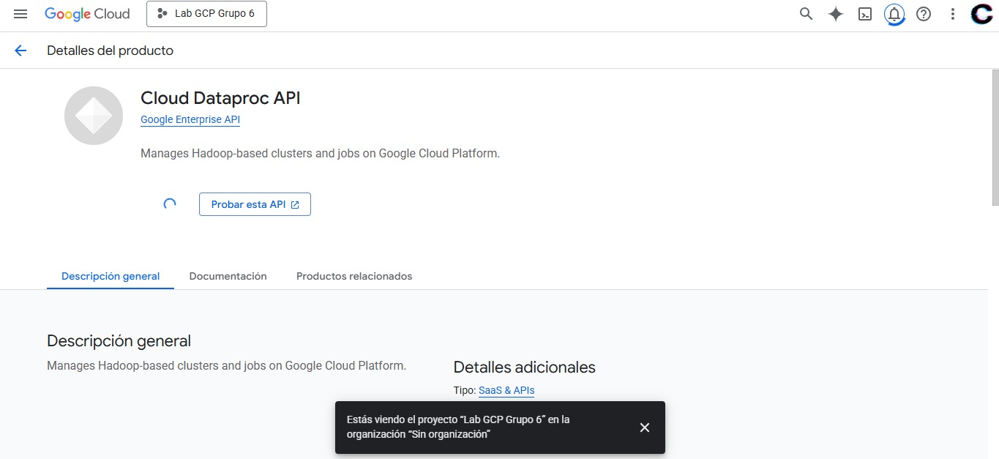
</p>

### 1.4 Configuración de permisos IAM

Validamos que nuestra cuenta contaba con permisos de **Editor**, necesario para operar Dataproc.

<p align="center">
    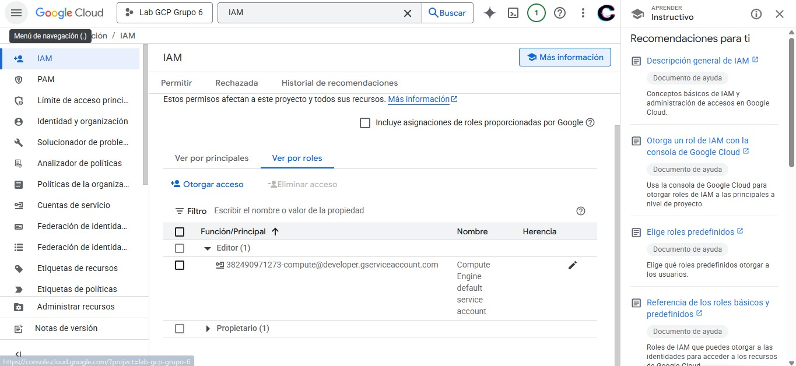
</p>

---

## 🗄️ 2. Creación del Bucket en Google Cloud Storage (GCS)

En **Cloud Storage**:

<p align="center">
    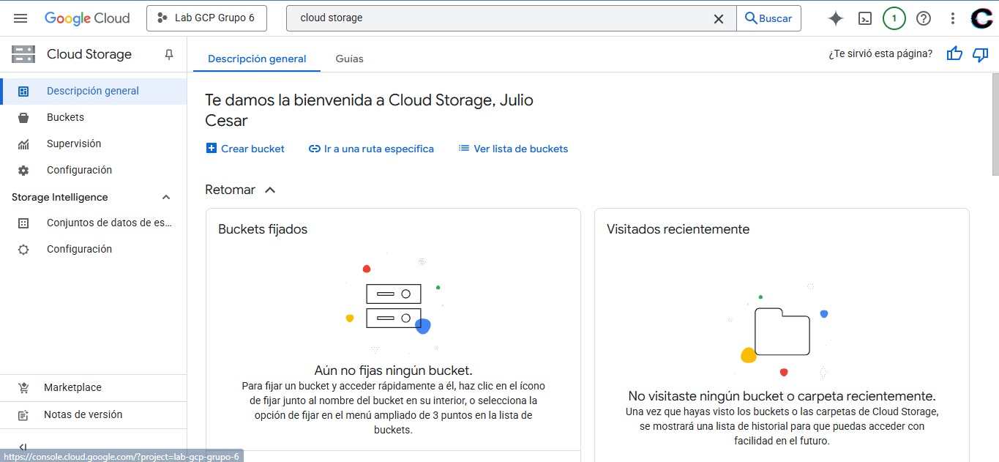
</p>

1. Creamos un bucket exclusivo para el laboratorio con el nombre `sin-grupo6-bucket-1`.

<p align="center">
    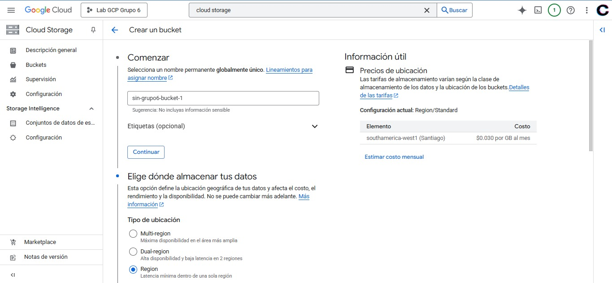
</p>

2. Seleccionamos la región correspondiente a Chile `southamerica-west1 (Santiago)`.

<p align="center">
    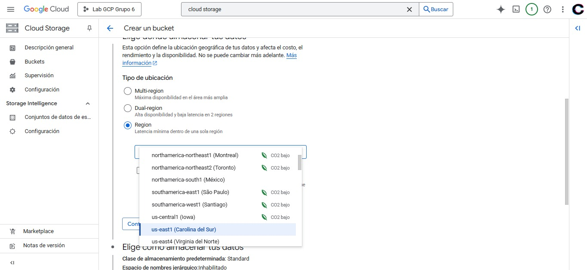
</p>

3. Mantenemos la política de privacidad por defecto.
4. Subimos el archivo de datos `flights.csv` que posteriormente utilizaremos en HDFS y Spark.

<p align="center">
    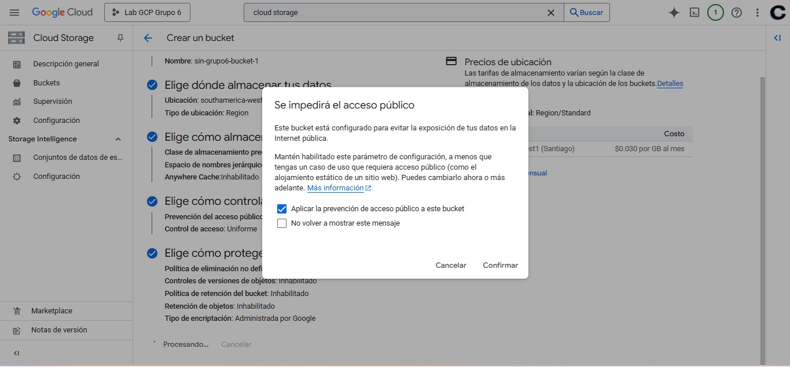
</p>
---

## 🧩 3. Creación del Clúster en Dataproc

Abrimos **Cloud Shell** para ejecutar los comandos.

<p align="center">
    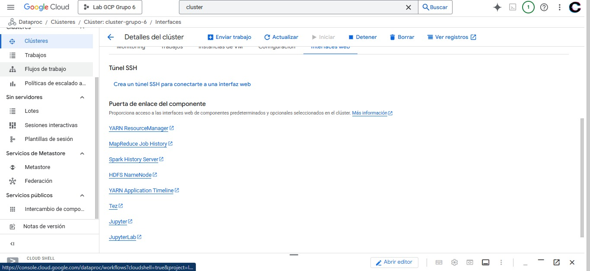
</p>

### 3.1 Autenticación

Nos autenticamos correctamente en GCP:

```bash
gcloud auth login
```

Seleccionamos el proyecto:

```bash
gcloud config set project lab-gcp-grupo-6
```

### 3.2 Creación del clúster

Ejecutamos el despliegue del clúster Dataproc:

```bash
gcloud dataproc clusters create cluster-grupo-6 \
  --enable-component-gateway \
  --bucket sin-grupo6-bucket-1 \
  --region southamerica-west1 \
  --subnet default \
  --no-address \
  --master-machine-type n4-standard-2 \
  --master-boot-disk-type hyperdisk-balanced \
  --master-boot-disk-size 30 \
  --num-workers 2 \
  --worker-machine-type n4-standard-2 \
  --worker-boot-disk-type hyperdisk-balanced \
  --worker-boot-disk-size 30 \
  --image-version 2.2-debian12 \
  --optional-components JUPYTER,ZOOKEEPER \
  --max-idle 3600s \
  --max-age 10800s \
  --scopes "https://www.googleapis.com/auth/cloud-platform" \
  --project lab-gcp-grupo-6
```

<p align="center">
    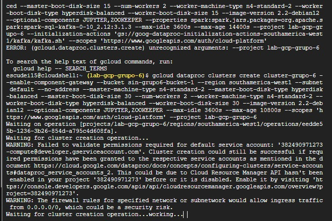
</p>
<p align="center">
    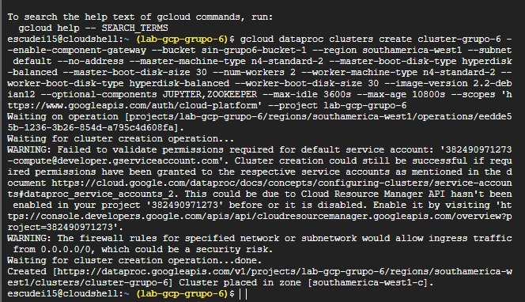
</p>

Una vez aprovisionado, ingresamos al entorno de JupyerLab siguiento la ruta:

**Dataproc → Clúster → Interfaces Web → JupyterLab**

<p align="center">
    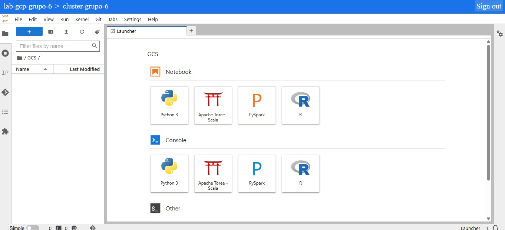
</p>
---

## 📂 4. Gestión de archivos con HDFS

En JupyterLab abrimos una terminal y realizamos las siguientes operaciones:

### 4.1 Cambio al usuario HDFS

```bash
sudo -u hdfs bash
```

### 4.2 Listado de directorios raíz

Confirmamos la estructura inicial de HDFS:

```bash
hadoop fs -ls /
```
<p align="center">
    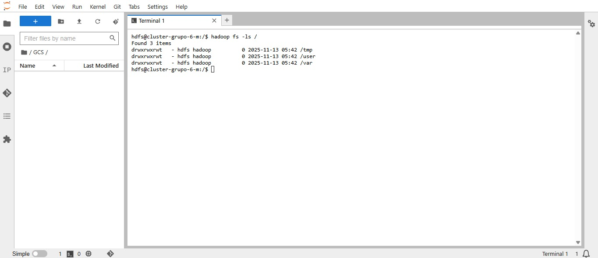
</p>

### 4.3 Creación del directorio de trabajo

Creamos el directorio para almacenar los archivos del laboratorio:

```bash
hadoop fs -mkdir /laboratorio2
```
<p align="center">
    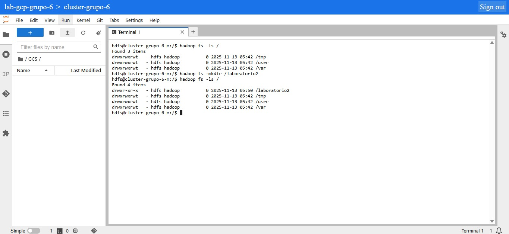
</p>

### 4.4 Carga del archivo CSV a HDFS

Copiamos el archivo `flights.csv` desde el sistema local:

```bash
hadoop fs -copyFromLocal /flights.csv /laboratorio2
```

Con esto dejamos los datos listos para ser usados por Spark.

<p align="center">
    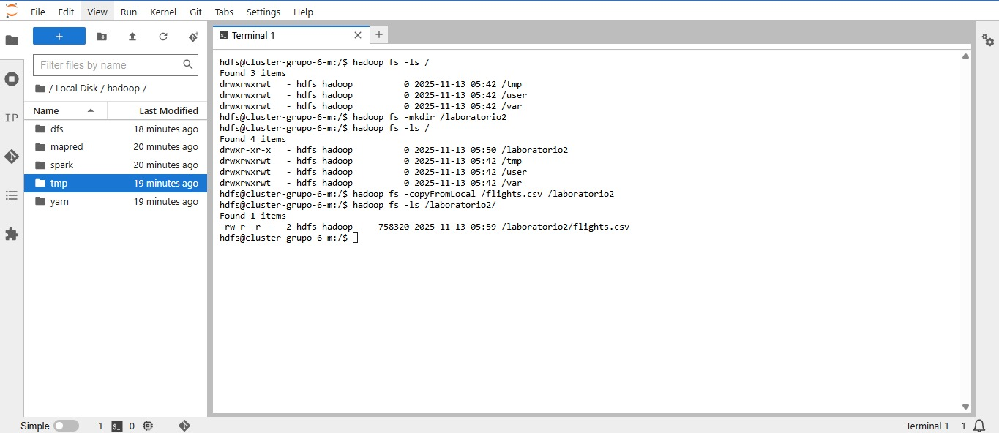
</p>

---

## 📘 5. Ejecución de Notebooks en Spark

Subimos al bucket los notebooks:

* **ConsultaSparkDF_lab.ipynb**
* **ConsutarParquet_lab.ipynb**
* **ReadStream_lab.ipynb**

Luego los abrimos en JupyterLab y ejecutamos:

✔ Carga del CSV en un DataFrame Spark
✔ Conversión y validación en formato Parquet
✔ Configuración del Streaming conectado a Kafka

---

## ❌ Errores

En la fase de ejecución del notebook tuvimos un error que no supimos resolver y eso truncó el desarrollo de la actividad, el código asociado a este error era:

```bash
WARN YarnScheduler: Initial job has not accepted any resources; check your cluster UI to ensure that workers are registered and have sufficient resources
```

Seguiremos intentando la ejecución completa del laboratorio.

