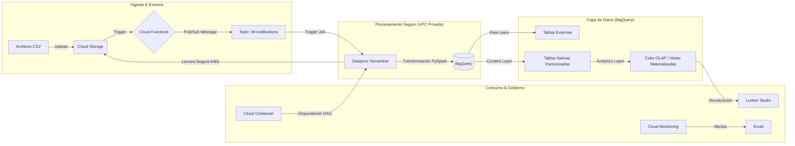

# 📊 Data Lakehouse Empresarial - Retail Analytics

## 📖 Descripción del Proyecto

Este proyecto implementa una arquitectura **Data Lakehouse Empresarial** moderna en Google Cloud Platform. Su propósito es migrar un flujo de datos tradicional (Hadoop on-premise) hacia una infraestructura **Serverless**, **Event-Driven** y **Segura**. 

El sistema ingesta datos transaccionales de retail, los procesa mediante **Dataproc Serverless (PySpark)** dentro de una red privada aislada (**VPC**) y los disponibiliza en **BigQuery** para analítica avanzada en **Looker Studio**, cumpliendo con estándares de seguridad bancaria mediante encriptación **CMEK (KMS)**.

---

## 🏗️ Arquitectura de Solución

La solución sigue el patrón "Medallion Architecture" (Raw → Curated → Analytics).


---

## 🌟 Características Clave (Advanced Features)

- **Security by Design**: Uso de VPC Service Controls para aislar el procesamiento y KMS para encriptación con llaves manejadas por el cliente.
- **Arquitectura Event-Driven**: Pipeline reactivo iniciado automáticamente vía Cloud Functions (Gen 2) y Pub/Sub al detectar archivos.
- **Orquestación Robusta**: Flujo controlado mediante Cloud Composer 2 (Airflow).
- **Optimización**: Uso de Materialized Views en BigQuery para acelerar dashboards (Smart Tuning).

---

## 📁 Estructura del Repositorio
```
grupo09-retail-analytics/
├── dags/
│   └── etl_retail_dag.py           # DAG de Airflow para orquestación
├── functions/
│   ├── main.py                     # Cloud Function (Trigger GCS -> PubSub)
│   └── requirements.txt            # Dependencias Python
├── scripts/
│   └── etl_curated_job.py          # Script PySpark (Limpieza y Transformación)
├── security/
│   ├── alert-policy.yaml           # Políticas de Alerta (Monitoring)
│   └── kms_setup.sh                # Scripts de configuración de llaves
├── sql/
│   ├── 01_raw_tables.sql           # DDL Capa Raw
│   ├── 02_curated_tables.sql       # DDL Capa Curated
│   └── 03_analytics_cube.sql       # Lógica del Cubo OLAP
└── README.md
```

---

## 🚀 Guía de Despliegue (Quick Start)

### Prerrequisitos

- Google Cloud SDK instalado.
- Proyecto GCP activo con facturación habilitada.
- Permisos de Owner o Editor.

### 1. Configuración de Variables
```bash
export PROJECT_ID="pc4-si807-g9"
export REGION="us-central1"
export BUCKET_NAME="pc4-si807-g9-bucket"

gcloud config set project $PROJECT_ID
```

### 2. Infraestructura de Seguridad (VPC + KMS)
```bash
# Crear Red Privada
gcloud compute networks create vpc-retail-g9 --subnet-mode=custom

gcloud compute networks subnets create sub-retail-us \
  --network=vpc-retail-g9 \
  --region=$REGION \
  --range=10.0.0.0/24 \
  --enable-private-ip-google-access

# Crear Llaves de Encriptación
gcloud kms keyrings create keyring-retail-g9 --location=$REGION

gcloud kms keys create key-retail-data \
  --location=$REGION \
  --keyring=keyring-retail-g9 \
  --purpose=encryption
```

### 3. Despliegue de Almacenamiento
```bash
# Crear Bucket con Encriptación KMS
gsutil mb -l $REGION gs://$BUCKET_NAME

gsutil kms encryption \
  -k projects/$PROJECT_ID/locations/$REGION/keyRings/keyring-retail-g9/cryptoKeys/key-retail-data \
  gs://$BUCKET_NAME

# Subir Scripts y Datos
gsutil cp scripts/etl_curated_job.py gs://$BUCKET_NAME/scripts/
gsutil cp data/*.csv gs://$BUCKET_NAME/raw/
```

### 4. Ejecución del Pipeline (Dataproc)

Lanzar el job PySpark dentro de la red segura:
```bash
gcloud dataproc batches submit pyspark \
  --subnet=sub-retail-us \
  --kms-key=projects/$PROJECT_ID/locations/$REGION/keyRings/keyring-retail-g9/cryptoKeys/key-retail-data \
  gs://$BUCKET_NAME/scripts/etl_curated_job.py
```

---

## 📊 Modelo de Datos

| Capa      | Tecnología              | Estrategia        | Descripción                           |
|-----------|-------------------------|-------------------|---------------------------------------|
| RAW       | GCS + BigQuery External | Schema-on-Read    | Datos crudos CSV.                     |
| CURATED   | BigQuery Native         | Schema-on-Write   | Datos limpios, tipados y particionados. |
| ANALYTICS | BigQuery                | Star Schema       | Tablas de hechos agregadas para BI.   |

---

## ✅ Validación y Calidad

Para verificar la integridad de los datos, ejecutar la siguiente consulta en BigQuery. El resultado debe ser **0.0**.
```sql
SELECT 
  (SELECT SUM(total_ventas_netas) 
   FROM `dataset_si807_g9.resumen_ventas_analytics`) 
  - 
  (SELECT SUM(monto_venta_neta) 
   FROM `dataset_si807_g9.fact_hecho_venta_curated`) 
AS diferencia_integridad;
```

---

## 🛠️ Stack Tecnológico

- **Cloud Provider**: Google Cloud Platform
- **Storage**: Cloud Storage (Standard + Coldline)
- **Compute**: Dataproc Serverless (Spark 3.1)
- **Warehouse**: BigQuery
- **Orchestration**: Cloud Composer 2 (Airflow)
- **Event Bus**: Pub/Sub
- **Compute (Triggers)**: Cloud Functions (Gen 2)
- **Visualization**: Looker Studio

---

## 👥 Autores - Grupo 09

- **Curso**: Inteligencia de Negocios (SI807)
- **Universidad**: Universidad Nacional de Ingeniería (UNI)
- **Semestre**: 2025-0

---
