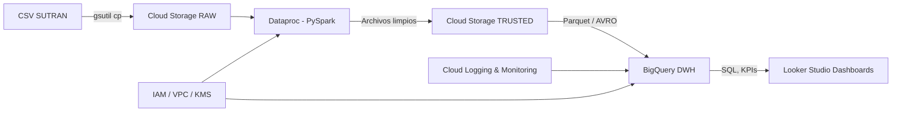

# 🟦 PC3 – Migración del Proceso ETL a Google Cloud (Caso: SUTRAN)

Este proyecto forma parte de la PC3 del curso de Inteligencia de Negocios y tiene como objetivo migrar el proceso ETL a la nube utilizando servicios de Google Cloud Platform (GCP).


---

## 🌐 Infraestructura GCP utilizada

| Servicio       | Uso principal                                       |
|----------------|-----------------------------------------------------|
| **Cloud Storage**  | Almacenamiento de archivos CSV (raw, clean)        |
| **Dataproc + JupyterLab** | Limpieza de datos y transformación con PySpark  |
| **BigQuery**     | Carga de datos final en modelo estrella             |

---

## 🧪 Archivos procesados

- `BBDD_ONSV-PERSONAS_2021-2023.csv`
- `BBDD_ONSV-VEHICULOS_2021-2023.csv`
- `BBDD_ONSV-SINIESTROS_2021-2023.csv`

---

## 🧼 Proceso ETL resumido

1. **Carga de archivos CSV al bucket** en la carpeta `/raw/`
2. **Lectura y limpieza de datos con PySpark**, incluyendo:
   - Corrección de codificación (ISO-8859-1)
   - Eliminación de caracteres invisibles (`\ufeff`)
   - Conversión de tipos (`int`, `string`, `timestamp`)
3. **Creación del modelo estrella**:
   - `dim_persona`
   - `dim_vehiculo`
   - `dim_tiempo`
   - `dim_tipo_via`
   - `f_siniestro`
4. **Carga final a BigQuery** usando el conector Spark-BigQuery y bucket temporal `sutran-bucket-2025`

---

## 🧊 Modelo Estrella

```text
                +------------------+
                |  dim_persona     |
                +------------------+
                          |
                          |
+------------------+      |      +------------------+ 
|  dim_vehiculo    |------|------|  dim_tipo_via    |
+------------------+      |      +------------------+
                          |
                   +-------------+
                   | f_siniestro |
                   +-------------+
                          |
                   +--------------+
                   |  dim_tiempo  |
                   +--------------+

```

# 🧪 PC3 – Migración y Automatización del Proceso ETL en Google Cloud Platform (GCP)

Este proyecto detalla paso por paso cómo se migró un proceso ETL al entorno cloud (GCP) usando Dataproc (con PySpark), BigQuery y Cloud Storage, basado en datos abiertos de siniestros de tránsito (SUTRAN / ONSV).

---

## 📌 Objetivo

Implementar, automatizar y documentar un flujo ETL completo en Google Cloud, integrando Spark en Dataproc con BigQuery como destino final y almacenamiento intermedio en Cloud Storage.

---

## 🧰 Herramientas utilizadas

| Servicio            | Uso en el proyecto                                 |
|---------------------|----------------------------------------------------|
| **GCP Cloud Console**  | Creación del proyecto, buckets, permisos          |
| **Cloud Storage**      | Almacenamiento de archivos raw/clean              |
| **Dataproc + JupyterLab** | Limpieza, transformación y carga con PySpark     |
| **BigQuery**           | Carga final a modelo estrella                     |
| **Python / PySpark**   | Lógica ETL                                        |

---

## 📂 Requisitos previos

- Cuenta institucional con créditos disponibles en GCP
- Roles asignados: **Propietario** del proyecto y acceso a BigQuery, Dataproc, Storage
- SDK de GCP autenticado (si se usa localmente)
- Archivo `etl_pipeline_sutran.ipynb` (notebook principal) ubicado en la carpeta `notebooks/`

---

## 🧩 Pasos reproducibles del proceso

---

### 🔹 1. Crear el proyecto en GCP

- Proyecto: `shaped-icon-478404-p0`
- ID: `370944850430`


---

### 🔹 2. Configurar y autenticar GCP

- Crear grupo de datos y bucket
- Bucket creado: `sutran-bucket-2025`


---

### 🔹 3. Subir archivos CSV al bucket

Subcarpeta `/raw/` con los archivos:

- `BBDD_ONSV-PERSONAS_2021-2023.csv`
- `BBDD_ONSV-VEHICULOS_2021-2023.csv`
- `BBDD_ONSV-SINIESTROS_2021-2023.csv`


---

### 🔹 4. Autenticarse desde Dataproc / JupyterLab

- Clúster creado: `sutran-cluster`
- Autenticación vía cuenta institucional


---

### 🔹 5. Lectura y limpieza de datos con PySpark

Usamos el notebook `etl_pipeline_sutran.ipynb` para realizar:

- Lectura de archivos desde `/raw/`
- Limpieza de caracteres BOM (`\ufeff`)
- Conversión de codificación a UTF-8
- Cast de columnas numéricas
- Escritura a `/clean/` y luego a Parquet

📎 Ver notebook: [notebooks/etl_pipeline_sutran.ipynb](/grupo10_sutran/notebooks/notebooks_jupyter_etl_pipeline_sutran.ipynb)

---

### 🔹 6. Crear datasets en BigQuery

- Dataset principal: `bi_sutran`
- 5 datasets fueron creados como evidencia

📸 
📸 

---

### 🔹 7. Modelo Estrella en BigQuery

Desde el notebook se genera y carga:

- `dim_persona`
- `dim_vehiculo`
- `dim_tiempo`
- `dim_tipo_via`
- `f_siniestro`

**Carga realizada con:**

```python
df.write \
  .format("bigquery") \
  .option("temporaryGcsBucket", "sutran-bucket-2025") \
  .option("table", "shaped-icon-478404-p0.bi_sutran.nombre_tabla") \
  .mode("overwrite") \
  .save()
```


# PC 4 – Seguridad, IAM, Redes y Gobernanza en Google Cloud Platform  

Este documento presenta la configuración de seguridad, IAM, redes, firewall, políticas y auditoría implementadas en el proyecto.  
Se incluyen capturas de pantalla como evidencia, siguiendo la rúbrica del curso.

---

## 2. Seguridad, IAM, Redes y Gobernanza

---

### 2.1 IAM Granular (Roles personalizados + Políticas JSON)

Se definió un **rol personalizado** para restringir operaciones específicas sobre recursos del proyecto.  
El rol fue creado mediante un archivo **JSON** y aplicado a través de CLI (gsutil), cumpliendo los requisitos de la rúbrica relacionados a políticas personalizadas.

✔ Control de acceso granular  
✔ Rol creado mediante JSON  
✔ Aplicación vía CLI  
✔ Principio de mínimo privilegio aplicado  

**Evidencia:**  


---

### 2.2 Red VPC Personalizada (Subred pública y privada)

Se diseñó e implementó una **VPC dedicada** al proyecto llamada `vpc-sutran-prod`, siguiendo buenas prácticas de arquitectura:

- **Subred pública**: permite salida controlada a internet y acceso estrictamente administrado.  
- **Subred privada**: aislada, utilizada para procesamiento interno (Dataproc, ETL, etc).  
- Rango CIDR asignado de acuerdo al diseño del proyecto.

✔ Segmentación correcta  
✔ Separación de cargas públicas y privadas  
✔ Buenas prácticas de arquitectura de red  

**Evidencias:**  
  


---

### 2.3 Reglas de Firewall configuradas según políticas del proyecto

Se configuraron reglas de firewall alineadas al principio Zero Trust:

#### **Regla 1 – fw-ssh-public**
- Dirección: Entrada  
- Acción: Permitir  
- Origen: IP pública del desarrollador  
- Protocolo: TCP 22  
- Objetivo: permitir administración segura del cluster Dataproc

#### **Regla 2 – fw-internal**
- Dirección: Entrada  
- Acción: Permitir  
- Origen: 10.0.0.0/16 (rango interno de la VPC)  
- Protocolos: TCP/UDP internos  
- Objetivo: habilitar comunicación entre componentes internos

✔ Permisos mínimos  
✔ Acceso público limitado  
✔ Tráfico interno habilitado correctamente  

**Evidencias:**  
  


---

### 2.4 Auditoría y Logging (Cloud Audit Logs)

Se activó el sistema de Auditoría de Google Cloud que registra:

- Cambios en IAM  
- Actividades administrativas  
- Accesos a datos  
- Eventos del sistema  
- Acciones denegadas por políticas

Esto proporciona trazabilidad completa para gobernanza y seguridad.

✔ Cloud Logging habilitado  
✔ Auditoría activa  
✔ Evidencias de logs generados  

**Evidencias:**  
  


---

## 2.5 Gobernanza aplicada

Las decisiones de arquitectura siguen buenas prácticas de seguridad empresarial:

- Política de mínimo privilegio  
- Redes aisladas y segmentadas  
- Reglas de firewall estrictas  
- Auditoría activa  
- Roles personalizados y controlados por JSON  
- Configuración vía CLI para reproducibilidad  
- Separación entre componentes públicos/privados  

---
## 3. Scripts SQL del Proyecto

Todos los scripts SQL utilizados en el proceso de validación, construcción del modelo estrella,
cálculo de métricas, KPIs y funciones avanzadas se encuentran en:

**`/grupo10_sutran/scripts/`**

Accesibles desde los siguientes enlaces:

- [01_validacion.sql](/grupo10_sutran/scripts/01_validacion_calidad.sql)
- [02_join_modelo_estrella.sql](/grupo10_sutran/scripts/02_join_modelo_estrella.sql)
- [03_kpis.sql](/grupo10_sutran/scripts/03_kpis.sql)
- [04_funciones_ventana.sql](/grupo10_sutran/scripts/04_funciones_ventana.sql)
- [05_ranking.sql](/grupo10_sutran/scripts/05_ranking.sql)
- [06_ctes.sql](/grupo10_sutran/scripts/06_ctes.sql)

Cada script contiene consultas ejecutadas en BigQuery, organizadas según la rúbrica:

- **Validación de datos:** conteos, duplicados, nulos, tipos.  
- **Modelo estrella:** cruces completos entre hechos y dimensiones.  
- **KPIs:** agregaciones, tasas, métricas críticas.  
- **Funciones avanzadas:** LAG, RANK, OVER, PARTITION BY.  
- **CTEs:** análisis multi-dimensional con WITH.  

Las evidencias de ejecución (resultados y capturas de pantalla) están almacenadas en la carpeta `/evidencias/PC4/`.

# PC4

## Arquitectura Avanzada en la Nube con GCP

### 1. Arquitectura Avanzada en la Nube
Nuestra arquitectura se despliega en Google Cloud Platform (GCP) bajo un enfoque de Data Lake → ETL → Data Warehouse → BI Cloud. Cumple los principios de escalabilidad, seguridad, resiliencia, monitoreo y automatización.

#### ✔ Servicios Usados (Básicos + Avanzados)

| Categoría                      | Servicio GCP                                          | Rol en la arquitectura                                        |
| ------------------------------ | ----------------------------------------------------- | ------------------------------------------------------------- |
| Almacenamiento                 | Cloud Storage                                         | Data Lake (raw / trusted / refined)                           |
| Procesamiento Batch            | Dataproc (Spark)                                      | Limpieza, transformación y generación de dimensiones y hechos |
| Procesamiento ETL Orquestación | Cloud Composer (Airflow) – opcional / Cloud Functions | Automatización ETL                                            |
| Data Warehouse                 | BigQuery                                              | Modelo estrella, consultas analíticas                         |
| Monitoreo                      | Cloud Monitoring + Cloud Logging                      | Logs, métricas, visualización                                 |
| Seguridad                      | IAM, KMS, Service Accounts                            | Control de acceso y cifrado                                   |
| Red                            | VPC, Firewall, Private Service Connect                | Tráfico privado y seguro                                      |
| BI Cloud                       | Looker Studio                                         | Dashboards conectados a BigQuery                              |

---

#### ✔ Storage estructurado: Raw / Trusted / Refined (Data Lake)

📁 **Bucket estructura:**

```
/raw/        → archivos CSV originales cargados por gsutil
/trusted/    → datos limpios (tipo, encoding, registros nulos)
/refined/    → tablas finales listas para modelado estrella (BigQuery)
```

📸 

---

#### ✔ Procesamiento Batch (Dataproc) – explicable

Usamos Dataproc + PySpark para transformar los datos:

* Limpieza de codificación ISO-8859-1
* Eliminación de registros nulos, duplicados
* Normalización de claves
* Creación de dimensiones y tabla de hechos

📎 Ver notebook: [Limpieza Inicial](/grupo10_sutran/notebooks/notebooks_jupyter_Limpieza_Inicial_Datasets_ONSV_2021_2023.ipynb)

---

#### ✔ Escalabilidad & Elasticidad

| Tipo                     | Implementación                                     |
| ------------------------ | -------------------------------------------------- |
| Escalabilidad vertical   | Aumentar capacidad de nodos Dataproc (CPU, RAM)    |
| Escalabilidad horizontal | Añadir más nodos en clúster Dataproc (autoscaling) |
| Elasticidad              | Serverless en BigQuery y Cloud Functions           |

Dataproc configurado con autoscaling basado en carga y número de jobs.


---

#### ✔ Alta Disponibilidad (HA) y Disaster Recovery (DR)

| Estrategia | Implementación en GCP                                  |
| ---------- | ------------------------------------------------------ |
| HA         | Dataproc en Multi-Zone (us-central1-a y b)             |
| DR         | Replicación BigQuery + Storage hacia Multi-Región (US) |
| Backup     | Versionamiento + snapshots programadas                 |

Acá se hizo una migración ya que inicialmente se estuvo trabajando de forma Regional

1. Creamos el bucket multi-region (US)
-l US: indica la ocnfiguración multi-region(US)
-b on: uniform bucket-level access
```
gsutil mb -l US -b on gs://sutran-bucket-mr/
```
📸 

2. Migramos lo de un bucket a otro
```
gsutil -m rsync -r gs://sutran-bucket-2025 gs://sutran-bucket-mr
```
📸 

3. Creamos nuevo BigQuery multi-regios (US)
```
bq mk --location=US --dataset shaped-icon-478404-p0:sutran_mr
```
📸 

---

#### ✔ Monitoreo

| Servicio         | Uso                                        |
| ---------------- | ------------------------------------------ |
| Cloud Monitoring | Métricas de CPU, RAM, jobs                 |
| Cloud Logging    | Logs de Dataproc y Cloud Functions         |
| Alertas          | Notificación por correo ante fallos de ETL |

---

#### ✔ Diagrama de arquitectura (estructura mínima)



---

### 2️⃣ Seguridad, IAM, Redes y Gobernanza

#### ✔ IAM Granular (por servicio y usuario)

| Usuario       | Permisos                                           |
| ------------- | -------------------------------------------------- |
| Data Engineer | storageAdmin, dataproc.editor, bigquery.dataEditor |
| Analista BI   | bigquery.dataViewer, bigquery.jobUser              |
| Viewer        | bigquery.readSessionUser                           |

---

#### ✔ Redes VPC Configurada

| Tipo de subred | Uso                                     |
| -------------- | --------------------------------------- |
| Pública        | Cloud NAT, acceso a internet controlado |
| Privada        | Dataproc, BigQuery, Storage             |

🚪 Firewall: solo puertos 443, 8080 permitidos
🔒 Private Service Connect entre BigQuery y Storage (sin salida a internet)

---

### 3️⃣ Carga Automatizada en Data Lake

✔ Usamos gsutil y Cloud Shell:

```bash
gsutil cp ./accidentes_2018.csv gs://sutran_data/raw/
```

✔ Versionamiento activado
✔ Reglas de ciclo de vida (archivar >120 días)
✔ Logs de ejecución en Cloud Logging

---

### 4️⃣ Implementación del ETL en la Nube

🔹 ETL implementado usando **Dataproc + PySpark + Cloud Functions**

Pipeline:

1. Extracción desde Storage
2. Transformación PySpark (limpieza, join, normalización)
3. Carga final a BigQuery vía spark-bigquery connector

✔ Automatizado con Cloud Composer → ejecución programada diario
✔ Logs, fallos y errores visibles en Cloud Logging

---

Perfecto, Jairo. Ya que llegaste al punto donde todo está **implementado y funcionando**, te dejo un modelo completo y detallado del `README.md` para tu proyecto, incluyendo:

* Descripción general
* Estructura de carpetas
* Requisitos
* Explicación del flujo ETL
* Comandos utilizados
* Evidencias incluidas

---

# ETL Automatizado con Google Cloud Platform - Grupo 10 SUTRAN

---

## ⚙️ Archivos importantes

### 1. `main.py`
Función principal que escucha eventos en Cloud Storage y dispara un job de Dataproc cuando un nuevo archivo es subido a `/raw/`.

```python
import os
from google.cloud import dataproc_v1
from google.cloud.dataproc_v1.types import JobPlacement, PySparkJob, Job

def trigger_dataproc_job(data, context):
    region = os.environ["REGION"]
    project_id = os.environ["PROJECT_ID"]
    cluster = os.environ["CLUSTER"]

    job_client = dataproc_v1.JobControllerClient(
        client_options={"api_endpoint": f"{region}-dataproc.googleapis.com:443"}
    )

    job = Job(
        placement=JobPlacement(cluster_name=cluster),
        pyspark_job=PySparkJob(main_python_file_uri=f"gs://{project_id}-bucket-mr/scripts/etl_master.py")
    )

    result = job_client.submit_job(project_id=project_id, region=region, job=job)
    print(f"Job {result.reference.job_id} submitted.")
```

### 2. `requirements.txt`

Lista de dependencias de Python para Cloud Function:

```
google-cloud-dataproc
```

### 3. `etl_master.py`

Script PySpark que realiza la lógica ETL con los datos cargados en `/raw/`, aplicando transformaciones y escribiendo los resultados en `/trusted/`.

> Este archivo está ubicado en el bucket
> `gs://sutran-bucket-mr/scripts/etl_master.py`


## Flujo del Pipeline ETL

1. Un nuevo archivo `.csv` es subido a `gs://sutran-bucket-mr/raw/`
2. Cloud Function (`etl_trigger_sutran`) se activa
3. La función dispara un **job de PySpark en Dataproc**
4. `etl_master.py` es ejecutado desde el bucket
5. Los datos transformados son guardados en `gs://sutran-bucket-mr/trusted/`


##  Comandos utilizados

### 1. Autenticación y configuración de proyecto

```bash
gcloud init
gcloud auth login
gcloud config set project shaped-icon-478404-p0
```

### 2. Subida de script ETL al bucket

```bash
gsutil cp etl_master.py gs://sutran-bucket-mr/scripts/
```

### 3. Despliegue de Cloud Function (1ra Generación)

```bash
gcloud functions deploy etl_trigger_sutran \
  --runtime python310 \
  --trigger-resource sutran-bucket-mr \
  --trigger-event google.storage.object.finalize \
  --entry-point trigger_dataproc_job \
  --source . \
  --region us-central1 \
  --no-gen2 \
  --set-env-vars "PROJECT_ID=shaped-icon-478404-p0,REGION=us-east1,CLUSTER=cluster-sutran"
```

### 4. Subida de archivo para disparar la función

```bash
gsutil cp "C:\Users\jairo\Documents\datasets_sutran\BBDD_ONSV-PERSONAS_2021-2023.csv" gs://sutran-bucket-mr/raw/
```

---

## Evidencias

Ubicadas en `/evidencias/PC4/`:

### **instalation_configuration_gcloud.png**  


### **function_deploy.png**  


### **load_new_data.png**  


### **dataproc_ejecutandose.png**  


### **verificacion_log.png**  


